# 区块链基础

Foundations of Blockchains课程（*by Prof. Tim Roughgarden*）笔记

**本课程适合有计算机科学基础的读者，读者需具备编程能力和基本的数学能力，基础的数据结构与算法、操作系统原理、计算机网络以及具备基本的分布式系统知识。*

**本课程不涉及具体的工程代码，而是专注于区块链技术本身的底层原理和系统分析。*

*\*如果读者想要习得区块链协议的设计能力，那么笔者建议本课程中的证明部分不要跳过，读者证明的部分也需要多加练习。*

**本文中的部分英文术语不采用中文文献中的既有翻译，笔者认为有一些现有的中文翻译有待修正。*

*\*本笔记定有遗漏错误之处，请务必观看视频教程和教授编写的笔记（下述每个章节的开头都有讲义链接），并阅读相关文献（**一定不能跳过文献阅读**）*

课程视频资源（https://youtube.com/playlist?list=PLEGCF-WLh2RLOHv_xUGLqRts_9JxrckiA&si=OZF0s4r9lsS4ejXz）

## 0 术语表与阅读材料

### 0.1 术语和缩略表

$f$ : fault 错误的，拜占庭的；

$fn$ : fault node 拜占庭节点；

$s$ : sender 发送者；

$sn$:  sender node 发送者节点；

$ns$ : non-sender 非发送者节点；

$fns$ : fault non-sender 拜占庭的非发送节点；

$h$: honest 诚实的；

$hn$: honest node 诚实节点；

$hs$: honest sender 诚实的发送者；

$hns$: honest non-sender 诚实的非发送者；

### 0.2 阅读材料

**James R. Lee.** (2024). *Chapter 3: Byzantine Broadcast and the Dolev-Strong Protocol.* Course notes, CSE 422, University of Washington. https://homes.cs.washington.edu/~jrl/cse422wi24/notes/blockchain_3.pdf

**M. Pease, R. Shostak, L. Lamport.** (1983). *Reaching Agreement in the Presence of Faults.* Journal of the ACM (JACM), 27(2), 228-234.

**M. J. Fischer, N. A. Lynch, M. S. Paterson**. (1985). *Impossibility of distributed consensus with one faulty process*. Journal of the ACM (JACM), 32(2), 374-382.

**A. Miller, Y. Xia, K. Croman, E. Shi, and D. Song.**(2016). *The honey badger of BFT protocols.* Proceedings of the ACM SIGSAC Conference on Computer and Communications Security, 31-42.

**C. Dowrk, N. Lynch, L. Stockmeyer.** (1988). *Consensus in the presence of partial synchrony.* Journal of the ACM (JACM), 35(2), 288-323.

## 1 引论

Lecture 1 原版讲义链接：https://timroughgarden.github.io/fob21/l/l1.pdf

Lecture 1 原版PPT链接：https://timroughgarden.github.io/fob21/slides/F21L1.pdf

### 1.1 课程概要

#### 1.1.1 区块链栈 - Blockchain stack

以下stack并不是行业中所讨论的标准化的stack，而是Prof.自己总结的为了方便讲课和理解区块链原理使用的stack。

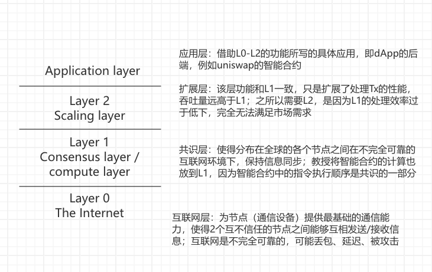

笔者补充：

L1层是区块链系统最重要的一层。我们都知道区块链是一个分布式账本（distributed ledger），之所以称为账本，是因为作为区块链的第一个成功的应用系统——比特币系统，其区块链中记录的信息是UTXO交易信息，也就是账本。后来，我们将区块链的概念进行了延伸和拓展，从结构上看区块链，实际上它是一个使用哈希值作为reference的链表，是一种数据结构。

也就是说，这个数据结构中具体记录什么样的数据其实都是可以的，并不一定非要记账，也可以是其他的数据。***因此，区块链不再只是账本！***这个数据结构有一个特点，具有不可篡改性，因为数据在被编码为区块的时候，添加了数据本身的哈希信息。所以我们将过去的这些数据的历史，称为history，即数据历史，也就是旧版本的数据。区块链系统作为一个分布式系统，为了查询和写入当前版本的数据，并且为了保证数据的确定性、可验证性，我们可以使用状态机（State Machine)来达成这些目的。

作为一个分布式系统，区块链要解决系统可靠性问题，很容易想到使用副本的架构。而状态机很容易应用到副本架构上，也就是State Machine Replication。

故，**区块链系统可以等价于状态机+不可篡改的数据历史（或者说append-only log）+共识机制**

| 区块链元素             | 状态机中的角色                    |
| ---------------------- | --------------------------------- |
| 全网的一致账本（链）   | 状态转移历史的全记录（日志）      |
| 区块中的交易           | 输入（commands / inputs）         |
| 区块链节点的状态       | 状态机的状态                      |
| 执行交易生成的新状态   | 状态转移函数的输出（`new_state`） |
| 共识算法（如PoW、PoS） | 保证状态机在多个副本间的一致性    |

SMR带来的问题是，我们如何确保整个系统最终所有节点在有限的时间内能够输出同一个确定的值？如何防止不同的节点输出的值是不同的？由于区块链系统是一个公开的系统，所有人都可以参与进来，难免存在一些恶意节点故意对系统进行攻击，那么如何防止其他的好的节点被欺骗从而输出一个与其他节点不同的值，从而造成系统崩溃？这些都是SMR问题，也就是本课程着重需要讲解和讨论的问题。这些问题可以归结为2个基本问题：如何保证SMR系统的一致性（consistency）和活性（liveness）。解决这些问题的机制，我们称为**共识机制**，将这个机制写成每个节点都运行的分布式程序称为**共识协议**。共识协议往往是**事件驱动**的代码。

### 1.2 课程大纲 - Outline

**Layer 0会被忽略**，该课程假设读者学习过计算机网络课程，L0是计网的内容。

- L1的内容占本课程的60%，包括：
  - 经典共识协议 - 1980s的共识协议，即permissioned consensus protocols（有许可共识协议，即需要ACL的共识协议）
    - 中本聪的最长链共识协议，即longest-chain consensus，也就是比特币所使用的共识协议
    - 如何转向为permissionless consensus protocol（免许可共识协议，即无需ACL的共识协议）
      - 即如何抵抗女巫攻击（sybil-resistance），策略包括Proof of Work & Proof of Stake
        - 网络难度调整，自私挖矿
        - 设计免许可共识协议的基本原则
        - 深入分析比特币的协议和以太坊的协议
- L2的内容占本课程的20%，包括：
  - 如何通过payments channels扩展比特币网络，即闪电网络（lightning network）
  - 如何通过roll-up策略扩展以太坊
  - 下一代的L1协议，其性能已经足够高，可以无需L2
- 应用层的内容占本课程的20%，包括：
  - DeFi原语（primitives），包括预言机 即 oracles，稳定币 即 stablecoins 等设计
    - 基于DeFi原语之上构建的DeFi应用，包括借贷、自动做市商（AMM）的交易系统
    - MEV 即 Maximal Extractable Value，最大可提取价值，指的是通过在区块中添加和排除交易并更改区块中的交易顺序，可以从区块生产中提取的超过标准区块奖励和燃料费用的最大值来获得收益
    - DAO 即 Decentralized Autonomous Organization，去中心化自治组织，是链上治理的一种组织，通过去中心化方式对链的变更进行投票并决策

**Prof.对本课程的注解**

1. 在本课程中，***区块链无关于支付和虚拟货币***，本课程专注于将区块链作为一种全新的计算范式（computing paradigm）来看待。想象一个云上计算机/计算资源，不属于任何一个特定的人或组织，而是属于全球成千上万的民众，需要为计算资源付费但无需任何额外的许可；
2. 在本课程中，区块链无关于数字货币，本课程将专注于把区块链作为实现permissionless programmable computer作为首要目标，数字货币只是实现这个目标的一种手段或副作用；之所以需要数字货币，是为了解决实现这个目标的过程中可能出现的2个问题：
   1. 计算需求超过计算机可提供的容量时，需要使用付费的手段进行限制以防滥用，而数字货币作为这个计算机的原生货币是最为简便的支付手段
   2. 计算机的运行需要对节点进行激励才可持续，同样的，数字货币作为这个计算机的原生货币是实现permissionless最为简便的激励方式
3. 本课程专注于讨论协议的设计原则，而不是具体协议

### 1.3 数字签名方案 - Digital Signature Scheme

**为什么需要共识（consensus）？**

非正式的解释是，共识是为了维持很多机器（即节点）对history保持同步，即使面对不可靠的网络和恶意攻击，keep multiple machines(nodes) in sync, even in the face of an unreliable network, malicious attacks.

在构建共识协议之前，需要一些**持久假设（permanent assumption）**：

- 互联网一直存在，即，存在一个半可靠的机制使得不可信节点之间的点对点通讯是可能的；
- 密码学一直存在，即，存在数字签名方案和密码学哈希算法可供节点使用。

**什么是数字签名方案（DSS）？**

数字签名方案由三种高效的算法构成：

- 密钥生成算法（key generation algorithm），将 一个随机种子（random seed）映射为 公钥-私钥 密钥对（(pk, sk) pair）
- 签名算法（signature algorithm），将 消息+私钥 映射为 消息+签名，以供验证算法进行验证
- 签名验证算法（verification algorithm），将 消息+签名+公钥 映射为 "yes"/"no"(或者"accept"/"reject")，以表示给定消息所属签名的真伪

注：从数字签名算法可知，不同的消息会产生不同的签名，这点和物理世界中用笔签名很不一样

本系列课程**对于签名的一个假设**：

签名是理想的，即攻击者几乎没有可能获取私钥，也就不可能对某个消息生成伪造签名

在现实中，只要秘钥的长度足够长，那么这个假设几乎是正确的。但理论上，这个假设是错误的，至少使用暴力破解/枚举的手段在理论上是可以不断尝试并获取到私钥的。密码学能做的是让这种破解手段需要付出的代价和成本远高于破解后的收益，从博弈论和经济学角度出发，这样做是不符合经济人假设的，即不划算的，也就让信息保护得以可能。例如，秘钥长度足够的情况下，使得使用枚举方法在现如今和可预见的未来几十年中人类所拥有的计算能力需要上万年甚至上亿年才能枚举完成，这就成了几乎不可能的破解任务。同时，需要确保DSS的三种算法是高效的，这样才有实用价值，并且从另一个维度提升安全性——人们可以不断的更替秘钥，并且在被破解之前就能高效实用验证算法进行验证，否则该方案就是不安全的。另一种更为聪明的方法是通过逆向工程的方法进行破解，效率更高，将指数级别的复杂度降低到线性，能够通过这种方式被破解的密码学算法同样是不安全的。

区块链常用的密码学算法是离散对数算法，该算法/难题可以假设无法找到一个有效的逆向工程算法通过消息+签名来得到秘钥。关于离散对数算法的细节，请参考《密码学原理与实践（第三版）》，Douglas R. Stinson著。

### 1.4 状态机复制问题 - The SMR Problem

为了在后续课程中讨论共识协议的正确性，需要介绍一些概念和问题。这里先介绍SMR - State Machine Replication，即状态机复制。

状态机是CS中已经学习过的概念，这里不再赘述。Replication（复制/副本）的概念，在DevOps和软件工程实践中也是基础概念，有过工作经验的软件工程师应当熟知，因此这里也不再赘述（例如数据库副本集，多实例数据库冗余机制等）。

我们知道，副本集/多实例冗余的问题在于，如何保持副本之间的同步，并且确定某一个共同的状态，亦即共识？

区块链系统是一个分布式系统，同样需要replication以保证系统的可靠性。区块链系统和数据库系统不一样的地方在于，数据库系统通常是一家公司所掌控的，公司对数据库拥有绝对权力，当然也包括副本，因此内部作恶的情况和概率相比于区块链这样的完全开放式的系统要小得多。区块链系统是public的，其replication需要面对public的攻击，如有利可图即存在作恶节点的可能性。那么如何保证区块链系统的大多数节点的状态是一致、真实、未篡改并且可靠的？这就是SMR问题。

我们对SMR问题的描述再详细一点：

区块链系统中，可以大致范围两类角色——

- 一类是**全节点**，即服务提供者，提供计算、数据存储服务，全节点之间会使用正确的顺序（order）同步最新的仅追加数据（append-only data，亦可称其为history），或者叫做状态（state，亦即数据），或者叫做transaction（可翻译成交易或事务，缩写为tx）
- 另一类是**客户端节点**，它们希望从全节点上获取自己想要的数据或者写入数据，亦即提交tx。

例如，有全节点A、B和C。Alice在A节点上提交了一个tx，转账5个数字货币给Bob，然后再转账1个数字货币给Tim。那么，Alice的本地节点会产生2个tx，顺序是：prefix tx-(N) => tx-(N+1)(5 to Bob) => tx-(N+2)(1 to Tim)。这个tx会提交给A节点，A节点上的区块顺序也必须是prefix tx-(N) => tx-(N+1)(5 to Bob) => tx-(N+2)(1 to Tim)，A节点将新的两个tx同步给B和C，B和C上的区块链也是按照同样的顺序将区块添加入链中。如何做到这一点，便是SMR问题。

一般的，我们使用一种叫做协议（protocol，更准确的说，是分布式协议，即distributed protocol）的解决方案来达成这个目的。

协议，即在每个节点上都会运行的基于事件驱动的代码，这段代码会在本地进行运算，可以从别的节点接收新的消息，发送新的消息给别的节点，根据消息做出一些动作，例如改变状态，亦即往区块链中添加新的tx。

这样的协议的需要达成下述2个目标，可称其解决了SMR问题：

1. 使系统具备**安全性（safety properties）**，即坏事不会发生。在区块链系统中，这样的安全属性即一致性（consistency），指的是所有节点都保持history的同步（包括tx数据和顺序的一致），允许少部分节点有所延迟，但延迟节点的history必须是其他节点的前驱（prefix），也就是不能出现数据篡改；
2. 使系统具备**活性（liveness properties）**，即好事一定发生。在区块链系统中，这样的活性属性指的是节点在限定时间内必须完成对合法tx在链上的添加动作，业界称为出块。若非如此，这个系统就失去了作用，tx没有被入链，那么对用户来说系统就不可用了。 

## 2 经典共识协议 - Bootcamp on Classical Consensus

Lecture 2 原版讲义链接：https://timroughgarden.github.io/fob21/l/l2.pdf

Lecture 2 原版PPT链接：https://timroughgarden.github.io/fob21/slides/F21L1.pdf

第2章课程大纲：

- Synchronous model. Dolev-strong protocol.
- Asynchrounous model. Definition.  FLP impossibility.
- The partially synchronous model. Need 67% honest nodes. The CAP Theorem.
- The Tendermint(BFT type) protocol and its **provable guarantees(consistency + eventaul liveness)**

### 2.1 四个基本假设 - Four Assumptions

为后续讲解同步模型中基于Dolve-Strong协议的拜占庭广播(Byzantine Broadcast in the Synchronous Model via the Dolve-Strong Protocol)做准备，需要设置一些假设。

基于上述的SMR问题，为了使问题先简单化，然后逐渐一般化，我们可以引入**四个假设**先解决核心问题，再逐一放宽（relax），引入更多解决方案使得假设被放宽后协议依然有效。

**假设1**：假设系统工作在许可环境中（permissioned setting），即假设有一个节点集合，该集合内的节点元素是运行协议的固定且已知的节点，表示为$N = \{1, 2, ..., n\}$，这些节点的IP地址也是已知的。许可环境指的是节点需要许可才能加入网络，相对的，permissionless即免许可，指的是任意一个节点无需许可即可加入网络。

**假设2**：假设PKI（public key infrastructure，公钥基础设施）存在，即每个节点$i$有公私密钥对，对于每个节点而言，PKI是已知的，节点可以通过PKI生成密钥对，并且每个节点已知其他节点的公钥以验证签名（即假设每个节点的公钥已经正确分发给其他所有节点）。

**假设3**：同步假设（synchronous），有两个子假设：

- 所有节点都共享一个全局时钟，假设时钟间隔（interval）为$1$秒，那么时钟序列则为$0,1,2,3,...$
- 所有在时刻$t$发送的消息都会在时刻$t+interval$到达，按照上一个子假设$interval=1$，则消息会在$t+1$时刻到达

**假设4**：所有节点都是诚实节点（honest nodes）。诚实在这里指的是，节点正确、无bug且无偏差、如预期地运行协议，与意图无关，诚实与否指的是节点的行为

### 2.2 SMR归约到拜占庭广播 - SMR Reduces to Byzantine Broadcast

(SMR Reduces to Byzantine Broadcast)

注：reduces to即“归约到”是可计算性理论和计算复杂性理论中的术语。指的是，如果存在能有效解决问题B的算法，也可以作为解决问题A的子程序，则将问题A称为“可归约”到问题B，因此求解A不会比求解B更困难，写作$A \leq_{m} B$，其中$m$表示映射缩小。

在这里，reduces to的具体含义是，解决拜占庭广播的协议可以作为构建状态机复制协议的构件块。

#### 2.2.1 Solution via Round-Robin Leaders

领导者模型（Leader）是分布式系统的共识协议中（例如Raft）常用的协调节点共识的方式。通常是通过某一种算法选举出领导者角色对整个系统的决策过程进行协调，例如领导者可以提议新的操作或值、协调其他节点对提议进行投票，最终决定哪些操作被提交（达成一致），使决策流程更集中化。

轮询算法（Round-Robin）是一种简单的调度算法，它将处理机会或资源按顺序分配给每个参与者。每个参与者在被轮到时获得一个固定的时间片或处理机会，然后轮到下一个，如此往复。

Round-Robin Leader将二者结合起来，系统中的所有节点按照预先确定的顺序轮流担任领导者，例如在2.1节之假设下，我们设定$t\ mod\ n$为领导者。其基本思想是：

- 该领导者会通过某种算法<u>**对已知的未入链的tx进行排序**</u>，包括客户端刚发来的tx和其他节点同步过来的tx，然后得到一个pending tx list即待处理tx列表。然后将这个列表发送给其他所有的节点，这个列表可以以“区块”即block的结构来表示。需要反复强调的是，<u>**这些tx是有序的（ordered）**</u>，因此从区块链的视角看，**<u>区块内部包含的tx是有序列表</u>**。当然列表可能是空的，如果没有在一个time step中收到任何tx的话。
- 当节点接收到最新的领导者发送过来的tx有序列表（也可以说是区块block）时，将其添加到本地history的末尾，即append操作。

上述解决方案同时满足了一致性要求和活性要求。之所以满足一致性要求，是因为在上述协议中，所有节点都完全同步运行（operate in lock step），领导者会发送完全一样的列表给所有节点，而所有节点也会将同一个列表添加到本地history的末尾。根据归纳推理可知，最后的结果是所有节点的状态是一致的。之所以满足活性要求，是因为每个节点都最终会成为领导者，并将已知的tx添加到history中。

#### 2.2.2 拜占庭节点/故障节点

然后我们开始尝试逐一放宽假设，先从第四个假设开始，即假设所有节点都是诚实节点——这显然是不可能的。

要强调的是，诚实指的不是意图，而是行为（我们很难甚至无法判断意图，并且在协议中，采用结果论更加具有可实践性，因此意图不重要，行为结果更重要）。一个节点如果掉线了，从而无法及时参与区块的同步，也会被认为不是一个诚实节点。一个节点如果因为代码bug导致无法正常工作，也是不诚实节点。更何况很有可能存在故意的恶意节点攻击网络。因此，所有节点都是诚实节点是一个不可能假设。**<u>只要是节点无法正确、无bug且无偏差、如预期地运行协议，都算作不诚实节点。</u>**

**Faulty node** 即 **故障节点** 定义为：一个节点如果是不诚实的，那么它就是故障节点。

这里介绍一些常见的故障节点类型：

1. crash fault 即 崩溃故障，定义为一个节点原先是诚实的，直到出现了一些故障时间，然后完全停止参与协议——不发送、不接收消息。例如服务器宕机；
2. mission fault 即 任务故障，定义为一个节点没有发送它应该要发送的消息；可能是故意的也可能是无意的，但从结果上来说，这样的节点就是一个故障节点，也是不诚实节点；任务故障可能比崩溃故障更为严重，因为当故障节点是leader时，它不发送应该要发送的tx区块，其他的节点会认为在这个time step中，没有新的tx产生，于是开始了下一个time step，这会导致历史错乱，违背一致性；
3. Byzantine fault 即 拜占庭错误，这里不对拜占庭错误做假设，因为拜占庭错误节点可能做出任何一种对系统造成破坏的行为（这里依然假设密码学存在，并且节点无法破解密码）；作为故意攻击者的拜占庭节点比较典型的策略是，通过行为不一致来破坏系统，例如将一些消息给一些节点，再将另一些不一样的消息给其他的节点（可能是错漏的消息），让系统造成混乱和history不一致

注：在下述笔记中，我们可以采用“故障节点”（$fn$）这个术语描述包含上述所有故障类型的节点。又因为拜占庭节点的行为是任意的，包括崩溃故障和任务故障，且协议的研究关注的是行为结果而不是意图，**可以认为“拜占庭节点”这个术语和“故障节点”在协议研究的上下文中是等价的**。

**我们将假设4放宽，设定新的假设4**。为了设定新的假设，需要引入参数$f$，且$0 \leq f \leq n, f \in N$，$f$表示系统能忍受的故障节点的最大数量。即，如果故障节点数量超过$f$，那么系统会失效。

**新假设4：已知参数$f$，拜占庭节点的数量$\leq f$，其余$\geq n-f$个节点是诚实节点。**

在该假设下，Round-Robin Leader协议明显无法满足一致性要求，因此需要一个新的协议。

#### 2.2.3 拜占庭广播问题

(The Byzantine Broadcast Problem)

如果$f \geq 1$，也就是出现了1个以上的拜占庭节点，那么在Round-Robin Leader协议中，当拜占庭节点变成领导者时，它给一些节点发送一些tx，给另一些节点发送完全不一样的tx，诚实节点由于被欺骗导致系统的history一致性被破坏了，造成了混乱。

思考：如果坚持使用轮换领导者的方式达成一致性要求，要做出哪些改动？

我们提出一个解决方案称为**拜占庭广播协议 即 Byzantine Broadcast Protocol**（BB）来解决这个问题，该协议作为subroutine被加入到Round-Robin Leaders Protocol。

在BB中：

- 协议（所有节点）已知有一个节点为被指定的**发送节点 即 designated sender**，简称为**发送者 即 sender**
- 发送者有一个私有输入（private input）$v^{*} \in V$，其中，$v^{*}$表示发送者的所有待处理tx有序列表（即已对tx进行排序），$V$表示发送者的所有待处理tx的顺序组合的集合

我们的目标依然是，协议必须使存在$f$个拜占庭节点的网络满足两个基本要求（基本性质），即安全性（safe property/consistency）和活性（liveness property）。

具体的，在BB中，两个基本要求对应这样三个目标：

1. **终止性（termination）**，即每个诚实节点最终会在某个时刻**终止运行协议**并根据已有信息**猜测$v_{i} \in V$**；

   termination是为了保证节点不会无限制的等待下去，而应该在一个时刻终止运行，否则网络中会出现无休止的通信或状态更改导致系统不稳定、共识无法收敛，也就是不诚实行为。并且，诚实节点需要根据自己已获得的信息（例如已获得的tx列表），根据某种规则，输出一个$v_{i}$的值，这个值应当与$v^*$一致；

2. **一致性（agreement）**，即所有诚实节点选择同样的$v_{i}$，即对$v_i$这个值**保持一致意见（$v_i$不一定等于$v^*$）**，或者说所有诚实节点对$v_i$的值达成一致；

   中文虽然都叫作一致性，但agreement和前文提到的consistency是不同的。agreement指的是诚实节点对$v_i$值达成了一致的共识，从而避免拜占庭节点故意混淆$v^*$值（注意：当$s$节点是$f$的，此时的$v^*$不一定是$truth$）。consistency指的数据在多个replication以及不同时间点上的状态是否保持一致，是一个跨时间的持久属性。agreement保证了安全性，也就是即便网络中存在$f$个拜占庭节点，诚实节点被其混淆真理（真正的$v^*$值）这种坏事不会发生；

3. **有效性（validity）**，即如果发送者是诚实的，那么所有诚实节点所输出的**$v_i = v^*$**。

   如果发送者是诚实的，那么即便存在$f$个拜占庭节点，根据设定好的规则，诚实节点应当能够输出$v_i = v^*$，使得发送者的私有输入（private input，即$v^*$）能够被有 效传播，并避免被拜占庭节点混淆。但是，当sender是拜占庭节点时，由于诚实节点依然能够输出$v_i=v^*$，此时即便$v^*$不再是$truth$，也依然认为有效性成立。**当且仅当发送者是诚实的，其private input才是$truth$。**

上述三个目标只能对诚实节点作要求，自然的，我们无法要求/约束拜占庭节点的行为，因为这些节点是不受控的；

在实践中，仅仅满足其中两个目标是相对容易的，同时满足三个目标，特别是2和3，是困难的。但若非如此，协议就无法达成SMR的目标。因此，拜占庭广播问题的核心在于设计一个非平凡协议（non-trivial protocol），能够同时满足终止性、一致性和有效性，即使网络中存在拜占庭节点，也能可靠地传递信息。

#### 2.2.4 将SMR归约到拜占庭广播

在2.1的四个基本假设的前提下，我们在2.2.2中放宽了假设4。那么，基于2.1的假设1~3以及2.2.2的新假设4，可以将拜占庭广播协议作为子程序插入到Round-Robin Leaders协议中。SMR可以归约到新协议，且有如下步骤：

SMR协议（给定BB作为子程序）：

1. 所有节点轮换成为leader节点（例如使用round-robin算法进行轮换）；
2. 给定leader节点（亦即BB协议的sender节点）和time step，运行BB协议，所有诚实节点得出共识，即一个tx列表$L$；
3. 每个节点将$L$添加到本地历史（local history）的末尾，亦即将最新区块添加到本地的区块链的末尾。

归约证明：

- BB agreement满足SMR的一致性要求（consistency）亦即安全性
- BB validity满足SMR的活性要求（liveness）

### 2.3 拜占庭广播的简单协议 - Simple Protocols for Byzantine Broadcast

#### 2.3.1 直觉分析：以f=1为例（$n\ge4$）

假设存在1个拜占庭节点，那么诚实节点就需要交叉比对信息，以确定哪个是真实的sender发送的信息。

我们可以构建这样一个协议：

注1：协议指的是诚实节点为了达成SMR/拜占庭广播协议的要求（一致性、活性 或 终止性、一致性、有效性）所需要做的事情）；

注2：同样的，该协议基于四个基本假设和新假设4

**t=0：**（t即time step，时间步，下同） 发送者将$v^*$发送给所有节点（假设发送者总是会对消息进行签名）

**t=1：**所有非发送者的节点将从发送者那里接收到的消息转发给其他所有节点（假设每个节点发送消息都会对消息进行签名）

**t=2：**有3种情况：

- 如果我是发送者，那么直接输出$v^*$
- 如果我是非发送者的诚实节点，并且只收到过一种$v$，那么直接输出$v$
- 如果我是非发送者的诚实节点，收到过2种以上的$v_1, v_2, ...$，那么每个节点$i$通过投票的方式，选出得票最多的$v_i$（有$\le 1$的选票来源于发送者，有$\le n-2$的选票来源于非发送者节点）：
  - 如果有$\ge2$个$v_i$得票相同，且票数是最大值，那么需要设置额外的规则，使诚实节点遵守终止性和一致性。例如将得票相同的$v_i$按字母大小排序，小的优先，然后输出$v_i$；
  - 输出$v_i$

如此，该协议即满足拜占庭协议的三个要求，终止性、一致性、有效性。

下面来分析这个协议（假设$f=1, n=4$）：

1. 当sender是非拜占庭节点时
   1. $t=0$时，sender向每个节点发送$v^*$，那么每个节点都收到了1次$v^*$
      在任意诚实节点上，记$C_{v^*}=1$（C表示Count）；
   2. $t=1$时，非sender向每个节点echo收到的msg，此时诚实节点会发送$v^*$，拜占庭节点会发送$v^b$
      在任意诚实节点上，记$C_{v^*}=1+(n-3)=n-2, C_{v^b}=1$；
      上述$n-3$指的是$n-f(=1)-sender(=1)-self(=1)=n-3$；
   3. $t=2$时，每个节点对$v^i$进行投票；sender对$v^*$投1票，诚实节点选取$Max(C_{v^i})$来投票，结果是投给$v^*$，一共有2个诚实节点，因此$v^*$得到3票即$n-1$票，而$v^b$得到1票即$f$票；
2. 当sender是拜占庭节点时，协议依然满足agreement和validity，**因为validity不对此情况做$v^*$必须是$truth$的要求**，因此只要所有节点最终都能达成共识，在有限的time step里输出共同的值即可。

#### 2.3.2 $f=2$时的反例

注：当系统中存在2个以上拜占庭节点时，必须要考虑这2个节点会共同密谋破坏系统的情况。

**命题**：上述拜占庭广播协议在$f=2$时不满足agreement要求。

**证明：**

假设有$n=2k(k \in N^*)$个节点，其中有2个节点为拜占庭节点（以下简称$f$节点），其中1个$f$节点为sender节点（以下简称$s$节点），另一个$f$节点为非sender节点（以下简称$ns$节点），其余$n-2$个节点为诚实节点（以下简称$h$节点），拜占庭sender节点以下简称$fs$节点，拜占庭非sender节点以下简称$fns$节点。

将$n-2$个节点分成2组，每组有$\frac{n}{2} - 1$个$ns$节点；

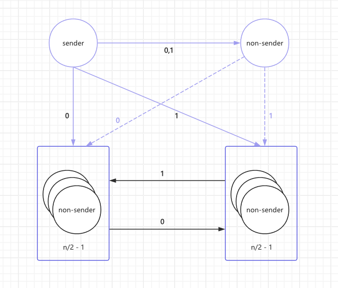

如图，$t=0$时：

- $fs$节点向除了$fns$节点外的其余一半节点发送$v^*=0$，另一半节点发送$v^*=1$
- $fs$节点向$fns$节点发送$v^*=0$和$v^*=1$，由于该$ns$节点是$f$的，该节点会同时留存这两个签名过的值

$t=1$时：

- 除$fns$节点外，一半的$ns$节点会向其余节点echo $v^*=0$，另一半则echo $v^*=1$
- $fns$节点模仿$fs$节点的操作，将$v^*=0$ echo 给一半的$ns$节点，将$v^*=1$ echo 给另一半的$ns$节点

$t=2$时：

- 除$fns$节点外，一半的$ns$节点会投票并输出$v^*=0$，另一半则投票并输出$v^*=1$

如此，系统违反了agreement，即一致性。$\square$

**要点：**

1. 要注意的是，拜占庭节点可以通过互相密谋破坏系统；
2. 即便有一些协议碰巧是正确的，但证明其正确性是困难的，因为拜占庭节点的策略空间异常丰富，要排除所有的策略才能得证；
3. 从上述反例可以看出，只进行一轮的交叉检查是不够的，因此我们引入Dolev-Strong协议

### 2.4 Dolev-Strong协议 - The Dolev-Strong Protocol

注：Dolev-Strong协议不是现实世界中的好协议，因为它基于同步模型，并且速度很慢。但出于教学目的，我们需要一步一步训练对于协议良好设计的直觉。因此一下子就开始讲解复杂协议不是个好主意，对Dolev-Strong协议的学习在本课程中是出于教学目的。

基本思想：Dolev-Strong协议的目标依然是确保所有诚实节点在存在$f$节点（特别是存在$fs$节点和$fns$节点，且它们共同密谋的情况）时依然能够达成agreement。$ns$节点会寻找$s$节点是$f$的证据，互相交叉比对各自的notes，notes中包含了发送者的签名，经比对，若发现不同的msg的第一个签名来自同一个私钥，即$s$节点发送了不一致的msg，则认为该私钥的持有者是$f$节点，因此找出$f$节点是相对容易的。如果发现msg是$f$节点发出的，那么$h$节点不再关心validity和sender的private input，而是直接输出一个默认的$v$，例如空交易列表。

#### 2.4.1 协议定义

对于确认值$v$是有效的定义（Def. of convinced of value $v$ at time $t$）：

当且仅当消息满足下述三个性质时，节点$i$在时间步$t$可以确认值$v$是有效的：

- 消息中包含对值$v$的引用 -- 消息中得有一个值来确认，通常是交易列表
- 消息的第一个签名是发送者的签名 -- 消息是由发送者产生的，因此第一个签名必然是发送者的签名，否则就是伪造的消息
- 消息的签名数量$\ge t-1$个，其中不包含节点$i$自己的签名 -- 用来交叉验证，防止一部分节点收到$v_m$，另一部分节点收到$v_n$的情况（$m \ne n$）

#### 2.4.2 协议描述

注：永远需要记住的是，协议仅是对于$h$节点的要求，亦即只有$h$节点被要求确保如实运行协议，我们无法对$f$节点做出任何要求

协议描述：

$t=0$时，$s$节点将包含私有输入$v^*$以及其签名的消息发送给所有节点；

$t=1,2,3...,f+1$时，$ns$节点开始进行多轮交叉验证，对于每个$f+1$个节点，需要$t+1$轮验证。当节点$i$在当前时间步确认值$v$是有效的，且该值被消息$m$引用，该节点将对其签名并发送给所有其他节点；

最终输出：当且仅当节点$i$确认值$v$是唯一的值时，该节点最终输出值$v$，否则输出$\bot$（即默认值，例如空tx列表）。

### 2.5 Dolev-Strong协议分析与证明 - Analysis of the Dolev-Strong Protocol

#### 2.5.1 有效性 - Validity

**命题：**Dolev-Strong协议满足有效性。

注：要记住的是，当$s$节点是$f$的，则对于这样的$fs$节点无需要求有效性。

**证明：**

设$s$节点是$h$的。

当$t=0$时，$s$会发送带有其签名的$v^*$给其他所有节点。由于假设3，这些节点将在$t=1$时收到包含$v^*$和$s$节点对该值签名的消息$m$。

当$t=1$时，$h$节点会收到包含$v^*$与$s$节点对该值签名的消息$m$，此时，根据convinced of value定义，值$v^*$是被确认的有效值，因此所有的$h$节点将确认$v^*$的有效性。

由于理想签名假设（即任何节点无法伪造$s$节点的签名），故任意$h$节点无法确认任意一个$v \ne v^*$。

综上，$h$节点所输出的$v_i=v^*$。$\square$

#### 2.5.2 一致性 - Agreement

**命题：**Dolev-Strong协议满足一致性。

**证明：**

**充分条件：**

如果一个$h$节点$i$曾经确认了值$v$，那么所有的$h$节点在协议结束时都确认了值$v$。

亦即，如果所有的$h$节点确认同一个值的集合，那么所有节点的输出是一致的。

**分类讨论：**

1. 当节点$i$对消息$m$所包含的值$v$进行确认的时间为$t < f+1$时，节点$i$将其签名附加到$m$上并发送给所有其他节点，
   则所有$h$节点在$t+1 \le f+1$时确认值$v$；
2. 当确认的时间为$t = f+1$时，消息$m$包含$f+1$个不同的签名，则至少有一个必为$h$节点的签名且该签名附加于$t < f+1$的时间步，那么该消息必然是被1中的节点所确认过的，即消息$m$已经被所有节点确认，故节点可确认此消息$m$。

综上，协议满足一致性。$\square$

#### 2.5.3 Dolev-Strong协议中的$f$最大值几何？

问题：$f$值对DS协议的影响有多大？

- DS协议运行一轮的时间与$f$是线性关系。$f$越大，则运行时间越长，因为$t=f+1$；
- 无论$f$的值是多少，DS协议总是能满足一致性和有效性。能容忍任意数量的$f$节点是不寻常的，大多数协议都要求一个上限；

注意！在SMR中，当且仅当$f < \frac{n}{2}$时才有意义。

- 当$f < \frac{n}{2}$时，节点可以通过多数投票的方式解决（拜占庭节点引起的）冲突；
- 当$f \ge \frac{n}{2}$时，通过多数投票无法分辨投票结果是拜占庭节点故意编造的值还是truth。

## 3 节点模拟、不可区分性与公钥基础设施的必要性 - Simulation, Indistinguishability, and the Necessity of PKI

Lecture 3 原版讲义链接：https://timroughgarden.github.io/fob21/l/l3.pdf

Lecture 3 原版PPT链接：https://timroughgarden.github.io/fob21/slides/F21L3.pdf

注：标题中的“节点模拟”指的是在FLM不可能结果证明过程中，对手为了破坏协议所使用的一种策略，用类似虚拟机的技术虚拟出n个节点与其副本节点，试图让诚实节点以为自己正在和一个真实的节点进行交互。“不可区分性”指的是诚实节点无法区分自己正在和真实节点进行交互，还是在和对手所虚拟出的节点进行交互。

FLM不可能结果的意义在于，它证明了在无PKI的同步网络模型中，我们无法设计出一个协议能够同时满足终止性、一致性和有效性，除非做出一些必要的取舍。同时也深刻反映了密码学和可信设置（trusted setting）在协议设计中的重要性。计算机科学领域从一开始就有对于不可能性的证明，例如图灵的停机问题，NP完备性问题等。这些证明看上去是令人沮丧的，因为这意味着**<u>我们无法既要又要</u>**，但它们给了工程师一个最底层的基础原则，从而避免工程师们在不可能的幻想中浪费时间——**<u>在设计协议和软件的时候，必须有所取舍</u>**。

### 3.1 不可能结果 - An Impossibility Result

不可能结果/不可解结果，指的是在某些假设或条件下，某个问题采用任何算法或协议都不可能满足所有期望的性质。

**定理3.1：[PSL 80, FLM 86] 当$f \ge \frac{n}{3}$时，不存在任何拜占庭广播协议能够在<u>异步模型</u>中同时满足终止性、一致性和有效性。$f$表示拜占庭节点的上界。**

注：该定理最初由Pease、Shostak和Lamport于1980年在论文《Reaching Agreement in the Presence of Faults》中提出。

其中，确定性协议的定义：

该定理和上述Dolev-Strong协议不冲突（Dolev-Strong协议已被证明$\forall f \in N^*$是满足BB协议性质的），因为它们的假设不同。Dolev-Strong假设PKI存在，而FLM不可能结果没有PKI假设。但两者都使用了同步假设。

注：协议证明很重要，请读者务必不要跳过。

下述是FLM的证明（由M. J. Fischer, N. A. Lynch和M. Merritt在Distributed Computing 1(1):26-39, 1986上发表的论文["Easy impossibility proofs for distributed consensus problems"](https://groups.csail.mit.edu/tds/papers/Lynch/podc85.pdf)中证明）。

证明思路：

要证明这样的一个不可能结果是困难的。因为这样的协议的设计空间非常庞大，我们可以对协议有任意的设计，如果用枚举法来一一排除这些设计从而证明不可能结果，几乎是很难完成的任务。因此我们可以假设这个协议存在，这个协议同时满足了这些性质，然后将协议部署在一些节点上去运行，用黑盒测试的方式看看会发生什么？是否能导出矛盾？这样不就能利用反证法来证明不可能结果了吗！

为了使得课程时间长度在合理范围内，我们先做一些假设限制证明的范围。首先我们假设协议是确定的（deterministic protocol），不要引入随机性。并且先从简单的基本情况入手，例如从$n=3, f=1$开始，然后再想办法试证更一般的情况（留作读者的家庭作业）。

注：请读者务必阅读[PSL 80](https://lamport.azurewebsites.net/pubs/reaching.pdf)和[FLM 86](https://groups.csail.mit.edu/tds/papers/Lynch/podc85.pdf)这两篇论文。

#### 3.1.1 建立一些模糊的直觉

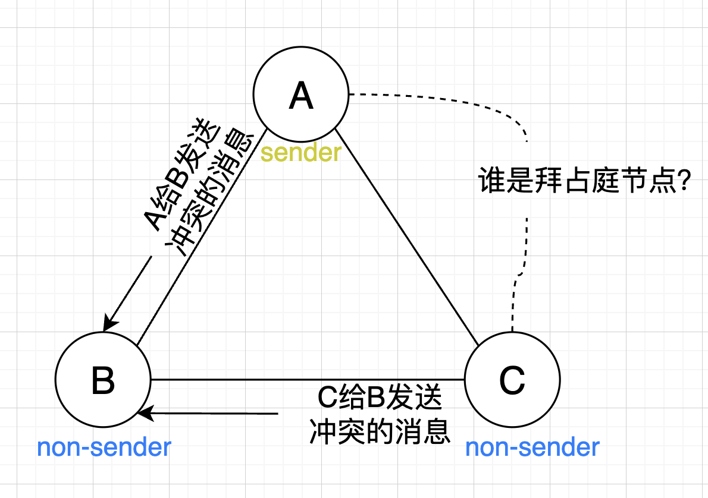

假设有三个节点分别是A、B和C节点（即上图中的顶点），用边表示两个节点之间有连接：即能够进行通信并且互相知道各自的IP地址。

假设A节点是拜占庭节点，那么A节点会给B节点（0）和C节点（1）发送不一致的消息，假设C节点是诚实的，那么C节点会将从A节点收到的消息（1）echo给B节点：

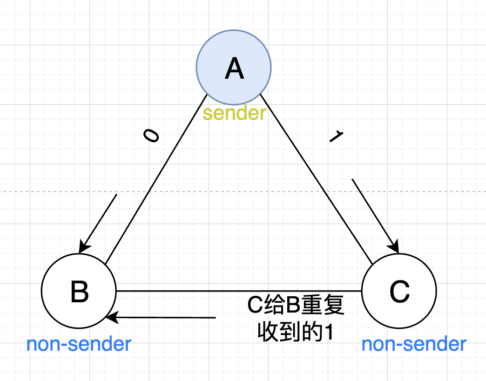

此时B节点会收到冲突的消息——从A节点那里收到了0，从C节点收到了1。

考虑另一种情况，假设C节点是拜占庭节点，而A节点是诚实的sender节点。A节点给B和C都发送0，而C节点给B节点发送1而非它收到的0。如下图：

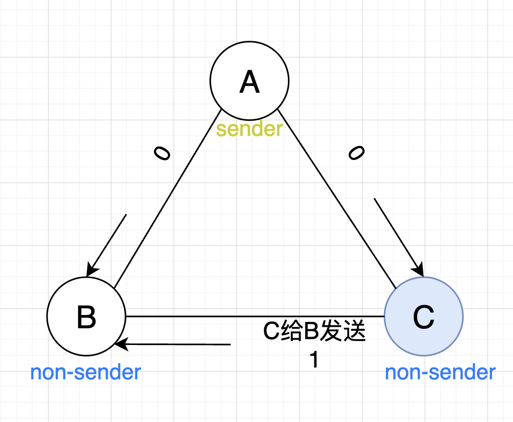

此时B节点收到的消息依然是冲突的。

上述两种情况都是冲突的，因此B节点无法区分A节点和C节点到底哪个是拜占庭节点，也无法输出一个确定的值，即无法达成agreement。但是，当$n=4,f=1$时，B节点是可以输出一个确定的值的，此时不会违反agreement。

### 3.2 FLM的不可能结果证明：一个思想实验 - Proof of PSL-FLM impossibility

该证明使用反证法，假设定理不成立，即假设存在一个确定性的算法$\pi$使得协议能够在$n=3, f=1$的情况下满足BB协议的全部性质。通过推理得出该协议在满足全部BB协议性质的情况下与假设矛盾，得出该确定性的算法不存在。

命题：当$f \ge \frac{n}{3}$时，不存在任何确定性协议（deterministic protocol）能够在<u>异步模型</u>中实现同时满足终止性、一致性和有效性的拜占庭广播。

前提：

协议$\pi$约束条件：

1. $n=3, f=1$
2. $s$节点会告知其他节点自己是sender，并且会发送$private\ input\ v$
3. 运行$\pi$协议的节点会获得3个IP地址，包括自己的IP地址和另外2个节点的IP地址

证明：

令$\pi$为一个确定性的BB协议（同时满足终止性、有效性和一致性，即termination、validity和agreement）。

构造一个网络结构如下：

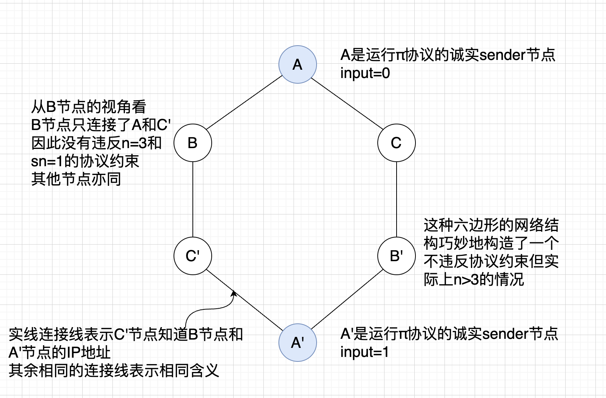

通过观察可以发现，上述网络结构的实际节点数量超过前提约束的$n=3$，但并不违反协议$\pi$的约束，因为每个节点无法发现第4个节点的存在。

在这个六边形网络中，validity和agreement不能被定义。因此我们需要构造几种场景使得这两种性质能够被定义并推导出矛盾的结果，从而得证。

考虑下述三种场景：

**I.**

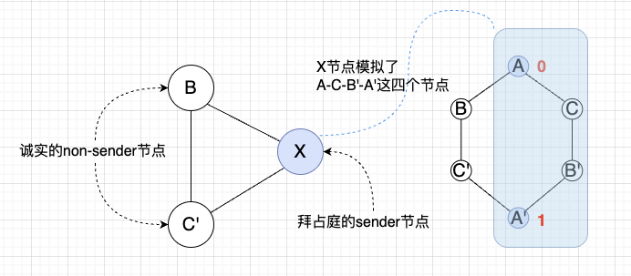

假设B和C'节点是$hns$节点，X节点是$fs$节点。

根据$\pi$协议的约束与假设，B节点和C'节点对X节点具体是什么样的节点是一无所知的，它们只能通过X的行为推断X是否是拜占庭的。

那么可以通过这样一种方式欺骗B和C'：让X节点模拟六边形拓扑中的A-C-B'-A'。可以想象，X是一台物理的计算机，而A节点、C节点、B'节点和A'节点都是X上的虚拟机。这些虚拟机节点根据$\pi$协议的定义，模拟运行$\pi$协议的行为，并且试图以C'所预期的A'行为与C'交互，以B所预期的A的行为与B交互。使得C'以为自己正在和A'交互，B以为自己正在和A交互。这种策略的目的是为了达成indistinguishability，即使得B和C'无法分辨自己处在什么样的环境中，是存在拜占庭节点的环境，还是没有拜占庭节点的环境。

**推论1：由于$\pi$满足agreement，因此B和C'会输出同样的值$v_i$。**

**II.**

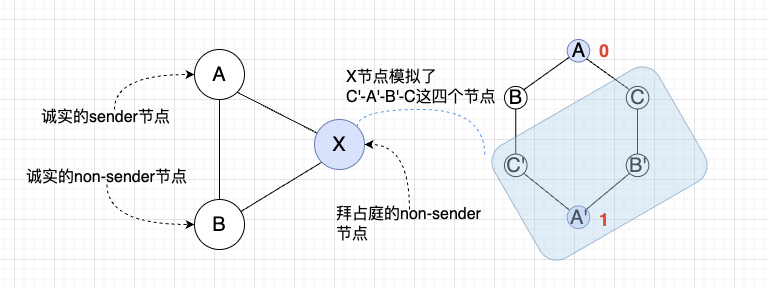

假设A和B分别是$hs$节点和$hns$节点，X节点是$fns$节点。

X节点依照同样的策略：模拟C'-A'-B'-C节点，对A和B节点进行欺骗。

**推论2：由于$\pi$满足validity，因此A和B都会输出0。**

**III.**

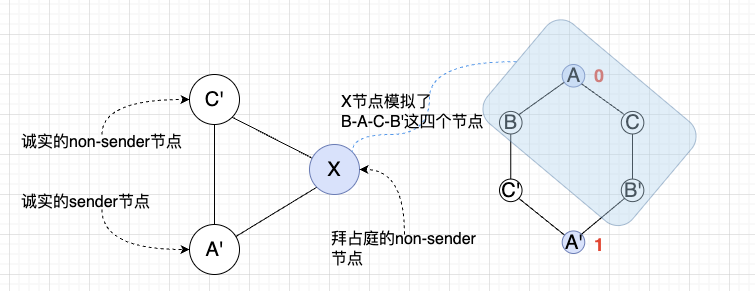

假设A'和C'分别是$hs$节点和$hns$节点，X节点是$fns$节点。

X节点依照同样的策略：模拟B-A-C-B'节点，对C'和A'节点进行欺骗。

**推论3：由于$\pi$满足validity，因此C'和A'都会输出1。**

综上所述，推论2、推论3与推论1矛盾，故$\pi$协议不存在，命题成立。$\square$

### 3.3 PKI和可信设置的重要性 - The Importance of PKI and Trusted Setups

#### 3.3.1 讨论

为何FLM不可能结果与Solev-Strong协议对任意个$f$都可容忍的性质不冲突？

因为Solev-Strong协议成立的前提是存在PKI假设的，而FLM不可能结果的成立并不存在PKI假设。并且，当PKI存在时，FLM不可能结果就不成立。这种节点组成的网络是许可网络，亦即，节点知道与之连接的节点的IP地址和节点名称，并且节点知道与之连接的节点的公钥之假设，是一种称为“可信设置”（trusted setup）假设的一个实例。

但是，当我们把PKI假设附加到3.2所证明的FLM不可能结果所使用的环境设置上时，FLM不可能结果就不成立了。

#### 3.3.2 FLM不可能结果附加PKI假设后不成立

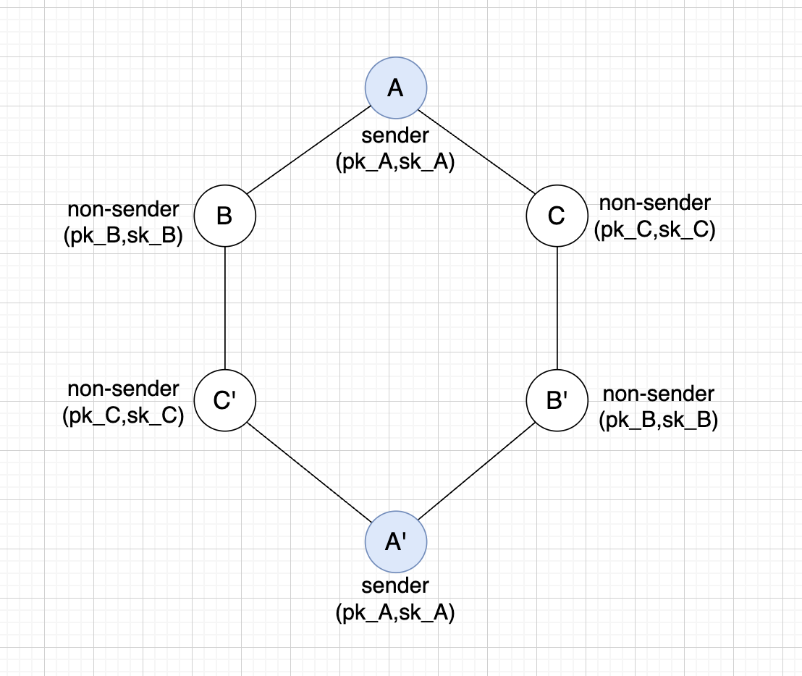

如上图所示，除了3.2已有的假设外，我们对这个网络设置附加PKI假设。A节点和A'节点使用密钥对$(pk_A,sk_A)$，B节点和B'节点使用密钥对$(pk_B,sk_B)$，C节点和C'节点使用密钥对$(pk_C,sk_C)$

我们考虑3.2证明中的第一个场景：

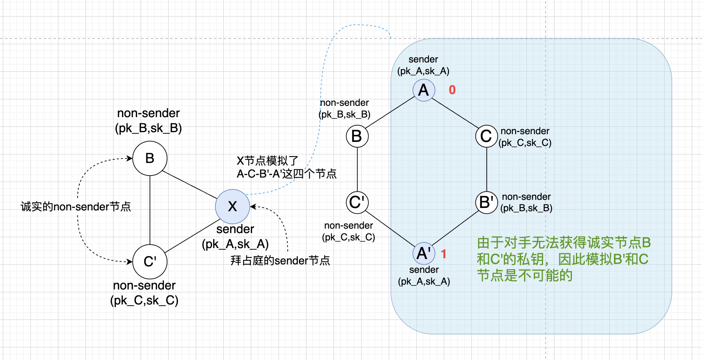

如图，对手试图模拟A-C-B'-A'，但由于PKI假设中包含了“其他节点无法获取本节点私钥”，因此对手试图虚拟出B'节点和C节点来混淆网络是不可能的，因为B'节点和C节点无法虚拟出一个真实的B节点和C'节点的消息签名。如此一来，FLM不可能结果就无法成立。

## 4 异步模型和FLP定理 - The Asynchronous Model and the FLP Impossibility Theorem

Lecture 4-5 原版讲义链接：https://timroughgarden.github.io/fob21/l/l4-5.pdf

Lecture 4-5 原版PPT链接：https://timroughgarden.github.io/fob21/slides/F21L4-5.pdf

### 4.1 放宽同步假设 - Relaxing the Synchronous Assumption

前三章的内容基于2.1节中的四个基本假设以及对于第4个假设的放宽。回顾一下假设3即同步假设：所有节点共享一个全局时钟，并且有一个消息发出后，必然在$t + interval$之内的时间步到达。这在互联网中是很难实现的，我们必须考虑互联网可能存在断电、宕机、遭受DDoS攻击等突发状况或者各种原因导致无法提供服务的情况。这意味着消息发出后可能永远不会到达（即便服务恢复，消息也早就被路由器或其他网络设备丢包了），因此有必要放宽同步假设。

注：

1. 如果存在一个**先验的**$\Delta$是消息延迟时间的最大值，那么该网络模型依然是同步假设。
2. 如果仅放宽time step，允许消息延迟可以在$n$个time steps后到达（time inflation），这依然是同步假设（这里的$n$是**先验的**）。

Time inflation没有真正放宽同步模型，试考虑Dolev-Strong协议：

- sender在time step 0发出消息；
- non-sender在time step 1、2、3……中发送交叉验证消息。

如果我们假设time step的最大延迟是100个时间步，那么只要让non-sender在time step 100、200、300……发送消息即可。这样改造后的协议和原先的协议没有区别，它没有正视本质问题，即现实中互联网通信不可避免的会有意外中断和攻击。并且，这样的设计让节点在大部分时间傻等，效率极为低下，这是不可接受的。一个实际可用的协议的消息传递速度不能被最坏情况下的消息延迟控制，应该在通信网络良好时尽可能快速传递消息，达成共识。

### 4.2 异步模型 - The Asynchronous Model

基本思想：

1. 没有全局共享时钟
2. 对于消息最大延迟不做假设

最小假设是每条消息最终会到达目标机器，最大延迟是一个有限值，但不对这个值的大小做任何假设（消息可能遭遇任意长但有限的延迟），即**最终可达性约束**。该假设是为了防止系统假死，看上去永远没有进展。

注：对于任意一条消息，消息的传递时间**没有任何先验的上限**。即消息可能会在1秒后送达，也可能会在1亿年后送达，没人知道什么时候会送达。

如果假设消息不会到达，那么不可能性结果是易证的（即平凡的不可能性），但这样就没有什么实际意义了。我们希望证明的是不平凡的不可能性，也就是说，即便所有消息最终会被送达，共识依然是不可能的。

我们不希望设计出一个在某一种网络模型下运行良好，却在另一个模型下是坏的协议。我们很难评估在那么多通信模型里，到底哪个模型足够好；也很难评估现在我们认为是好的模型，在未来是否依然是好的。因此，我们希望对网络模型做出最弱的假设，看看在情况足够坏的时候，是否能够设计出一个好的协议。异步网络模型就是这样的具备最弱假设的模型，这很类似于算法分析中的最坏情况分析。

另一方面，对网络通信行为做出假设是很困难的，甚至是不可行的。真实世界的通信行为很复杂，敌手的攻击手段是非常多的，网络通信能出现的故障也很多样。因此，我们对网络通信做出的假设难以实证，我们无法保证敌手的攻击手段或者网络通信故障仅限于我们的假设空间。由于这样的假设在现实中难以成立，那还不如不做这样的假设。

异步网络模型其实并不符合真实世界。做出这样的建模也不是为了建模真实网络，而是为了避免建立不可靠的、有争议的假设。这种最低限度假设的模型是研究协议健壮性的极限测试场，后面我们会看到，在这种极限的情况下，所有的协议目标是无法同时实现的，这也是FLP定理的核心。

异步网络模型的形式化描述如下：

- 维护一个未送达消息的消息池$M$，$M$可初始化为$\{(r,\bot)^{n}_{r=1}\}$
  - $(r,\bot)$是一个二元组，表示节点编号$r$和空值$\bot$（初始消息为空，空值用符号$\bot$表示）
  - $(r,\bot)^{n}_{r=1}$表示$r$的取值为从$1$到$n$，即构造$(1,\bot),(2,\bot),(3,\bot),...,(n,\bot)$这些二元组，共$n$个二元组
  - 将上述二元组装进一个集合里，即$\{(1,\bot),(2,\bot),(3,\bot),...,(n,\bot)\}$，可以写为$\{(r,\bot)^{n}_{r=1}\}$，也就是未送达消息的消息池可以初始化为由$n$个二元组：$(节点编号,消息为空值)$构成的集合
- while(TRUE):
  - 任意一条消息$(r,m) \in M$会被投递给接收者$r$（前提是满足最终可达性约束）
    - $r$表示消息接收者，$m$表示消息内容（message payload/content）
    - 异步模型不对消息到达顺序做假设
      - 我们在证明FLP过程中可以思考敌手可能从$M$中取出一条消息使得协议是失败的
  - 接收者$r$可以往$M$中添加任意条消息

上述的while循环的每一轮迭代可以看成是time step，但要注意的是，节点并不知道迭代次数。这个模型是纯事件驱动的，节点只有在收到新消息时才会发送消息。

如果消息池$M$一开始完全是空的，即$M = \varnothing$，那么任意节点都不会发送任何消息，这样系统就不能启动。为了使系统启动，我们为每个节点初始化一条空值消息$(r, \bot)$到$M$中，这样每个节点都会获得一次参与协议的机会。某个节点$r$在收到一条消息$(r,m)$后，它可以选择停止运行协议，也可以选择往消息池中再添加一条空值消息$(r,\bot)$，这样即便$M$空了之后，也可以保持节点$r$的持续运行。

在第2和第3章中，我们了解到了拜占庭节点可以为所欲为，可以共同密谋来破坏协议的目标。在异步模型中，可能存在一个新的攻击方式——对消息投递顺序的恶意控制。这意味着协议必须同时抵御拜占庭节点+恶意消息调度的联手攻击，这使得协议的设计难度变得更为艰难。

### 4.3 拜占庭共识 - Byzantine Agreement

FLP不可能性定理所关注的是一个我们还没有正式定义的一个共识问题：拜占庭共识问题（Byzantine Agreement, BA）。

在定义BA之前，我们先厘清一下“协议”（protocol）是什么意思。

#### 4.3.1 协议 - Protocol

与之前几章的解释一样，协议指的是部署在每个节点本地的一段事件驱动的代码。这段代码根据节点所掌握的信息来决定要发送哪些消息。

在异步模型中，协议是**纯事件驱动的：只有当节点收到一条新的消息后，协议才会被触发执行**。

一个节点在某一个时刻所拥有的信息有两类：

1. 在协议开始时所拥有的私有输入（private input）
2. 至今为止收到的所有消息的顺序。

因此，协议的定义如下：

对于***每一种可能的私有输入***    和    ***消息接收序列***，协议规定了节点在收到当前消息时应该发送哪些消息作为响应。

需要强调的是：协议的行为不能依赖于节点所不知道的信息，例如其他的节点收到了哪些消息。

即：如果一个节点在两次执行中收到的消息序列完全相同，且它的初始输入也相同，那么它的行为和最终输出也必然相同。

#### 4.3.2 拜占庭共识问题 - Byzantine Agreement Problem

与BB问题一样，拜占庭共识问题（BA problem）也是一个**一次性的共识问题（single-shot consensus problem）**。所谓一次性共识问题，指的是所有节点在一次协议执行中，就一个值**达成一次性的决定**，而不是持续不断地达成多个决策。SMR问题是multi-shot consensus，每个节点会持续地输出值，即交易序列。

在BA中：

- 每个节点$i$都有一个私有输入$v^*_i \in V_i$（在FLP中，我们依然将$V$的空间设置为$V=\{0,1\}$）；
- 没有一个指定的sender节点，所有节点都是平等的，扮演相同的角色；

BB中有sender节点，只有sender节点有私有输入（private input），而BA中，每个节点都有自己的私有输入。这里的“私有”的意义与之前是一样的，指的是当协议开始时，除了节点$i$自己，没有任何其他节点知道$v^*_i$的值，只知道它是$V$的一个元素。

BA可以看作是BB的推广——BB是一个特殊的BA，只有一个节点有私有输入，且更贴近多方共识的场景，更贴近区块链和SMR。

和BB协议一样，我们对协议的关注点在于，一个共识协议需要满足三个性质：终止性（termination）、一致性（agreement，即安全性）和有效性（validity，即活性）。其中，终止性和一致性的定义和BB协议相同。有效性需要做出一些修改，以反映BB和BA的一个重要区别：现在不是只有sender才有私有输入，而是所有节点都有私有输入。

我们期望BA协议有如下性质：

1. 终止性。所欲诚实节点$i$最终都会停止并输出$w_i \in V$；
2. 一致性。无论私有输入是什么，所有诚实节点都会停止并输出相同的值；
3. 有效性。对于每个诚实节点$i$，如果$v_i=v^*$，则$w_i=v^*$。

上述有效性的定义的意义是，如果所有诚实节点的输入都相同，则输出也必须为该值，不能被拜占庭节点干扰。

协议设计困难的地方在于我们难以同时满足上述所有性质。单独满足两个性质是容易的，例如节点输出某个固定值，就能满足一致性和终止性；每个节点都输出自己的输入，就能满足有效性和终止性。但协议在拜占庭节点的干扰下还能同时满足三个性质是异常困难的。

在异步模型中，BB问题是平凡的不可解的（留作家庭作业，读者可自行证明）。之所以引入BA问题，是因为通过FLP的证明，可以间接推出在异步模型中，SMR问题也是不可解的（读者也可试证，假设$n \ge 3, f=1$）。

| 问题                  | 能否在异步模型中成立 | 说明                                                         |
| --------------------- | -------------------- | ------------------------------------------------------------ |
| **拜占庭广播（BB）**  | ❌ 平凡不可解         | 因为只有一个 sender，而网络延迟可控 ⇒ 没办法区分“恶意”和“延迟” |
| **状态机复制（SMR）** | ❌ 无法实现           | 因为它需要多轮一致达成，而 FLP 定理已经否定了基本共识        |
| **拜占庭共识（BA）**  | ❌ FLP 证明不可达成   | 是三者中最“简洁”和“中立”的形式，适合用于理论证明             |

### 4.4 FLP定理 - The FLP Impossibility Theorem

**FLP定理**：[Fischer-Lynch-Paterson 1985] 在异步模型中，对于任意$n \ge 2$，即使系统中最多只有一个故障节点（即$f=1$），也不存在任何确定性的协议，能够同时满足终止性（termination）、一致性（agreement）和有效性（validity）。

关于终止性、一致性、有效性的具体描述，请看4.3.2节，不再赘述。

对FLP定理的一些注释：

- 这里的确定性（deterministic）指的是节点不使用任何本地随机性。每个节点在收到新消息后应发送什么消息，完全由它的私有输入和它到现在为止收到的消息序列所决定。

- FLP定理对随机协议有启发意义。在随机协议中，节点所发送的消息可以是私有输入和收到的消息的概率函数。实际上，FLP的证明揭示了这样一个事实：对于任何一个协议（无论是确定的还是随机的），只要它在终止时保证一致性和有效性，即使仍满足“所有消息最终会到达”的假设，就一定存在一个不会终止的执行路径。因此，没有任何随机协议能够始终同时保证我们想要的三个性质。（这种协议类似Las Vegas随机协议，例如QuickSort，总是能返回正确答案，但它是一种运行时间不可预测的随机算法）我们对这类随机协议所能抱有的最大希望是，在其能保证终止时的一致性与有效性的前提下，对终止性提供概率性的保证（例如，期望运行时间较短；在有限时间内大概率终止；且/或终止概率为1）。

  - 期望运行时间较短，比如平均只要10s就能结束；
  - 大概率在有限时间内结束，比如99%的情况下在100s内结束；
  - 最终一定会结束，但有可能需要很长时间。
  - 实际上，在异步模型中确实存在一些随机的BA协议提供这种概率性终止的保障。但现实中的区块链协议通常不依赖随机性来规避FLP定理，而是通过时间假设来实现共识，如半同步模型和Tendermint协议。若想进一步了解随机共识协议的历史，以及在异步模型中实际应用的随机区块链协议（如Helium的协议），可参考[HoneyBadgerBFT协议论文](https://eprint.iacr.org/2016/199.pdf)及其引用的文献。

- $f$（拜占庭节点数量的最大值）越大，实现共识就变得越困难。因此，在$f$很大的情况下依然成立的协议是令人印象深刻的，例如Dolev-Strong协议。同样的，在$f$很小的情况下，不可能性结果依然成立的定理也是最打脑壳的。FLP定理在$f=1$的情况下也依然成立，从某种意义上来说，它是一种“最强的不可能性结果”，是最令人打脑壳的了。

- 最令人打脑壳的不是说$f$是一个拜占庭节点，即一个行为不受控的有恶意的节点。而是即便是一个没有恶意的突然宕机的故障节点的存在，也能令FLP定理稳稳的成立。这点充分说明了FLP不可能性结果的强度，是让人打脑壳打到痴撚线的那种。所以BA问题是异常困难的。

- 即便存在PKI假设，FLP定理依然成立。（PKI假设不能防止节点不宕机）

- FLP定理在形式上区分了同步模型和异步模型中哪些问题是可解的。并且揭示了我们在直觉中所认为的，在异步模型中实现共识要更加困难。这种困难是本质上的，并不是因为协议的设计不够好。

  - 在PKI假设下，Dolev-Strong协议表明，在同步模型下，无论$f$取值多大，BB问题都是可解的

  - 一个不错的练习是，尝试证明，将Dolev-Strong协议或任意BB问题的解决方案作为子程序来解决同步模型中$f<\frac{n}{2}$情况下的BA问题

  - 即使不依赖PKI假设，在同步模型中，只要$f<\frac{n}{3}$，BA问题依然可解（参考PSL83论文）

  - 由于FLP定理在$n\ge2,f=1$的情况下仍然成立，这就表明，无论您是否有PKI假设，比起异步模型，共识协议在同步模型中具备更强的问题可解性，即具备更强的能够同时满足所有我们想要的性质的能力

  - | 模型     | 有 PKI         | 容错上限       | 共识问题可解性                     |
    | -------- | -------------- | -------------- | ---------------------------------- |
    | 同步模型 | ⭕️ 有           | 任意 $f < n$   | BB 与 BA 都可解（用 Dolev-Strong） |
    | 同步模型 | ❌ 无           | $f < n/3$      | BA 可解（基于经典结果）            |
    | 异步模型 | 无论是否有 PKI | $f = 1$ 即失败 | BA 不可解（FLP定理）               |

- FLP定理的意义在于提醒人们不要试图找寻一个不可能实现的解决方案，也不要完全放弃去解决问题，而是用有所取舍、折中的方式去解决问题。

### 4.5 FLP定理证明的一些配置 - Configurations

#### 4.5.1 证明策略

在证明策略上，与3.2节对FLM不可能性结果的证明相同，采用反证法。

即，我们假设确实存在一个确定性协议$\pi$，它能在异步模型下，在$f=1$的情况下，同时满足终止性（termination）、一致性（agreement）和有效性（validity）。如果我们能通过这些假设中推出矛盾，那么就证明协议$\pi$不存在。

具体的，正因为$\pi$在终止时必须满足一致性和有效性，才不可避免地会出现一些执行路径，使得协议永远无法终止，从而与终止性矛盾。（对这句话感到疑惑不要紧，先放一边，看完证明再来回顾）

在证明之前，我们需要进行一些概念的构建以帮助证明顺利完成。

#### 4.5.2 配置

我们可以将协议的运行过程看作是在有向图中行走的过程。我们需要展示一种情形，协议$\pi$可以经历一个无限的事件序列，而无法终止。为此，我们需要先定义配置（Configurations）。配置是协议在某个时刻的快照，它提供了足够的信息，让协议能够从该时刻重启。

**定义4-1：一个配置（configuration）$C$记录了每个节点的状态，包括节点的私有输入（private input）和到此刻为止节点所收到消息的序列，以及消息池$M$当前的状态，即已送出但未送达的消息。**

上文中说道，我们可以把协议的运行看作是在一个巨大（甚至可能无限）的有向图（directed graph）中行走，图中的顶点表示各个配置$C$，边表示消息传递事件$C \xrightarrow{(r,m)} C'$。其中，$(r,m)$表示一条消息，$C \rightarrow C'$表示当前的配置$C$被事件$(r,m)$触发（即节点$r$收到消息$m$）而发生状态转移，事件发生后，状态转移为另一个配置$C'$（见Figure 1）。（不要忘记，敌手可以控制消息传递，即敌手可以选择状态转换的路径）

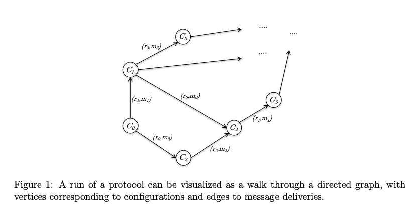

具体的说，每当消息$(r,m) \in M$被送达后，配置将产生三方面的变更：

1. $(r,m)$从消息池$M$中被移除；
2. 该消息被追加到节点$r$当前已接收消息序列的末尾；
3. 节点$r$所发送的新消息被添加到消息池$M$中（无论节点$r$的行为是出于诚实地运行$\pi$协议还是拜占庭行为）。

如果我们能够构造出一组消息序列使得$\pi$协议永不终止，这就等价于我们在这个有向图中找出了一条无限路径，也就构造出了对终止性的反例，即构造出了矛盾，从而完成证明。

下面我们会把配置划分为三种类型。假设每个节点的私有输入都是0或1，即输入空间$V=\{0,1\}$（不可能性结果的证明只需要构造最坏情况，因此输入空间越小，越容易控制分析；可能性结果证明则无需这个假设）。由于我们假设协议$\pi$满足一致性（agreement），所以一旦协议终止，诚实节点的输出只有两种可能：

- 所有诚实节点输出0
- 所有诚实节点输出1

**定义4-2（0-配置，1-配置和模糊配置）：**

一个配置可以被定义为以下三类之一：

- 0-配置（0-configuration）：如果无论拜占庭节点采取何种策略，消息被如何传递，最终使所有诚实节点都输出0，那么这个配置称为0-配置。
- 1-配置（1-configuration）：如果无论拜占庭节点采取何种策略，消息被如何传递，最终使所有诚实节点都输出1，那么这个配置称为1-配置。
- 模糊配置（ambiguous configuration）：如果一个配置既不是0-配置，也不是1-配置，那么称其为模糊配置，也叫双值配置（bivalent configuration）。

由于$\pi$协议满足终止性和一致性，我们也可以等价地定义模糊配置为：

存在一种拜占庭策略和消息传递顺序能够让敌手强制所有节点都输出0或输出1。即敌手能够控制所有诚实节点的最终输出。

对于一个0-配置或1-配置来说，最终结果是先验的——无论敌手如何作恶，结果不会改变。但如果是模糊配置，敌手可以控制输出。

上述定义是对一个固定的$\pi$协议而言的。例如，给定一个配置，该配置在某个协议中可能是模糊配置，而在另一个协议中可能不是。换句话说，一个配置是模糊的还是确定的（0或1），取决于该配置运行在什么协议之下。配置的模糊性是依赖$\pi$协议这个上下文的，模糊性不是一个可单独存在的先验属性。因此，脱离协议上下文，我们无法知道一个配置是否是模糊的，也就不能将FLP误解为：只要我们设计一个协议绕开模糊配置就能避开FLP。

再次澄清：上述定义是“在$\pi$协议已定义的前提下所定义的模糊配置”，我们要避免将某个配置$C$在某个固定的$\pi$协议下的模糊性误当作该配置在任意协议下都是模糊的。

#### 4.5.3 总体证明思路

这个证明的目标，是在图Figure 1中所示的有向图里面寻找一条无限路径。具体来说，就是寻找一条由模糊配置组成的无限序列（在我们假设的$\pi$协议下）。这样的构造会与$\pi$协议满足终止性的假设矛盾，从而得证。为了构造出这样的序列，我们需要使用两条引理（引理是构造证明时所使用的辅助性技术陈述，就像大型程序中的子程序一样）。引理1是归纳法的基础情形（base case），引理2是归纳步骤（inductive step）。

引理1是归纳的起点，它指出，存在某种节点私有输入的选择，使得对应的初始配置$C_0$是一个模糊配置，即节点有了私有输入后，协议$\pi$会进入一个无法决定输出0还是1的模糊状态。引理2说明了如何从一个旧的模糊配置$C_i$构造出下一个模糊配置$C_{i+1}$，即系统执行一步之后仍然会被卡在模糊状态，并持续陷入这种状态。我们先应用引理1，然后不断应用引理2，就能构造出这样一个无限的模糊配置序列：$C_0 \rightarrow C_1 \rightarrow C_2 \rightarrow C_3 \rightarrow ...$，这正是我们想要的。

这两条引理都不是显而易见的。不过引理1相对容易证明，因为它不需要用到异步模型下敌手的全部能力，所以我们可以先从引理1开始。

### 4.6 一个初始模糊配置 - An Initial Ambiguous Configuration

**引理1：**对于任意一个满足终止时具有一致性与有效性的确定性协议$\pi$（设$f=1,n\ge2$），总是存在一种节点私有输入的选取方式，使其对应的初始配置是模糊的。

该引理所表达的意思是，在任何满足一致性和有效性的确定性协议中，我们总是可以通过选择某种恰当的初始输入，让协议从一个“模糊状态”开始运行，也就是FLP归纳构造的base case。

一般情况下，配置的状态是极其复杂的（例如消息池中可能包含数亿条消息），但初始配置总共只有$2^n$种可能。为什么？

我们回顾配置（configurations）的定义，配置是每个节点的状态的快照，状态包含三个信息：

- 私有输入（private input）

- 节点到此刻为止收到的消息的序列

- 消息池$M$

由于在协议刚启动时，消息池$M=\{(r,\bot)^{n}_{r=1}\}$是唯一且确定的，并且所有节点收到的消息序列都是空的。因此，配置仅剩的自由度就在于如何选取每个节点的私有输入。又由于我们假设了节点总数为$n$且私有输入空间是$V=\{0,1\}$，因此所有节点的私有输入总共有$2^n$种可能，也就是配置总共有$2^n$种可能。实际上，我们只需要考虑这$2^n$个初始配置中的$n-1$个，就足以找到一个模糊配置。

**引理1的证明：**

不妨把所有节点的私有输入想象成一个$n$位的二进制字符串，其中第$i$位表示节点$i$的私有输入。

令字符串从全0开始，想象从左至右逐位将字符从0翻转为1，直到字符串变成全1为止。这个过程一共生成了$n+1$种私有输入组合，分别对应初始配置$X_0,X_1,X_2,...,X_n$。（在配置$X_i$中，前$i$个节点的私有输入是1，后$n-i$个节点的私有输入是0）

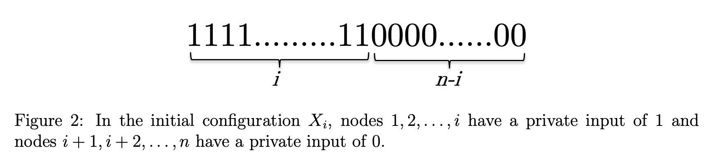

接下来我们使用假设：<u>$\pi$协议满足有效性</u>。

由于$\pi$协议满足有效性，因此当所有节点的私有输入均为0（尤其是所有诚实节点的输入为0），即$\pi$协议的初始配置为$X_0$，则无论拜占庭节点采取什么样的策略，也无论消息传递的顺序如何，$\pi$协议必然终止并且输出全0的结果。故，根据定义4-2，配置$X_0$为0-配置。

同理可得，初始配置$X_n$（即所有节点的输入全为1）为1-配置。

我们可以断言，在这些处于中间的配置，即$X_1, X_2, ..., X_{n-1}$中，必然存在一个模糊配置。

令$i\ge1$，当$i$足够小时，存在$i$使得配置$X_i$不是0-配置。这个值必然存在，我们至少能找到一种情况，即当$i=n$时，$X_i$是1-配置，满足条件。又由于$i$足够小，因此配置$X_{i-1}$必然是0-配置。

这里我们断言$X_i$必然是模糊配置，下面分情况讨论并使用反证法进行证明：

假设$X_i$不是模糊配置，那么$X_i$是承诺配置（commited configuration，即0-配置或1-配置）。

根据上述$i$的定义，$X_i$不是0-配置，对$X_i$分情况讨论：

Case 1. 若$X_i$是模糊配置，则断言成立；

Case 2. 若$X_i$是1-配置，尝试考察该配置：

​	设$i$节点为拜占庭节点，考虑其可能的两种行为策略：

​	(i) 由于$X_i$不是0-配置，故必然存在一种策略使得最终输出为全1

​	(ii) $i$节点将自己的私有输入伪装成0，并在其他方面完全诚实地执行$\pi$协议

​	如果$i$节点采用策略(i)，那么最终输出为全1；

​	如果$i$节点采用策略(ii)，由于诚实节点无法区分$X_{i-1}$和$X_i$，在$X_{i-1}$下的$\pi$协议之运行结果为全0输出，则$X_i$下的$\pi$协议之运行结果与$X_{i-1}$一致，也是全0输出。

综上所述，拜占庭节点$i$可以在$X_i$配置下，让协议的运行结果最终输出全0或全1，这与上述$X_i$不是模糊配置的假设矛盾，故$X_i$必然是模糊配置的断言成立，$X_i$正是我们在寻找的模糊配置。$\square$

> 注：上述证明中，或许存在困惑的部分有两处。
>
> 1. 问：为什么设$i$时，允许$i=n$，但下面讨论$X_i$是否为1-配置时，最终证明又否认了$X_i$是1-配置？
>    答：要注意定义。1-配置是承诺配置，意味着协议最终的输出结果必然是1，是确定的。而在$X_i$的讨论中，拜占庭节点的确有可能让所有节点都输出1，但也存在输出0的可能。也就是说，在拜占庭节点的干扰下，$X_i$是一种模棱两可的配置，不是确定的配置，因此不符合1-配置的定义。
>
> 2. 问：为什么$i$节点采用策略(ii)，诚实节点就无法区分$X_{i-1}$和$X_i$？我们可以举个例子：
>    答：假设$X_{i-1}$的私有输入是$(0,0,0)$，$X_i$的私有输入是$(0,1,0)$。设$i=2$，即第二个节点是拜占庭节点，那么它在$X_i$中采取策略(ii)，即隐藏自己原本的私有输入$1$，假装为$0$，则$X_i$变成了$(0,0,0)$。这就让诚实节点无法区分$X_{i-1}$和$X_i$了。

## 5 FLP定理证明

本章讲义和PPT和上一章是同一份，参考第4章的讲义和PPT

### 5.1 FLP定理归约到两条引理 - Reducing The FLP Impossibility Theorem to Two Lemmas

我们继续看第二条引理，和第一条引理很类似，但更为巧妙。这条引理的作用类似归纳证明中的归纳步骤，它以一个模糊配置作为输入，并输出一个更长的模糊配置序列。合用这两条引理，就能够构造出我们所需要的无限模糊配置序列，引理1负责启动这个序列，然后不断引用引理2来生成后续的所有部分。

实际上，之前的证明忽略了一个微妙的问题。也正是这个微妙之处，使得第二个引理的陈述要比你预期的更复杂一点（如下图 Figure 3）。

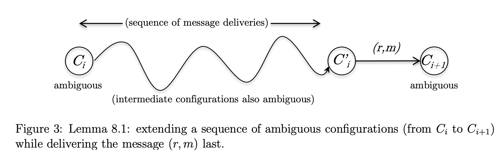

**引理2（扩展一个模糊序列）**：设一个固定的确定性协议$\pi$，使其在终止时满足一致性和有效性（$f=1, n\ge2$）。令$C_i$为一个模糊配置，$(r,m)$为$C_i$消息池中的一条消息。则存在一个消息投递序列使得：

(i) 消息投递序列的最后一步是投递消息$(r,m)$；

(ii) 该序列执行完成后，系统到达的状态是一个模糊配置$C_{i+1}$。

或许你会疑惑，为什么不用一个更简单的引理代替：对于任意模糊配置$C_i$，总是存在一条消息交付后能够使系统到达的状态是另一个模糊配置$C_{i+1}$。

为什么我们要强行让引理适用于任意一条出现在$C_i$消息池中的消息$(r,m)$？

因为上述简单版本的引理是平凡成立的，从引理1所述初始模糊配置$C_0$出发，我们可以投递一个由无限多的空消息构造的消息序列（dummy message，即形如$(r,\bot)$的消息）。空消息对系统不会产生任何影响，系统接收到空消息后不做任何决策，因此整个过程中产生的所有配置都是模糊的，系统依然保持模糊状态。如果我们反复引用简单版本的引理，就会得到一个敌手从未投递过任何有实际影响的消息（非平凡的）序列。显然，如果允许敌手这么做，那么达成共识是平凡不可能的。正因如此，在4.2节对异步模型的定理中，我们加上了最终可达性约束：每一条被添加到消息池中的消息，最终都必须被投递到它的目标接收者。

引理2表述中引入的额外的复杂性正是为了应对这个问题，它使我们能构造出一个满足消息最终可达性约束的无限配置序列。

结合引理1和引理2，我们可以对FLP给出下述证明：

设一个固定的确定性协议$\pi$，使其在终止时满足一致性和有效性（$f=1, n \ge 2$）。显然的，第一步我们引用引理1，选择一个初始模糊配置$C_0$。然后我们希望一次又一次地引用引理2，使得系统永远处于模糊状态，不可终止。每次引用引理2时，我们需要从当前的消息池中选择一条消息$(r,m)$，那我们要怎么选呢？

先把引理2放一边，假设我们暂时不关心是否保持模糊性，而只关心如何保证每条消息最终被投递。一个简单的解决方案是使用FIFO（First In First Out，先进先出）策略，即总是优先交付消息池中最早被发送的消息，即便这有可能会破坏系统的模糊性。这样一来，每当一条新消息被加入当前的消息池$M$时，我们就知道它将在至多$|M|$次迭代后被投递（$|M|$表示消息池中的消息总数量）。由于$M$是有限的（我们规定每轮迭代中每个节点只能发送有限条消息），这样能保证每条消息有明确的上界等待时间，即每条消息都能在有限步内被投递，避免消息饥饿问题（message starvation，指某一条消息永远在消息池中等待）。

引理2的表述方式使我们能够在两种极端方案之间找到一个这种策略：

- 一种是始终保持模糊状态，但不保证消息最终被投递的平凡解，比如只投递空消息；
- 另一种是保证消息最终都被交付但无法确保系统始终处于模糊状态的FIFO策略。

关键思想是，在保持模糊性的前提下，尽可能模拟FIFO的消息交付顺序。也就是说，我们想要模仿FIFO，尽可能的优先投递旧消息，但如果这条旧消息会破坏系统模糊性，那就先暂且搁置，投递其他的消息，等到时机合适的时候再送出。

具体来说，我们想要定义这样的模糊配置序列：

- 根据引理1，定义初始模糊配置$C_0$；
- 对$i=0,1,2,...$：
  - 设$(r,m)$为$C_i$之消息池中的最旧之消息；
  - 根据引理2，定义$C_{i+1}$为相对于当前配置$C_i$和消息$(r_i,m_i)$的某个仍保持模糊的后继配置。

这个构造过程会构造出一系列子序列，在某些$C_i$和$C_{i+1}$之间可能会存在上亿个中间配置。但无论怎样，把这些子序列拼接起来，整体上仍然是一个配置序列。如图Figure 4。

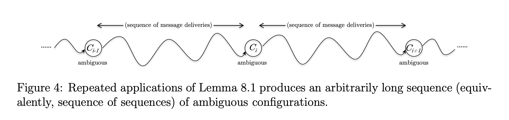

在$C_i$和$C_{i+1}$之间的这一段子序列，本质上是在拖延消息$(r_i,m_i)$的投递。这段子序列可以投递任意不会对系统模糊性造成破坏的消息，直到某一个时刻投递$(r_i,m_i)$也不会破坏模糊性再投递这条消息。

根据引理1和引理2，所有的$C_i$以及子序列中的中间配置，都是模糊配置。因为若非如此，系统的模糊性就会被破坏。这个序列同时也满足消息的最终可达性约束，与FIFO策略类似，如果某条消息$(r,m)$在配置$C_i$或在该配置之前被加入消息池$M$，那么它最迟会在配置$C_{i+|M|}$处被投递。每次引用引理2，都会投递至少一条$|M|$条消息中排在$(r,m)$之前的消息。因此，在至多$|M|$次引用引理2后，消息$(r,m)$就会排到最前面，成为下一条被投递的消息。$\square$

有时$(r,m)$可能会被更早地投递。例如，某次引用引理2的过程中，目标是投递一个更早的消息$(r',m')$，但需要先投递$(r,m)$才能确保投递$(r',m')$不会破坏模糊性。

现在我们已经知道引理1是成立的（引理1的证明在4.6节），并且联合引用引理1和引理2能够推出FLP定理。最后，我们来证明引理2（很难搞的证明）。

### 5.2 完成FLP定理证明 - Completing the Proof of the FLP Impossibility Theorem

为了证明引理2，不妨设一个固定的确定性协议$\pi$，使其在终止时满足一致性和有效性（$f=1,n \ge 2$），令$C_i$为$\pi$的一个配置，令$(r,m)$为$C_i$消息池中的一条消息。我们需要证明的是，$(r,m)$既能够最终被投递，又可以保持系统的模糊性。这期间可能会投递上亿条其他消息。

#### 5.2.1 证明准备 - Proof Setup

我们将配置分为三类，和定义4-2一样，这里也以一个固定的$\pi$协议为基础。但不同的是，这次还要相对于一个固定的配置$C_i$和消息$(r,m)$进行分类。

如果在配置$C_i$下直接投递$(r,m)$就能得到另一个模糊配置，那证明就完成了。因此我们假设一种相反的情况：立刻投递$(r,m)$会导致系统进入0-配置，即最终输出全0的结果（如若是使系统进入1-配置，则证明是完全对称的，只需互换0和1即可）。

下面是我们需要定义的三类配置：

**定义5-1（0\*-, 1\*-, 模糊*-配置）** 设$C$为一个可由$C_i$出发，通过投递一系列非$(r,m)$消息而达到的配置。配置$C$可分为如下三类：

- 0\*-配置：在配置$C$下投递$(r,m)$会使系统进入0-配置；
- 1\*-配置：在配置$C$下投递$(r,m)$会使系统进入1-配置；
- 模糊\*-配置：在配置$C$下投递$(r,m)$会使系统进入模糊配置。

由于任意一个配置必定是一个0-、1-或模糊配置，因此任意一个从$C_i$出发且尚未投递$(r,m)$的后继配置也必定是0\*、1\*或模糊\*-配置。

一个0\*-配置必定是一个0-配置（此时投递$(r,m)$不会影响结果）或一个模糊配置（一旦投递$(r,m)$，敌手所有能达成全1结果的策略会全部失效）。

一个模糊\*-配置必定是一个模糊配置，它是一个特例，能够在模糊配置下投递$(r,m)$后依然保持模糊性。

> 带有星号\*的配置是会受到$(r,m)$影响的配置，要注意和定义4-2的区别

利用上述定义，我们可以很清晰地重述我们的目标和假设：

- 引理2的结论：存在一个模糊\*-配置。即，存在一种消息投递方式，使得在其之后再投递$(r,m)$会使系统进入模糊配置；
- 假设：$C_i$是一个0\*-配置。如果$C_i$是一个模糊\*-配置，则证毕；如果它是一个1\*-配置，那么我们只需在后续证明中将0和1互换即可。

#### 5.2.2 搜索非0\*-配置

**通过广度优先搜索（breadth-first search, BFS）**：在4.5.2节中我们提到过，FLP定理的证明可以看作是在一个巨大的有向图中寻找一条无限的路径。图中的每一个顶点对应一个配置，每条边对应投递一条消息引起的状态转换。不妨试想<u>将一个初始的模糊配置（且是0\*-配置）$C_i$作为顶点，由此出发进行BFS搜索，我们限定在搜索过程中忽略所有消息为$(r,m)$的边</u>。根据定义5-1，搜索过程中遇到的每个配置，都是0\*-配置、1\*-配置和模糊\*-配置中的一个。

**逃离0\*-配置**：我们可以断言，<u>在搜索过程中，必然会遇到一个非0\*-配置</u>。

证明：如果搜索只能遇到0\*-配置，那么无论在什么时候投递$(r,m)$，其结果必定是进入0-配置，即最终输出为全0。在异步模型的最终可达性约束下，敌手最终必须投递$(r,m)$，则系统最终必定输出全0。亦即，配置$C_i$的输出结果为全0，这与$C_i$是一个模糊配置的假设矛盾，故上述断言成立。

**一个候选的模糊\*-配置**：我们还需要排除一种可能，即这次BFS搜索始终只会遇到0\*-配置和1\*-配置。换一句话说，我们可以断言，在搜索过程中，必然会遇到模糊\*-配置。

证明：根据上述证明，在这次BFS搜索过程中，我们必然会遇到一个非0\*-配置，令这个配置为$Y$，且令$Y$为距离$C_i$最近的非0\*-配置。即，从$C_i$出发，经过最少次数的消息投递能到达$Y$。如果有多个这样的配置，任意择其一即可。令$X$为$C_{i} \rightsquigarrow Y$的搜索路径中$Y$的直接前驱配置。设$(r',m')$为该搜索路径上的最后一条被投递的消息，即触发$X \mapsto Y$状态转换的消息。如图Figure 5。

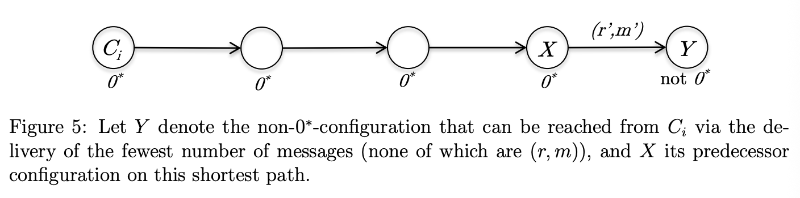

由于本次搜索已经限定忽略消息为$(r,m)$的边，故消息$(r',m')$必须与$(r,m)$不同。也因如此，由于$(r,m)$在$C_i$的消息池中，则其也必然在$X$和$Y$的消息池中。配置$X$可能就是$C_i$，也可能不是。这取决于$C_i$的消息池中是否存在被立刻投递后能使得系统进入非0\*-配置（$Y$）的消息。无论如何，由于$Y$是距离$C_i$最近的非0\*-配置，且$X$是它的直接前驱，则$X$必然是一个0\*-配置。

我们可以断言$Y$不可能是一个1\*-配置（因此，$Y$必然是一个模糊\*-配置），并且证明这个断言，来完成对引理2的证明。

同样的，我们可以使用反证法来证明该断言。假设$Y$是一个1\*-配置，我们试着将注意力放到$X$和$Y$上，令$(r',m')$为触发$X \mapsto Y$状态转换的消息。如图Figure 6。

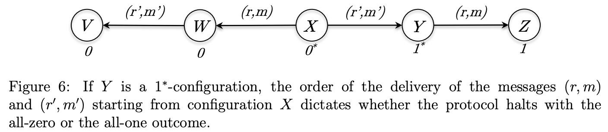

由于$X$是一个0\*-配置，那么在$X$上投递$(r,m)$会进入一个0-配置，记为$W$；类似的，由于$Y$是一个1\*-配置，则在$Y$上投递$(r,m)$会进入一个1-配置，记为$Z$。更进一步，我们考虑在$W$上投递仍未被投递的$(r',m')$，进入另一个配置，记为$V$。由于$W$是一个0-配置，则$V$也是0-配置。

**一对关键的消息**：Figure 6的核心要点在于这样的两个命题：

**P1**：从配置$X$（消息池中有$(r,m)$和$(r',m')$两条消息）开始，若先投递$(r,m)$，再投递$(r',m')$，则会得到一个0-配置（即配置$V$）；

**P2**：从配置$X$（消息池中有$(r,m)$和$(r',m')$两条消息）开始，若先投递$(r',m')$，再投递$(r,m)$，则会得到一个1-配置（即配置$Z$）。

也就是说，这两条消息的投递顺序决定了协议的最终结果是全0还是全1，聪明的你可能已经意识到正在悄然逼近的矛盾。我们将通过两种情况来证明，第一种是直接的、简单的，不涉及拜占庭节点；第二种类似我们在引理1中的证明。

Case 1: $r \ne r'$，即两条消息的接收者不同。如果这两条消息要发送给不同的接收者，那么没有任何节点知道它们被接收的相对顺序（需要注意的是，任意一个节点只知道自己的私有输入和自己所接收的消息序列，其行为完全由这些信息决定。节点无从知晓其他节点接收到哪些消息以及消息的接收顺序为何）。因此，调换这两条消息的接收顺序，并不会影响任何节点所接收的消息序列或其私有输入，所有节点的行为都将保持一致，也就是它们的输出都保持相同。这与上述命题P1和P2矛盾。

Case2：$r=r'$，即两条消息的接收者相同。如果两条消息的接收者是容一个节点$r$，那么有且只有节点$r$知道这两条消息投递的相对顺序。假设节点$r$恰好是一个拜占庭节点，它可以对其他节点隐瞒它收到$(r,m)$和$(r',m')$的真实顺序。即，拜占庭节点$r$可以采取两种策略：

(i) 诚实地遵守$\pi$协议；

(ii) 假装它先接收到了$(r,m)$，其余行为遵守$\pi$协议。 

节点$r$以外的所有节点无法区分下述两个场景，因此这些节点会表现出完全一致的行为：

1. 节点$r$先收到了消息$(r,m)$，然后收到$(r',m')$，并且遵守$\pi$协议，即$r$采用策略(i)；
2. 节点$r$实际上先收到了消息(r',m')，然后才收到$(r,m)$，但它假装自己收到了$(r,m)$，即$r$采用策略(ii)。

由于除$r$以外的节点无法区分这两种场景，因此最后的输出结果是一致的，这与命题P1和P2矛盾。

综上所述，上述结论与配置$Y$是一个1\*-配置矛盾，故配置$Y$是一个模糊\*-配置。$\square$

> 读者可以试证引理2中只有一个故障（崩溃）节点而非拜占庭节点的情况。

恭喜你！你已经成功完成了著名的FLP不可能性定理的证明，这个证明并不简单，但它能夯实你对分布式系统、区块链系统的底层认知。

首先，FLP定理并不是阻止你设计区块链协议，而是让你了解在设计时必须接受一种折中方案。例如，FLP告诉你，在网络遭受攻击时，所有区块链共识协议必须在consistency（所有节点保持同步）和活性（交易被持续处理）之间做出选择。这个选择是区块链协议设计决策中最为要紧的。BFT类协议（如Tendermint协议）在受到攻击时选择保持一致性，而最长链协议选择保持活性。不管你多么聪明，都无法设计出一个同时满足这两个性质的协议。

其次，FLP厘清了哪些假设是关键的。例如，第2章和第3章说明了PKI假设很重要（至少在同步模型中），在这个可信设置下所能实现的结果，在缺少它的情况下是不可能达成的。类似的，FLP确认并形式化了这样一个直觉：在第2、3章中的同步模型假设非常关键，网络可靠性的程度从根本上影响了共识协议能达成的目标。

最后，FLP会引导你找到设计具有可证明保证协议所需的最小假设。

接下来我们会介绍部分同步模型（partially synchronous model），是一个介于不现实的同步模型和过于严苛的异步模型之间的一种解决方案。没有FLP，就没有人能想出这个折中模型，它可以说是评估区块链共识协议基本属性所需的最重要的模型。

## 6 部分同步模型、33%和CAP定理 - The Partially Sychronous Model and the CAP Theorem

Lecture 6 原版讲义链接：https://timroughgarden.github.io/fob21/l/l6.pdf

Lecture 6 原版PPT链接：https://timroughgarden.github.io/fob21/slides/F21L6.pdf

### 6.1 半同步模型 - The Partially Synchrounous Model

#### 6.1.1 概要 - Overview

本章有三个目标。

一、介绍部分同步计算模型，它是同步模型和异步模型的折中方案。如果你只想记住一个模型，那么就记住这个模型。部分同步模型是工程上的甜区模型，因为它的假设既足够弱，能够适用于互联网规模的分布式协议设计，又足够强，能够使得一些具有可证明性质的协议存在。

二、明确我们对部分同步模型期望的限制。具体来说，我们将会证明一个不可能性结果，当拜占庭节点占比大于等于三分之一时（$f \ge \frac{n}{3}$），就无法得到可证明的好结果。我们在区块链项目白皮书或技术讨论中经常看到的33%这个阈值，就是指这个不可能性结果。这个证明不会太复杂，没有FLP那么晦涩难懂。学习这个证明的好处是，你可以记得住它背后的直觉。

三、讨论分布式系统中的一个著名定理，即CAP定理（The CAP Principle / Theorem）。C表示Consistency，即一致性；A表示Availability，即可用性；P表示Partition-tolerance，即分区容错性。CAP定理指出，你只能在这三者之中取其二，无法三者兼得。CAP定理与异步模型中的FLP定理很相似，因此理解它们之间的区别很重要，不可混淆。二者虽然都揭示了分布式系统的局限性，但本质假设和结论不同。听完这节课后，若有人使用CAP定理为他们系统的缺点进行辩解，你应该能够判断他们是否真的知道自己在说什么。

#### 6.1.2 回顾同步模型和异步模型 - Recap: Synchronous vs. Asynchronous Model

为了引出部分同步模型（partially synchronous model），我们先来回顾一下之前学习过的同步模型和异步模型。

**同步模型（synchronous model）**：

- 共享的全局时钟，所有节点无需通信就知道当前是哪个时间步
- 消息延迟有一个先验已知的上界$\Delta$，任何消息在第$t$时间步被投递，最迟会在第$t+\Delta$时间步送达
- 优点：可以实现可证明的好结果，例如在PKI假设下，Dolev-Strong与其派生的SMR协议（例如结合Round-Robin leader）可以容忍99%的拜占庭节点
- 缺点：假设不现实，现实中的互联网做不到消息延迟不超过$\Delta$，例如因断电造成消息丢失，因攻击造成不可预知的消息延迟等

**异步模型（asynchronous model）：**

- 没有全局时钟
- 除了消息最终可达性约束外，对消息延迟不做任何假设，消息可能无线延迟但不会永远丢失
- 优点：在这么弱的假设下，任何一个正向的结果都有极高的理论价值
- 缺点：根据FLP定理，即使只有一个崩溃故障，任何确定性协议都无法解决拜占庭共识问题或SMR问题

无论是同步模型还是异步模型，都没有让我们实现我们想要实现的目标，一种在互联网规模下可能实用的共识协议。因此，我们显然需要第三种模型，它是这两种模型的一个折中方案，假设要足够弱，以适配互联网规模的系统，也要足够强，使得可证明正确的可实践的共识协议成为可能。

**思考**：同步模型假设排除了网络中有服务中断和遭遇攻击的现实，而异步模型假设网络可能遭受持续不断的攻击。现实中的互联网更有可能是处于二者之间的一种状态，即网络的服务中断和攻击极有可能是一种暂时的状态，中断和攻击总会在某个时刻停下来。那么网络便可以在服务中断或遭受攻击时采用异步模型的策略，而在稳定时采用同步模型的策略，这样就能对consistency和liveness有一定的保障，这便是半同步模型。

#### 6.1.3 半同步模型描述

**直觉：系统总有一天会从攻击和服务中断中恢复**

在互联网中，系统总有可能会遭受不可预知的攻击，且攻击和服务中断持续的时间也是无法预测的，这让我们无法接受同步模型。不过，攻击和服务中断必然会在某个时刻终止（或许持续几个小时，亦或是几天），即系统在某一个时刻必然会恢复为“正常”状态。

因此，我们不妨按此将系统的运行时间分为“正常”时段（建模为同步模型）和“遭受攻击”时段（近似建模为异步模型）。在这样的模型下，我们的目标可以是：

- 在系统运行的正常时段，获得我们想要的性质，例如安全性和活性
- 在系统运行的遭受攻击时段，不要让系统完全崩溃，例如至少保留一种性质
- 当攻击结束后，系统能够快速恢复为正常状态

半同步模型当然可以建模为在n个同步阶段和异步阶段之间不停地转换。为了方便研究，我们采用一个最小模型，即建模为只有一个同步阶段和一个一步阶段。更为复杂的半同步模型可以通过这个最小模型进行链式扩展而得。为了研究系统如何从攻击中恢复，我们可以假设系统首先处于异步阶段，然后转换为同步阶段。

**形式化定义 - The Formal Definition**

半同步模型的形式化定义是由Dwork，Lynch和Stockmeyer在论文[Consensus in the presence of partial synchrony](https://dl.acm.org/doi/pdf/10.1145/42282.42283)中完成，他们也对一系列分布式系统中的可能性和不可能性结果进行了证明，做出了非凡的贡献。

**时间假设**：与同步模型类似，第一个假设是系统中存在一个共享的全局时钟。即，无论系统处于受攻击时段还是正常时段，所有节点在不通信的情况下都对当前的时间步达成一致。显然我们不想做出该假设，但在同步模型中的两个假设里，这无疑是更容易接受的假设。全局时钟假设可以做适当的放宽，允许不同的节点之间存在时钟的有界漂移（bounded drift）。

**同步阶段**：第二个假设，是存在一个参数$\Delta$为一条消息在同步阶段中的最大延迟（以时间步为单位）。在初始异步阶段中，参数$\Delta$不起作用。与同步模型类似，在半同步模型中，我们假设$\Delta$的值是一开始就已知的，协议定义是基于这个值的。例如，你可以把1个时间步看成是1毫秒，$\Delta$的值可以是1000或2000个时间步，即1秒或2秒。

**GST（Global Stabilization Time, 全局稳定时间）**：最后一个假设是$GST$，该参数决定网络通信何时从异步模式转换为同步模式（讲义原文是"...switches from synchronous to asynchronous mode..."，应该是教授写反了）。与$\Delta$不同，$GST$的值不是一开始就知道的，因此协议定义不能依赖该值。也就是说，无论$GST$何时发生，协议都要对其承诺的保证负责。没有人会通知协议$GST$是否已经发生，协议必须自行检测模式转换是否已经发生，并根据检测结果恢复正常运行。

> 注：GST在这里是一个理论上的时刻/时间点，指的是系统从异步通信模式转换成同步通信模式的那个时刻，GST的定义本身不依赖节点行为和测量。在实践上，协议并不知道这个时刻什么时候发生，也没有一个标准来衡量这个时刻的发生，只能通过经验性的metrics去判断GST是否已经发生。比如某个节点在连续多轮内都能按时收到所有其他节点的消息，那么可以判定GST发生；或者通过心跳+超时来判断，如果超时次数明显减少，达到一个经验值或者用统计学方法判断超时在某个“稳定区间”内，那么可以判定为GST已经发生。

综合来看，参数$GST$和$\Delta$对消息投递强制施加了如下约束（其中$\Delta$是先验已知的；而$GST$值是由消息投递敌手选择的，是未知的，且无论敌手恰好选择了什么样的值，约束都存在）：

1. （异步阶段发送的消息）如果一个消息在时间步$t$发送，且$t \le GST$，那么该消息将会在时间步$GST + \Delta$或更早的时候被目标接收方收到（即，可以视作消息是在$GST$时刻被发送的）

   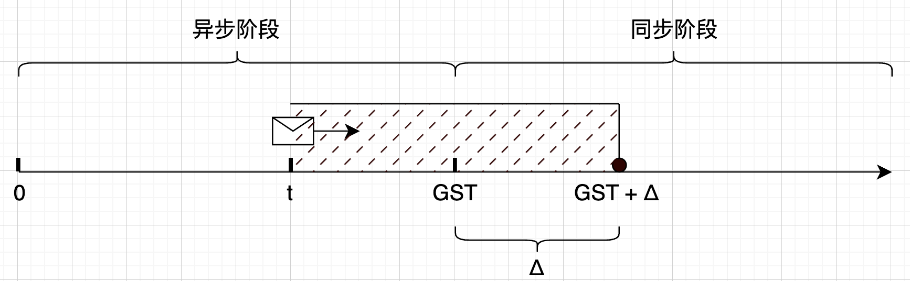

2. （同步阶段发送的消息）如果一个消息在时间步$t$发送，且$t \ge GST$，那么该消息将会在时间步$t + \Delta$或更早的时候被目标接收方收到
   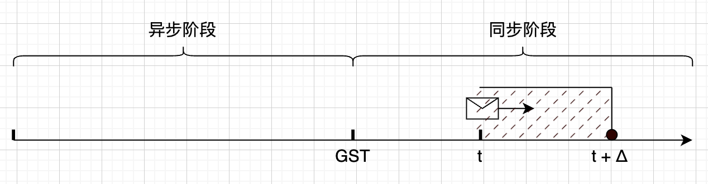

> 注：$t<GST$时，系统处于异步阶段，$t \ge GST$时，系统处于同步阶段。如果消息是在$t=GST$时发出的，那么消息最晚会在$GST+\Delta=t+\Delta$收到。

由于$GST$必须是有限的，因此所有消息最终必然在有限时间内被送达。从这点来看，半同步模型其实是异步模型的一个特例，消息在异步模型和半同步模型都会最终被送达，只是前者可能是无限长时间，后者是有限长时间。因此异步模型是严格意义上更一般化的模型，因为消息送达时间没有定量的约束。

关键在于，$GST$的值对协议来说是未知的。控制消息传递的敌手可以根据协议的行为来“选择”$GST$的具体时间点。也就是说，敌手可以根据协议的设计来延迟$GST$，逼迫系统暴露安全性或活性问题。因此，在协议设计的时候若要提升健壮性，则设计不可依赖$GST$的具体值。

之所以半同步模型在建模的时候让$GST$保持未知，是因为该模型的核心目标就是迫使我们应对现实中不可预知时长的网络中断和攻击。如果$GST$是已知的，那么协议设计可以偷懒，依赖已知的$GST$，这样设计出来的协议难以应对真实的网络状况。另一个理由是，如果$GST$是已知的，那么同步模型中所有可能性结果可以直接照搬过来，协议只需要等到$GST$之后再按照同步模型的协议设计来执行即可，那为何不直接用同步模型呢。

**协议**：后续我们将证明半同步模型的一个不可能性结果，因为我们需要明确定义协议的能力边界，即协议能够做什么，不能够做什么。在异步模型中，协议定义了节点的行为（即选择发送哪些消息），这是一个基于节点当前已知信息的函数，这些已知信息包括私有输入（private input）和到此刻为止节点收到的所有消息之序列。由于半同步模型引入了时间假设，节点的已知信息增加了一些，包括此刻的时间步、每条消息具体在哪个时间步收到的。那么在半同步模型中，一个协议可以定义为基于节点目前已知信息映射到其行为的函数。已知信息包括私有输入、当前的时间步、收到的消息序列以及消息到达的时间步，行为则是选择哪些消息发送以及发送的目的地。与异步模型不同的是，半同步模型中的协议可以实现超时机制（例如忽略那些比预期到达时间晚了很多个时间步的消息）。后续课程我们会讲解Tendermint协议如何利用这一点。

**未知的$\Delta$模型**：半同步模型其实有2个不同的版本，各位或许对此会有点疑惑（这2个版本都是Dwork、Lynch和Stock Meyer定义的）。在本系列课程中，我们只采用$GST$版本的模型。但在其他的地方，你可能会遇到另一个版本的模型，即未知的$\Delta$模型。我们在这里对这个模型做一个简要的介绍。

第二个版本的模型与第四章开头的讨论密切相关。在第四章，我们对同步模型的假设放宽做过粗略的尝试（假设$\Delta = 1$），将其扩展为一个消息延迟可变的模型（延迟在1到一个已知的上限$\Delta$之间）。随后我们注意到，任意一个对$\Delta=1$的模型成立的可能性结果，都可以通过time inflation（时间膨胀）自动推广为一个更一般的情况（$\Delta$是已知的），即所有节点在每次操作之间都固定等待$\Delta$个时间步，以确保来自诚实节点的消息都能及时送达。对此我们并不满意，我们期望的是一个运行速度不受最坏的消息延迟限制，并且能够自适应网速的共识协议。如果底层的通信网络速度是足够快的，那么协议本身也应该匹配这样的网速。这就是第二个版本的半同步模型背后的基本思想。

在未知$\Delta$版本的模型中，没有$GST$假设，也就是没有从异步阶段到同步阶段转换的过程。所有消息都会在$\Delta$个时间步被送达，这点和异步模型一样。与同步模型（以及GST版本的半同步模型）不同的是，这里的参数$\Delta$并不是已知的，因此协议的定义不能依赖$\Delta$。即，无论网速和$\Delta$的值是多少，协议必须在所有同步模型的具体实现中都能正确工作。

**为什么存在两个版本**：这两个版本的半同步模型看起来都很自然。GST版本的建模是以系统宕机或遭受攻击后快速恢复为目标。而未知$\Delta$版本的目标是系统根据任意的网速能够自适应运行。之所以它们都被称为半同步模型，是因为提出partial synchrony概念的原始论文就是将这两个版本都放到了半同步这个概念下。另一个原因是，在其中一个版本的模型中成立的可能性或不可能性结果，通常在另一个版本的模型中也成立。因此，就我们的研究目的而言，这两个版本在效果上大致等价，但形式上不同。作为练习，读者可以尝试在未知$\Delta$的版本下重新构造FLP定理的证明。你当然也可以思考如何改造Tendermint协议，使一致性和活性（$f \le \frac{n}{3}$）在未知$\Delta$版本的模型中也成立。

本系列课程后续不再讨论未知$\Delta$版本的模型。

#### 6.1.4 共识协议的目标 - Goals for a Consensus Protocol

在半同步模型中，我们应该对共识协议提出什么样的要求？例如，达到什么标准或要求后，我们才能认为一个协议在半同步模型中解决了BA问题？回顾第四章的内容，BA问题指的是，对任意节点$i$有私有输入$v_i^* \in V_i$，并且BA协议应当有如下性质：

1. 终止性（Termination）。每个诚实节点$i$最终都会输出$w_i \in V$并停止运行；
2. 一致性（Agreement）。无论私有输入为何，所有诚实节点都会输出同样的值并停止运行；
3. 有效性（Validity）。对任意节点$i$，若$v_i=v^*$，则$w_i=v^*$。

FLP定理告诉我们，在异步模型中，任何一种确定性的共识协议都无法同时满足这三个性质。半同步模型由于对消息投递施加了限制，而异步模型更为一般化，因此FLP定理无法直接适用于半同步模型（在第七章中，我们会学习一个可能性结果，用以说明FLP定理在半同步模型中为何不成立。）。不过我们知道半同步模型中有异步阶段，这个阶段是适用FLP定理的。因此，任何保证在终止时满足有效性和一致性的协议，必然会出现在GST之前无法终止的情况。也就是说，如果协议必须始终满足有效性和一致性，即不容忍安全性错误，那么它就无法在异步阶段保证活性，即一定会终止。同理，对于SMR问题而言，任何始终保证一致性的协议在GST之前也无法保证活性。然而在GST之后，协议就有可能同时实现这两个性质了。在GST后，我们不能仅通过切换到某种适用于同步模型的协议来保证安全性和活性。因为GST是未知的，是可以由敌手控制的，节点无从得知何时切换协议。在设计协议时就要考虑让协议自适应网络变化。

总体而言，我们所能期望的最佳情况大概是：

- 在异步阶段，即GST之前，至少能保证安全性或活性中的一个性质；
- 在同步阶段，即GST之后，同时保证安全性和活性。

那么在异步阶段我们要放弃什么？最自然的选择，也是20世纪关于半同步模型的研究中唯一被探讨过的选择，就是放弃活性，保留安全性。

安全性指的是“坏事永远不会发生”，其中的“永远”可以理解为即便在异步阶段也不应该出错。

活性指的是“好事最终会发生”，其中的“最终”或许可以认为是在GST之后。

许多区块链共识协议采用的正是这两种目标，即始终保证安全性，以及在GST之后实现最终活性，这也是本章和下一章的重点。

不过有一点很有意思，最长链共识机制（第八章）在异步阶段做出了非传统的权衡，即更偏向活性而非安全性。

#### 6.1.5 一个重要定理

在半同步模型中，比如BA问题，在什么条件下才能实现安全性和最终活性（eventual liveness）？这个问题有一个非常明确简洁的答案，也是读者可能在区块链领域经常看到的一个数字，一个神奇的阈值，**33%。**

**定理6.1**：在半同步模型中，当且仅当$f \le \frac{n}{3}$时，存在一个确定性拜占庭协议能同时满足一致性、有效性和最终活性（GST之后）。

这个定理中实际上包含两个结果，一个可能性结果和一个与之相对的不可能性结果。我们着重讲一下不可能性结果，即当$f \ge \frac{n}{3}$时，不存在任何一种拜占庭协议能够同时满足安全性和最终活性。

在第七章中我们会学习Tendermint协议，该协议实际上就是在$f < \frac{n}{3}$时保证了安全性和最终活性。下面是一些注释：

1. Tendermint只是众多在半同步模型下实现最优容错能力的协议之一（比如在原始论文中还有另一种解决方案）。由于Tendermint协议已经被多个主流的区块链协议所采用，因此我们会重点介绍该协议。
2. 定理6.1不依赖于PKI假设。本章我们将要证明的不可能性结果在PKI假设下依然成立，因为拜占庭节点不需要伪造签名也能破坏系统。Tendermint协议是依赖PKI假设的，但同样的正向结果在没有PKI的情况下在另一个协议中也能实现。
3. 与FLP定理一样，这个不可能性结果虽然是针对拜占庭一致性问题提出的，但同样适用于SMR问题。第七章中介绍的Tendermint协议解决的是SMR问题，我们可以通过归约方法构造出一个具备相同容错性的BA协议。
4. 你可以发现分布式计算专家经常把$f \le \frac{n}{3}$写成等价的形式$n \ge 3f+1$。这个不等式在分布式计算领域变成了一个梗……（理工男冷梗，不用管它
5. 每当你听到链圈人或白皮书提到33%这个数字，通常是为了说明协议为什么无法应对更强的攻击，其实就是在引用定理6.1。这是半同步模型下拜占庭协议的理论容错极限，超过这个阈值就不可能保证安全性和活性。
6. 如果你只能从2-7章中记住一个定理，那就记住6.1。它是我们对20世纪共识协议设计和分析研究的总结性成果。

#### 6.1.6 神奇数字33%之不可能性定理的直觉

本节的内容主要是给读者提供一种合理的、准确的直觉解释，说明为什么定理6.1之不可能性结果中的“当且仅当”是正确的。这个直觉性的论证会揭示这个神秘的33%阈值是从哪儿来的，而回过头来看，这个数字会显得像是命中注定的。33%这个数字不是偶然的，而是不可避免的结构性结果。这个非正式的论证非常简洁，你应该能够在脑海中记住很长一段时间。

**消息延迟无上限的作用** 首先，我们讨论一下证明的策略，以及我们期望在论证中想要看到的关键要素。我们在第三章的PSL-FLM不可能性结果在同步模型且无PKI假设的BB问题（Byzantine Broadcast，拜占庭广播）确立了33%这个阈值，因此该阈值并不是在定理6.1中第一次看到。

那么，这些33%的含义是相同的吗？

有没有可能定理6.1可以用某种方式归约到我们曾经费尽心力所证明的PSL-FLM的不可能性结果？也许在容错能力的程度上，同步模型和半同步模型其实没有本质的区别？

实际上，这两个不可能性结果的背后是**完全不同的驱动因素**。要记得的是，PSL-FLM不可能性结果在PKI假设下不成立。在PKI假设下，Dolev-Strong协议解决了BB问题，即便有99%的节点是拜占庭的，该协议也能够满足一致性、有效性和终止性。因此，PSL-FLM的不可能性结果的证明之关键在于其依赖于PKI不存在。这种依赖以一种微妙的方式体现出来，证明中使用了很巧妙的策略构造了拜占庭节点，通过模拟其余四个诚实节点的行为欺骗另外两个节点（六边形思想实验）。这种策略在PKI假设存在的情况下是不可行的，因为它们需要在没有对应私钥的情况下伪造签名，而PKI假设中包含了伪造签名是不可能的假设。

在上一节我们提到过，无论我们是否假设PKI存在，定理6.1都成立。故，第八章中对定理6.1的证明应该不会用到用拜占庭节点模拟诚实节点的策略。而在PSL-FLM的不可能性证明中，这个策略是唯一的一个技巧，因此定理6.1中的33%阈值必然是由其他因素造成的。

考虑到定理6.1的不可能性结果是针对半同步模型的，我们可以推测，这个阈值可能是消息延迟无上限这个潜在威胁带来的。

> 注：在GST之前，消息延迟可以无穷大。敌手可以利用这一点制造网络不确定性，诱导诚实节点在异步阶段做出不同的决策，从而破坏安全性

**直觉1：可合理否认的冷处理策略。**首先，哪怕在同步模型中，为了满足终止性，诚实节点即使没有从任何节点收到消息，也必须输出值并终止。拜占庭节点的一种策略就是对诚实节点进行冷处理（装死），即完全不发送任何消息。由于至多有$f$个节点是拜占庭的，因此诚实节点只能期望从至多$n-f$个节点那里收到消息，从而做出决策（如果一个诚实节点已经收到了$n-f$个节点的消息，那么它不用一直等下去，因为拜占庭节点有可能永远不会发出消息）。

**直觉2：披着羊皮的狼。**由于我们现在讨论的是半同步模型，因此诚实节点若没有收到某些节点的消息，对此也可以有一个同样合理的解释。有可能那些节点实际上是诚实节点，确实发送了所有该发送的消息，只是这些消息被严重延迟了。当然，这种情况只可能发生在GST之前，但GST在什么时候发生是协议不知道的，异步阶段可能持续很长时间。在同步模型中，就不会发生这种事。如果你没有收到某个节点该发送的消息，我们可以断定该节点是拜占庭节点。因此，比较麻烦的是，当一个诚实节点在收到$n-f$个节点的消息后，它必须进行决策。但是，该诚实节点并不知道，有可能这些$n-f$个节点里头，有$f$个实际上是拜占庭节点，而其余节点可能是诚实的，它们发送了消息但被严重延迟，从而导致该节点没有收到这些消息。**诚实节点被迫基于有限的信息做出决策，而它手头的消息有可能主要来自拜占庭节点。**就像披着羊皮的狼一样，这些拜占庭节点可能通过给诚实节点提供错误的信息来误导诚实节点做出决策。比如，拜占庭节点可以假装自己的私有输入是1而不是0。从直觉上看，如果这$n-f$个节点中，至少有一半是拜占庭的，那么诚实节点就无法判断该相信谁。若没有诚实多数节点，任何基于多数投票的机制都可能被拜占庭节点操纵。如果这些节点中有严格多数是诚实的，那么我们就可以寄希望于某种多数投票机制来指引诚实节点做出正确的决策。于是我们可以推断出，$f < \frac{n-f}{2} \Leftrightarrow f < \frac{n}{3}$。

梳理一下神奇阈值33%的推导逻辑：

1. 由于诚实节点必须满足终止性，且拜占庭节点可能永远不会发送任何消息，故一个诚实节点在做出决策前，至多等待$n-f$个节点（包括自己）发送过来的消息；
2. 诚实节点为了防止被欺骗，这$n-f$个节点中必须有严格多数个节点是诚实的，故$f < \frac{n-f}{2}$，即$f < \frac{n}{3}$。

这个非正式的论证揭示了一个关键难点，拜占庭节点与敌手操纵消息投递或形成共谋。拜占庭节点和操纵消息投递的敌手都有能力让$f$个节点长期保持沉默——拜占庭节点可以故意不发送消息，操纵消息投递的敌手可以拖延诚实节点投递的消息，而在诚实节点视角看，结果都是没有收到某些节点的消息，这让诚实节点无法区分那些节点究竟是拜占庭的，还是诚实的（但消息被敌手拖延了，比如可以想象GFW是这样的一个敌手）。

实际上，每个**敌手**有能力挫败2个诚实节点：一种方式是刚才提到的，延迟诚实节点投递的消息，让其他的诚实节点误以为这些节点是拜占庭节点；另一种方式是拜占庭节点发送与某个诚实节点相冲突的消息来抵消该诚实节点的信息对其余诚实节点的决策作用。

> 上一段中的“敌手”包括操纵消息投递的敌手和拜占庭节点，这里我们把敌手的概念泛化为一切有能力对系统造成破坏的对手。有时候我们会混用拜占庭节点和敌手这两个术语，在建模所有类型的攻击对系统造成总体破坏的时候，这两个术语是等价的，在讨论不同类型的破坏策略的时候，这两个术语是有区别的。

我们希望这2个诚实节点被挫败后，至少还剩下一个能正常运行的诚实节点，也就是$(n-f) - 2f > 0$，即$f < \frac{n}{3}$。

其中，$n-f$表示诚实节点在决策前至多能等待$n-f$个节点发送过来的消息，也就是有$n-f$个节点或许是诚实的；（$f$是模型假设的已知的**拜占庭节点**的数量，当然是要扣除的）

由于每个拜占庭节点（这里拜占庭节点的概念等价于敌手）即敌手能让2个诚实节点失效，也就是在$n-f$个节点里面，其中有$2f$个诚实节点可能是失效的（$n-f$是扣除了已知的拜占庭节点的数量，还剩下的节点有可能是诚实节点，但这些节点中，有$2f$个节点可能会被攻击从而失效，也需要扣除）；

我们当然期望拜占庭节点数量和可能会被攻击的诚实节点数量全都扣除后，剩下还能正常运行的诚实节点数量是大于0的，因此得到$(n-f)-2f>0$。

上述是直觉上的解释，我们需要更为严谨的能够令人信服的形式化证明，否则作为一个定理是不严谨的。

#### 6.1.7 定理6.1之不可能性结果的证明

**不可能性命题陈述：**在半同步模型中，无论是否存在PKI假设，对任意$f$和$n$，只要$f \ge \frac{n}{3}$，则不存在任何拜占庭协议能同时满足一致性、有效性和最终终止性。

一个简单但包含所有复杂性的特例：

我们尝试从最简单的情况开始，即$n=3, f=1$。一共有3个节点，其中至多有一个可能是拜占庭节点。

不要觉得这个特例很简单，似乎把不可能性结果的证明平凡化了，读者可以参考PSL-FLM不可能性结果的证明，将下面的论证进行推广并一般化。

证明策略依然是使用反证法。

设$n=3, f=1, V=\{0,1\}$。即有三个节点，Alice（A），Bob（B），Carol（C），其中B为拜占庭节点。假设存在一个确定性的拜占庭协议$\pi$能够在半同步模型中同时满足一致性、有效性和最终终止性。

考虑下述场景：Alice是诚实节点，其私有输入为1；Carol是诚实节点，其私有输入为0；Bob是拜占庭节点，因此不用假设其私有输入。

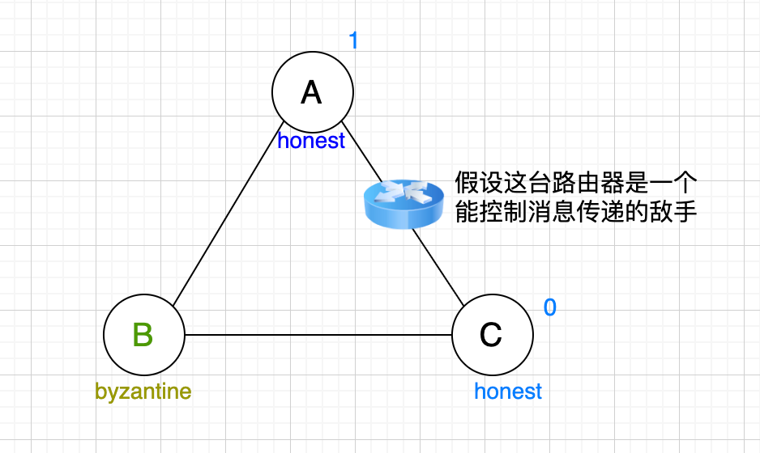

设想B节点采用典型的拜占庭策略，向不同的诚实节点发送不一致的消息，同时又获得了能控制消息投递敌手（那台该死的路由器）的配合，敌手故意拖延A节点和C节点之间的所有消息（在GST之前，消息可以无限延迟）。

B节点在与A节点交互的过程中，假装自己的私有输入是1，并且假装自己从没有收到过C节点的消息；B节点在与C节点交互的过程中，假装自己的私有输入是0，并且假装自己从没有收到过C节点的消息。无论$\pi$协议是否存在PKI假设，B节点都能通过同时运行两个$\pi$协议副本来达到上述目的。

由于在半同步模型中，GST可以大到任意程度，所以敌手有能力任意延长A和C之间的消息投递。

**两难困境**：

从A节点视角看，B节点一直在投递消息给我（有可能是假消息），而C节点一直沉默。A节点很清楚存在这样一种可能：B节点是拜占庭节点，它在用上述策略伪装，而C节点的消息被敌手拖延了。然而，也有可能是，B节点是诚实节点，私有输入就是1，而C节点是拜占庭节点，对A和B保持沉默。为了防止出现这种可能性，由于$\pi$协议满足最终终止性，无论A节点有没有收到C节点的消息，A节点必须在某个有限时间$T_1$之前做出决策。又由于$\pi$协议满足有效性，因此A节点的输出必须为1。

从C节点的视角看，C节点也陷入了同样的困境。同理，C节点也必须在某个有限时间$T_2$之前做出决策，且必须输出0。

**完成证明**：

假设敌手将A和C之间的所有消息延迟到$max(T_1, T_2)+1$（这对敌手来说是可行的，只要它把GST设置得比这个时间更晚即可），这样A和C在做出决策之前就不可能收到对方的消息。

如此一来，A节点会输出1，C节点会输出0。这与$\pi$协议满足一致性的假设矛盾。$\square$

#### 6.1.8 CAP原则 - The CAP Principle

> 注：CAP定理最初是在1999年以CAP principle被发表，在2000年的时候以布鲁尔猜想的形式于PODC会议提出。2002年，MIT的Seth Gilbert和Nancy Lynch已发表了对布鲁尔猜想的证明，从而正式成为定理。但是从数学角度看，这个证明的形式内容略显单薄，或许还不够严谨，因此是否配得上Theorem（定理）还有争议。故，这里我们依然称其为CAP原则。
>
> Gilbert, Seth; Lynch, Nancy (2002). "Brewer's conjecture and the feasibility of consistent, available, partition-tolerant web services". *ACM SIGACT News*. **33** (2). Association for Computing Machinery (ACM): 51–59. 

**CAP原则解释**

CAP原则是分布式系统中一个著名的观察性结论。CAP并不论文作者的首字母组合，而是我们期望分布式系统能够满足的三个性质的首字母组合。

我们先解释CAP：

- C表示consistency，即一致性（不是agreement）。它与SMR中的consistency相同。一致性要求数据库的副本集之间的数据在同一时刻全都保持一致，我们期望用户无论被路由到哪个副本上，执行同一条查询都能获得一样的结果。更一般的，一致性指的是用户在中心化系统和分布式系统上的使用体验是一致的。

- A表示availability，即可用性。类似SMR的liveness，活性。可用性表示，当一个用户在数据库中插入一条数据后，这条数据最终会被写入数据库并且能被查询到。更一般的，可用性指的是客户端在分布式系统中执行的任意命令最终都能被有效执行。
- P表示partition tolerance，即分区容错性。分区指的是网络中两组节点之间的通信长时间中断，比如网络遭受长时间的DDoS攻击。分区容错的意思是，即便出现了网络分区，我们也希望系统依然能够保持一致性和可用性。该性质在概念上与我们定义的半同步模型的异步阶段有些类似：在异步阶段，消息投递延迟可以是任意长的，从诚实节点角度看，这样的延迟与网络通信中断没有区别。但是，要注意二者在建模假设和行为上仍存在重要差异。

CAP原则断言：不存在任何分布式系统能够同时满足以下三种性质：一致性、可用性和分区容错性。

**论证过程**

CAP原则的论证其实很直观。试想一个分布式系统负责维护某个变量`i`的值，此时系统遭遇了网络分区，将网络分成了A组和B组。`i`的初始值是0，此时有一个客户端要更新`i`的值为`1`，客户端连接到了分组A的副本集中并执行了更新命令。

如果A组的副本集执行更新，由于A组和B组的通信中断，那么客户端在A和B中执行查询势必得到不一样的结果，违反一致性。

如果A组的副本集不执行更新，则违反可用性。

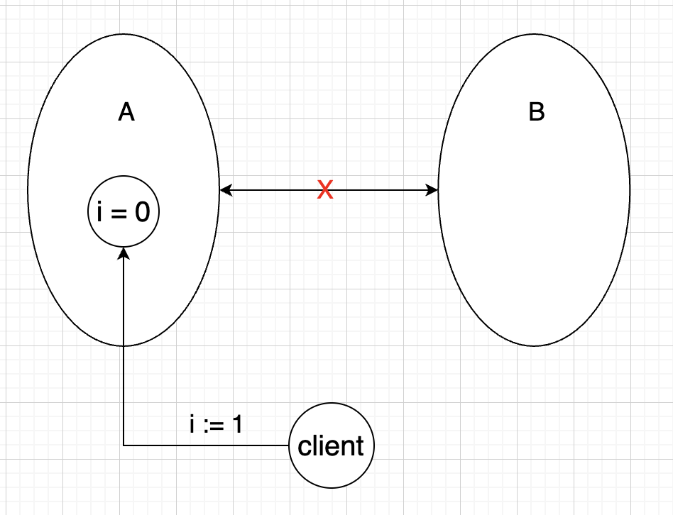

**设计决策树**

上述论证虽然看起来很平淡乏味，但它确实揭示出一种在设计分布式系统时很实用的决策路径：

- 判断你是否需要考虑网络分区，比如系统在开放的互联网环境里运行，就必须考虑，而系统部署在一个安全的私有网络中，则无需考虑；
- 如果不需要考虑，则可以同时要求一致性和可用性，这类似我们在同步模型下对SMR协议同时要求一致性和活性的做法；
- 如果必须考虑，那么需要评估应用场景，在一致性和可用性中做出权衡，如果出现了网络分区，牺牲哪个性质是可以接受的；

对于不同的应用场景，我们的决策是不同的。比如：

- 像银行这样的系统更倾向于牺牲可用性来保证一致性。这正是传统数据库做出的折中方案，相比于系统宕机24小时，账户余额不一致造成的经济损失是更无法忍受的；
- 类似搜索引擎这样的系统，往往更注重可用性，而一致性要求可以放宽一些（比如一些NoSQL数据库所采用的设计），在不同地理位置的用户看到的搜索结果会略有差异，但这点是相对可接受的，而宕机造成的损失则更大。

我们回到区块链协议设计中来，我们在接下来的两讲中看到类似的二选一：

- 一类SMR协议在受到攻击（半同步模型的异步阶段）时选择牺牲活性，例如Tendermint协议；
- 另一类协议更倾向于牺牲一致性，选择维持系统活性，例如最长链共识。

#### 6.1.9 FLP不可能性定理 V.S. CAP原则

CAP原则的结论与FLP定理很类似，在遭受网络攻击（异步阶段/网络分区）时，你必须在安全性/一致性  和  活性/可用性  之间做出选择。奇怪的是，你应该不太可能在同一门课程中同时学到FLP定理和CAP原则，前者是分布式计算理论课程里的内容，后者是分布式系统设计的内容。一个偏形式理论，一个偏系统工程。但任何区块链专家都应该清楚这两个定理/原则，并理解它们之间的区别。FLP定理的证明是困难的，而CAP原则的推理很简单。

CAP推理之所以简单，是因为它的设置允许两个分区的消息被无限延迟甚至丢弃，没有最终可达性约束，更没有GST。也就是说，在CAP中，控制消息传递的敌手的能力比FLP更强，这种额外的能力使得CAP的不可能性结论更容易推理。FLP不可能性定理则表明，即便敌手被强制要求最终必须投递所有消息，安全性和活性依然不可兼得。而在敌手能力相对较弱的前提下，证明这种不可能性就要困难得多。但从另一个维度上看，FLP模型中的敌手其实比CAP更强。在CAP中，敌手只能制造网络分区，而在FLP中，敌手可以做任何事情。但话又说回来，网络分区是一种经典的攻击，它已经能够涵盖大多数敌手的攻击策略。在CAP中，控制消息投递的敌手过于强大以至于我们无需再假设其他敌手的存在。换句话说，即便系统中所有节点都是诚实的，即$f=0$，CAP原则依然成立。相比之下，FLP定理在$f=0$的情况下就无法成立了，FLP需要至少一个故障节点才能成立。

再换句话说（感觉Prof.有时候废话有点多…）FLP真正揭示的是，哪怕存在只有一个节点宕机的威胁，也足以触发与无限延迟相同的结论，即在系统遭受攻击时，你必须在安全性和活性之间二选一。

