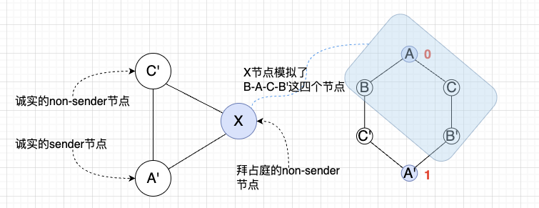

# 区块链基础

Foundations of Blockchains课程（*by Prof. Tim Roughgarden*）笔记

**本课程适合有计算机科学基础的读者，读者需具备编程能力，学习过基础的数据结构与算法、操作系统原理、计算机网络以及具备基本的分布式系统知识。*

**本课程不涉及具体的工程代码，而是专注于区块链技术本身的底层原理和系统分析。*

*\*本笔记定有遗漏错误之处，请务必观看视频教程和教授编写的笔记（下述每个章节的开头都有笔记链接），并阅读相关文献（**一定不能跳过文献阅读**）*

课程视频资源（https://youtube.com/playlist?list=PLEGCF-WLh2RLOHv_xUGLqRts_9JxrckiA&si=OZF0s4r9lsS4ejXz）：

<iframe width="560" height="315" src="https://www.youtube.com/embed/videoseries?si=5TihoCNFvfO7pD73&amp;list=PLEGCF-WLh2RLOHv_xUGLqRts_9JxrckiA" title="YouTube video player" frameborder="0" allow="accelerometer; autoplay; clipboard-write; encrypted-media; gyroscope; picture-in-picture; web-share" referrerpolicy="strict-origin-when-cross-origin" allowfullscreen></iframe>

## 0 术语表与阅读材料

### 0.1 术语和缩略表

$f$ : fault 错误的，拜占庭的；

$fn$ : fault node 拜占庭节点；

$s$ : sender 发送者；

$sn$:  sender node 发送者节点；

$ns$ : non-sender 非发送者节点；

$fns$ : fault non-sender 拜占庭的非发送节点；

$h$: honest 诚实的；

$hn$: honest node 诚实节点；

$hs$: honest sender 诚实的发送者；

$hns$: honest non-sender 诚实的非发送者；

### 0.2 阅读材料

**James R. Lee.** (2024). *Chapter 3: Byzantine Broadcast and the Dolev-Strong Protocol.* Course notes, CSE 422, University of Washington. https://homes.cs.washington.edu/~jrl/cse422wi24/notes/blockchain_3.pdf

**M. Pease, R. Shostak, L. Lamport.** (1983). *Reaching Agreement in the Presence of Faults.* Journal of the ACM (JACM), 27(2), 228-234.

**M. J. Fischer, N. A. Lynch, M. S. Paterson**. (1985). *Impossibility of distributed consensus with one faulty process*. Journal of the ACM (JACM), 32(2), 374-382.

## 1 引论

Lecture 1 原版笔记链接：https://timroughgarden.github.io/fob21/l/l1.pdf

Lecture 1 原版PPT链接：https://timroughgarden.github.io/fob21/slides/F21L1.pdf

### 1.1 课程概要

#### 1.1.1 区块链栈 - Blockchain stack

以下stack并不是行业中所讨论的标准化的stack，而是Prof.自己总结的为了方便讲课和理解区块链原理使用的stack。

笔者补充：

L1层是区块链系统最重要的一层。我们都知道区块链是一个分布式账本（distributed ledger），之所以称为账本，是因为作为区块链的第一个成功的应用系统——比特币系统，其区块链中记录的信息是UTXO交易信息，也就是账本。后来，我们将区块链的概念进行了延伸和拓展，从结构上看区块链，实际上它是一个使用哈希值作为reference的链表，是一种数据结构。

因此，这个数据结构中具体记录什么样的数据其实都是可以的，并不一定非要记账，也可以是其他的数据。***因此，区块链不再只是账本！***这个数据结构有一个特点，具有不可篡改性，因为数据在被编码为区块的时候，添加了数据本身的哈希信息。也因此，我们将过去的这些数据的历史，称为history，即数据历史，也就是旧版本的数据。区块链系统作为一个分布式系统，为了查询和写入当前版本的数据，并且为了保证数据的确定性、可验证性，我们可以使用状态机（State Machine)来达成这些目的。

作为一个分布式系统，区块链要解决系统可靠性问题，很容易想到使用副本的架构。而状态机很容易应用到副本架构上，也就是State Machine Replication。

因此，**区块链系统可以等价于状态机+不可篡改的数据历史（或者说append-only log）+共识机制**

| 区块链元素             | 状态机中的角色                    |
| ---------------------- | --------------------------------- |
| 全网的一致账本（链）   | 状态转移历史的全记录（日志）      |
| 区块中的交易           | 输入（commands / inputs）         |
| 区块链节点的状态       | 状态机的状态                      |
| 执行交易生成的新状态   | 状态转移函数的输出（`new_state`） |
| 共识算法（如PoW、PoS） | 保证状态机在多个副本间的一致性    |

SMR带来的问题是，我们如何确保整个系统最终所有节点在有限的时间内能够输出同一个确定的值？如何防止不同的节点输出的值是不同的？由于区块链系统是一个公开的系统，所有人都可以参与进来，难免存在一些恶意节点故意对系统进行攻击，那么如何防止其他的好的节点被欺骗从而输出一个与其他节点不同的值，从而造成系统崩溃？这些都是SMR问题，也就是本课程着重需要讲解和讨论的问题。这些问题可以归结为2个基本问题：如何保证SMR系统的一致性（consistency）和活性（liveness）。解决这些问题的机制，我们称为**共识机制**，将这个机制写成的每个节点都运行的分布式程序称为**共识协议**。共识协议往往是**事件驱动**的代码。

### 1.2 课程大纲 - Outline

**Layer 0会被忽略**，该课程假设读者学习过计算机网络课程，L0是计网的内容。

- L1的内容占本课程的60%，包括：
  - 经典共识协议 - 1980s的共识协议，即permissioned consensus protocols（有许可共识协议，即需要ACL的共识协议）
    - 中本聪的最长链共识协议，即longest-chain consensus，也就是比特币所使用的共识协议
    - 如何转向为permissionless consensus protocol（免许可共识协议，即无需ACL的共识协议）
      - 即如何抵抗女巫攻击（sybil-resistance），策略包括Proof of Work & Proof of Stake
        - 网络难度调整，自私挖矿
        - 设计免许可共识协议的基本原则
        - 深入分析比特币的协议和以太坊的协议
- L2的内容占本课程的20%，包括：
  - 如何通过payments channels扩展比特币网络，即闪电网络（lightning network）
  - 如何通过roll-up策略扩展以太坊
  - 下一代的L1协议，其性能已经足够高，可以无需L2
- 应用层的内容占本课程的20%，包括：
  - DeFi原语（primitives），包括预言机 即 oracles，稳定币 即 stablecoins 等设计
    - 基于DeFi原语之上构建的DeFi应用，包括借贷、自动做市商（AMM）的交易系统
    - MEV 即 Maximal Extractable Value，最大可提取价值，指的是通过在区块中添加和排除交易并更改区块中的交易顺序，可以从区块生产中提取的超过标准区块奖励和燃料费用的最大值来获得收益
    - DAO 即 Decentralized Autonomous Organization，去中心化自治组织，是链上治理的一种组织，通过去中心化方式对链的变更进行投票并决策

**Prof.对本课程的注解**

1. 在本课程中，***区块链无关于支付和虚拟货币***，本课程专注于将区块链作为一种全新的计算范式（computing paradigm）来看待。想象一个云上计算机/计算资源，不属于任何一个特定的人或组织，而是属于全球成千上万的民众，需要为计算资源付费但无需任何额外的许可；
2. 在本课程中，区块链无关于数字货币，本课程将专注于把区块链作为实现permissionless programmable computer作为首要目标，数字货币只是实现这个目标的一种手段或副作用；之所以需要数字货币，是为了解决实现这个目标的过程中可能出现的2个问题：
   1. 计算需求超过计算机可提供的容量时，需要使用付费的手段进行限制以防滥用，而数字货币作为这个计算机的原生货币是最为简便的支付手段
   2. 计算机的运行需要对节点进行激励才可持续，同样的，数字货币作为这个计算机的原生货币是实现permissionless最为简便的激励方式
3. 本课程专注于讨论协议的设计原则，而不是具体协议

### 1.3 数字签名方案 - Digital Signature Scheme

**为什么需要共识（consensus）？**

非正式的解释是，共识是为了维持很多机器（即节点）对history保持同步，即使面对不可靠的网络和恶意攻击，keep multiple machines(nodes) in sync, even in the face of an unreliable network, malicious attacks.

在构建共识协议之前，需要一些**持久假设（permanent assumption）**：

- 互联网一直存在，即，存在一个半可靠的机制使得不可信节点之间的点对点通讯是可能的；
- 密码学一直存在，即，存在数字签名方案和密码学哈希算法可供节点使用。

**什么是数字签名方案（DSS）？**

数字签名方案由三种高效的算法构成：

- 密钥生成算法（key generation algorithm），将 一个随机种子（random seed）映射为 公钥-私钥 密钥对（(pk, sk) pair）
- 签名算法（signature algorithm），将 消息+私钥 映射为 消息+签名，以供验证算法进行验证
- 签名验证算法（verification algorithm），将 消息+签名+公钥 映射为 "yes"/"no"(或者"accept"/"reject")，以表示给定消息所属签名的真伪

注：从数字签名算法可知，不同的消息会产生不同的签名，这点和物理世界中用笔签名很不一样

本系列课程**对于签名的一个假设**：

签名是理想的，即攻击者几乎没有可能获取私钥，也就不可能对某个消息生成伪造签名

在现实中，只要秘钥的长度足够长，那么这个假设几乎是正确的。但理论上，这个假设是错误的，至少使用暴力破解/枚举的手段在理论上是可以不断尝试并获取到私钥的。密码学能做的是让这种破解手段需要付出的代价和成本远高于破解后的收益，从博弈论和经济学角度出发，这样做是不符合经济人假设的，即不划算的，也就让信息保护得以可能。例如，秘钥长度足够的情况下，使得使用枚举方法在现如今和可预见的未来几十年中人类所拥有的计算能力需要上万年甚至上亿年才能枚举完成，这就成了几乎不可能的破解任务。同时，需要确保DSS的三种算法是高效的，这样才有实用价值，并且从另一个维度提升安全性——人们可以不断的更替秘钥，并且在被破解之前就能高效实用验证算法进行验证，否则该方案就是不安全的。另一种更为聪明的方法是通过逆向工程的方法进行破解，效率更高，将指数级别的复杂度降低到线性，能够通过这种方式被破解的密码学算法同样是不安全的。

区块链常用的密码学算法是离散对数算法，该算法/难题可以假设无法找到一个有效的逆向工程算法通过消息+签名来得到秘钥。关于离散对数算法的细节，请参考《密码学原理与实践（第三版）》，Douglas R. Stinson著。

### 1.4 状态机复制问题 - The SMR Problem

为了在后续课程中讨论共识协议的正确性，需要介绍一些概念和问题。这里先介绍SMR - State Machine Replication，即状态机复制。

状态机是CS中已经学习过的概念，这里不再赘述。Replication（复制/副本）的概念，在DevOps和软件工程实践中也是基础概念，有过工作经验的软件工程师应当熟知，因此这里也不再赘述（例如数据库副本集，多实例数据库冗余机制等）。

我们知道，副本集/多实例冗余的问题在于，如何保持副本之间的同步，并且确定某一个共同的状态，亦即共识？

区块链系统是一个分布式系统，同样需要replication以保证系统的可靠性。区块链系统和数据库系统不一样的地方在于，数据库系统通常是一家公司所掌控的，公司对数据库拥有绝对权力，当然也包括副本，因此内部作恶的情况和概率相比于区块链这样的完全开放式的系统要小得多。区块链系统是public的，其replication需要面对public的攻击，如有利可图即存在作恶节点的可能性。那么如何保证区块链系统的大多数节点的状态是一致、真实、未篡改并且可靠的？这就是SMR问题。

我们对SMR问题的描述再详细一点：

区块链系统中，可以大致范围两类角色——

- 一类是**全节点**，即服务提供者，提供计算、数据存储服务，全节点之间会使用正确的顺序（order）同步最新的仅追加数据（append-only data，亦可称其为history），或者叫做状态（state，亦即数据），或者叫做transaction（可翻译成交易或事务，缩写为tx）
- 另一类是**客户端节点**，它们希望从全节点上获取自己想要的数据或者写入数据，亦即提交tx。

例如，有全节点A、B和C。Alice在A节点上提交了一个tx，转账5个数字货币给Bob，然后再转账1个数字货币给Tim。那么，Alice的本地节点会产生2个tx，顺序是：prefix tx-(N) => tx-(N+1)(5 to Bob) => tx-(N+2)(1 to Tim)。这个tx会提交给A节点，A节点上的区块顺序也必须是prefix tx-(N) => tx-(N+1)(5 to Bob) => tx-(N+2)(1 to Tim)，A节点将新的两个tx同步给B和C，B和C上的区块链也是按照同样的顺序将区块添加入链中。如何做到这一点，便是SMR问题。

一般的，我们使用一种叫做协议（protocol，更准确的说，是分布式协议，即distributed protocol）的解决方案来达成这个目的。

协议，即在每个节点上都会运行的基于事件驱动的代码，这段代码会在本地进行运算，可以从别的节点接收新的消息，发送新的消息给别的节点，根据消息做出一些动作，例如改变状态，亦即往区块链中添加新的tx。

这样的协议的需要达成下述2个目标，可称其解决了SMR问题：

1. 使系统具备**安全性（safety properties）**，即坏事不会发生。在区块链系统中，这样的安全属性即一致性（consistency），指的是所有节点都保持history的同步（包括tx数据和顺序的一致），允许少部分节点有所延迟，但延迟节点的history必须是其他节点的前驱（prefix），也就是不能出现数据篡改；
2. 使系统具备**活性（liveness properties）**，即好事一定发生。在区块链系统中，这样的活性属性指的是节点在限定时间内必须完成对合法tx在链上的添加动作，业界称为出块。若非如此，这个系统就失去了作用，tx没有被入链，那么对用户来说系统就不可用了。 

## 2 经典共识协议

Lecture 2 原版笔记链接：https://timroughgarden.github.io/fob21/l/l2.pdf

Lecture 2 原本PPT链接：https://timroughgarden.github.io/fob21/slides/F21L1.pdf

第2章课程大纲：

- Synchronous model. Dolev-strong protocol.
- Asynchrounous model. Definition.  FLP impossibility.
- The partially synchronous model. Need 67% honest nodes. The CAP Theorem.
- The Tendermint(BFT type) protocol and its **provable guarantees(consistency + eventaul liveness)**

### 2.1 四个基本假设

为后续讲解同步模型中基于Dolve-Strong协议的拜占庭广播(Byzantine Broadcast in the Synchronous Model via the Dolve-Strong Protocol)做准备，需要设置一些假设。

基于上述的SMR问题，为了使问题先简单化，然后逐渐一般化，我们可以引入**四个假设**先解决核心问题，再逐一放宽（relax），引入更多解决方案使得假设被放宽后协议依然有效。

**假设1**：假设系统工作在许可环境中（permissioned setting），即假设有一个节点集合，该集合内的节点元素是运行协议的固定且已知的节点，表示为$N = \{1, 2, ..., n\}$，这些节点的IP地址也是已知的。许可环境指的是节点需要许可才能加入网络，相对的，permissionless即免许可，指的是任意一个节点无需许可即可加入网络。

**假设2**：假设PKI（public key infrastructure，公钥基础设施）存在，即每个节点$i$有公私密钥对，对于每个节点而言，PKI是已知的，节点可以通过PKI生成密钥对，并且每个节点已知其他节点的公钥以验证签名（即假设每个节点的公钥已经正确分发给其他所有节点）。

**假设3**：同步假设（synchronous），有两个子假设：

- 所有节点都共享一个全局时钟，假设时钟间隔（interval）为$1$秒，那么时钟序列则为$0,1,2,3,...$
- 所有在时刻$t$发送的消息都会在时刻$t+interval$到达，按照上一个子假设$interval=1$，则消息会在$t+1$时刻到达

**假设4**：所有节点都是诚实节点（honest nodes）。诚实在这里指的是，节点正确、无bug且无偏差、如预期地运行协议，与意图无关，诚实与否指的是节点的行为

### 2.2 SMR归约到拜占庭广播

(SMR Reduces to Byzantine Broadcast)

注：reduces to即“归约到”是可计算性理论和计算复杂性理论中的术语。指的是，如果存在能有效解决问题B的算法，也可以作为解决问题A的子程序，则将问题A称为“可归约”到问题B，因此求解A不会比求解B更困难，写作$A \leq_{m} B$，其中$m$表示映射缩小。

在这里，reduces to的具体含义是，解决拜占庭广播的协议可以作为构建状态机复制协议的构件块。

#### 2.2.1 Solution via Round-Robin Leaders

领导者模型（Leader）是分布式系统的共识协议中（例如Raft）常用的协调节点共识的方式。通常是通过某一种算法选举出领导者角色对整个系统的决策过程进行协调，例如领导者可以提议新的操作或值、协调其他节点对提议进行投票，最终决定哪些操作被提交（达成一致），使决策流程更集中化。

轮询算法（Round-Robin）是一种简单的调度算法，它将处理机会或资源按顺序分配给每个参与者。每个参与者在被轮到时获得一个固定的时间片或处理机会，然后轮到下一个，如此往复。

Round-Robin Leader将二者结合起来，系统中的所有节点按照预先确定的顺序轮流担任领导者，例如在2.1节之假设下，我们设定$t\ mod\ n$为领导者。其基本思想是：

- 该领导者会通过某种算法<u>**对已知的未入链的tx进行排序**</u>，包括客户端刚发来的tx和其他节点同步过来的tx，然后得到一个pending tx list即待处理tx列表。然后将这个列表发送给其他所有的节点，这个列表可以以“区块”即block的结构来表示。需要反复强调的是，<u>**这些tx是有序的（ordered）**</u>，因此从区块链的视角看，**<u>区块内部包含的tx是有序列表</u>**。当然列表可能是空的，如果没有在一个time step中收到任何tx的话。
- 当节点接收到最新的领导者发送过来的tx有序列表（也可以说是区块block）时，将其添加到本地history的末尾，即append操作。

上述解决方案同时满足了一致性要求和活性要求。之所以满足一致性要求，是因为在上述协议中，所有节点都完全同步运行（operate in lock step），领导者会发送完全一样的列表给所有节点，而所有节点也会将同一个列表添加到本地history的末尾。根据归纳推理可知，最后的结果是所有节点的状态是一致的。之所以满足活性要求，是因为每个节点都最终会成为领导者，并将已知的tx添加到history中。

#### 2.2.2 拜占庭节点/故障节点

然后我们开始尝试逐一放宽假设，先从第四个假设开始，即假设所有节点都是诚实节点——这显然是不可能的。

要强调的是，诚实指的不是意图，而是行为（我们很难甚至无法判断意图，并且在协议中，采用结果论更加具有可实践性，因此意图不重要，行为结果更重要）。一个节点如果掉线了，从而无法及时参与区块的同步，也会被认为不是一个诚实节点。一个节点如果因为代码bug导致无法正常工作，也是不诚实节点。更何况很有可能存在故意的恶意节点攻击网络。因此，所有节点都是诚实节点是一个不可能假设。**<u>只要是节点无法正确、无bug且无偏差、如预期地运行协议，都算作不诚实节点。</u>**

**Faulty node** 即 **故障节点** 定义为：一个节点如果是不诚实的，那么它就是故障节点。

这里介绍一些常见的故障节点类型：

1. crash fault 即 崩溃故障，定义为一个节点原先是诚实的，直到出现了一些故障时间，然后完全停止参与协议——不发送、不接收消息。例如服务器宕机；
2. mission fault 即 任务故障，定义为一个节点没有发送它应该要发送的消息；可能是故意的也可能是无意的，但从结果上来说，这样的节点就是一个故障节点，也是不诚实节点；任务故障可能比崩溃故障更为严重，因为当故障节点是leader时，它不发送应该要发送的tx区块，其他的节点会认为在这个time step中，没有新的tx产生，于是开始了下一个time step，这会导致历史错乱，违背一致性；
3. Byzantine fault 即 拜占庭错误，这里不对拜占庭错误做假设，因为拜占庭错误节点可能做出任何一种对系统造成破坏的行为（这里依然假设密码学存在，并且节点无法破解密码）；作为故意攻击者的拜占庭节点比较典型的策略是，通过行为不一致来破坏系统，例如将一些消息给一些节点，再将另一些不一样的消息给其他的节点（可能是错漏的消息），让系统造成混乱和history不一致

注：在下述笔记中，我们可以采用“故障节点”（$fn$）这个术语描述包含上述所有故障类型的节点。又因为拜占庭节点的行为是任意的，包括崩溃故障和任务故障，且协议的研究关注的是行为结果而不是意图，**可以认为“拜占庭节点”这个术语和“故障节点”在协议研究的上下文中是等价的**。

**我们将假设4放宽，设定新的假设4**。为了设定新的假设，需要引入参数$f$，且$0 \leq f \leq n, f \in N$，$f$表示系统能忍受的故障节点的最大数量。即，如果故障节点数量超过$f$，那么系统会失效。

**新假设4：已知参数$f$，拜占庭节点的数量$\leq f$，其余$\geq n-f$个节点是诚实节点。**

在该假设下，Round-Robin Leader协议明显无法满足一致性要求，因此需要一个新的协议。

#### 2.2.3 拜占庭广播问题

(The Byzantine Broadcast Problem)

如果$f \geq 1$，也就是出现了1个以上的拜占庭节点，那么在Round-Robin Leader协议中，当拜占庭节点变成领导者时，它给一些节点发送一些tx，给另一些节点发送完全不一样的tx，诚实节点由于被欺骗导致系统的history一致性被破坏了，造成了混乱。

思考：如果坚持使用轮换领导者的方式达成一致性要求，要做出哪些改动？

我们提出一个解决方案称为**拜占庭广播协议 即 Byzantine Broadcast Protocol**（BB）来解决这个问题，该协议作为subroutine被加入到Round-Robin Leaders Protocol。

在BB中：

- 协议（所有节点）已知有一个节点为被指定的**发送节点 即 designated sender**，简称为**发送者 即 sender**
- 发送者有一个私有输入（private input）$v^{*} \in V$，其中，$v^{*}$表示发送者的所有待处理tx有序列表（即已对tx进行排序），$V$表示发送者的所有待处理tx的顺序组合的集合

我们的目标依然是，协议必须使存在$f$个拜占庭节点的网络满足两个基本要求（基本性质），即安全性（safe property/consistency）和活性（liveness property）。

具体的，在BB中，两个基本要求对应这样三个目标：

1. **终止性（termination）**，即每个诚实节点最终会在某个时刻**终止运行协议**并根据已有信息**猜测$v_{i} \in V$**；

   termination是为了保证节点不会无限制的等待下去，而应该在一个时刻终止运行，否则网络中会出现无休止的通信或状态更改导致系统不稳定、共识无法收敛，也就是不诚实行为。并且，诚实节点需要根据自己已获得的信息（例如已获得的tx列表），根据某种规则，输出一个$v_{i}$的值，这个值应当与$v^*$一致；

2. **意见一致性（agreement）**，即所有诚实节点选择同样的$v_{i}$，即对$v_i$这个值**保持一致意见（$v_i$不一定等于$v^*$）**，或者说所有诚实节点对$v_i$的值达成一致；

   中文虽然都叫作一致性，但agreement和前文提到的consistency是不同的。agreement指的是诚实节点对$v_i$值达成了一致的共识，从而避免拜占庭节点故意混淆$v^*$值（注意：当$s$节点是$f$的，此时的$v^*$不一定是$truth$）。consistency指的数据在多个replication以及不同时间点上的状态是否保持一致，是一个跨时间的持久属性。agreement保证了安全性，也就是即便网络中存在$f$个拜占庭节点，诚实节点被其混淆真理（真正的$v^*$值）这种坏事不会发生；

3. **有效性（validity）**，即如果发送者是诚实的，那么所有诚实节点所输出的**$v_i = v^*$**。

   如果发送者是诚实的，那么即便存在$f$个拜占庭节点，根据设定好的规则，诚实节点应当能够输出$v_i = v^*$，使得发送者的私有输入（private input，即$v^*$）能够被有 效传播，并避免被拜占庭节点混淆。但是，当sender是拜占庭节点时，由于诚实节点依然能够输出$v_i=v^*$，此时即便$v^*$不再是$truth$，也依然认为有效性成立。**当且仅当发送者是诚实的，其private input才是$truth$。**

上述三个目标只能对诚实节点作要求，自然的，我们无法要求/约束拜占庭节点的行为，因为这些节点是不受控的；

在实践中，仅仅满足其中两个目标是相对容易的，同时满足三个目标，特别是2和3，是困难的。但若非如此，协议就无法达成SMR的目标。因此，拜占庭广播问题的核心在于设计一个非平凡协议（non-trivial protocol），能够同时满足终止性、意见一致性和有效性，即使网络中存在拜占庭节点，也能可靠地传递信息。

#### 2.2.4 将SMR归约到拜占庭广播

在2.1的四个基本假设的前提下，我们在2.2.2中放宽了假设4。那么，基于2.1的假设1~3以及2.2.2的新假设4，可以将拜占庭广播协议作为子程序插入到Round-Robin Leaders协议中。SMR可以归约到新协议，且有如下步骤：

SMR协议（给定BB作为子程序）：

1. 所有节点轮换成为leader节点（例如使用round-robin算法进行轮换）；
2. 给定leader节点（亦即BB协议的sender节点）和time step，运行BB协议，所有诚实节点得出共识，即一个tx列表$L$；
3. 每个节点将$L$添加到本地历史（local history）的末尾，亦即将最新区块添加到本地的区块链的末尾。

归约证明：

- BB agreement满足SMR的一致性要求（consistency）亦即安全性
- BB validity满足SMR的活性要求（liveness）

### 2.3 拜占庭广播的简单协议

#### 2.3.1 直觉分析：以f=1为例（$n\ge4$）

假设存在1个拜占庭节点，那么诚实节点就需要交叉比对信息，以确定哪个是真实的sender发送的信息。

我们可以构建这样一个协议：

注1：协议指的是诚实节点为了达成SMR/拜占庭广播协议的要求（一致性、活性 或 终止性、意见一致性、有效性）所需要做的事情）；

注2：同样的，该协议基于四个基本假设和新假设4

**t=0：**（t即time step，时间步，下同） 发送者将$v^*$发送给所有节点（假设发送者总是会对消息进行签名）

**t=1：**所有非发送者的节点将从发送者那里接收到的消息转发给其他所有节点（假设每个节点发送消息都会对消息进行签名）

**t=2：**有3种情况：

- 如果我是发送者，那么直接输出$v^*$
- 如果我是非发送者的诚实节点，并且只收到过一种$v$，那么直接输出$v$
- 如果我是非发送者的诚实节点，收到过2种以上的$v_1, v_2, ...$，那么每个节点$i$通过投票的方式，选出得票最多的$v_i$（有$\le 1$的选票来源于发送者，有$\le n-2$的选票来源于非发送者节点）：
  - 如果有$\ge2$个$v_i$得票相同，且票数是最大值，那么需要设置额外的规则，使诚实节点遵守终止性和意见一致性。例如将得票相同的$v_i$按字母大小排序，小的优先，然后输出$v_i$；
  - 输出$v_i$

如此，该协议即满足拜占庭协议的三个要求，终止性、意见一致性、有效性。

下面来分析这个协议（假设$f=1, n=4$）：

1. 当sender是非拜占庭节点时
   1. $t=0$时，sender向每个节点发送$v^*$，那么每个节点都收到了1次$v^*$
      在任意诚实节点上，记$C_{v^*}=1$（C表示Count）；
   2. $t=1$时，非sender向每个节点echo收到的msg，此时诚实节点会发送$v^*$，拜占庭节点会发送$v^b$
      在任意诚实节点上，记$C_{v^*}=1+(n-3)=n-2, C_{v^b}=1$；
      上述$n-3$指的是$n-f(=1)-sender(=1)-self(=1)=n-3$；
   3. $t=2$时，每个节点对$v^i$进行投票；sender对$v^*$投1票，诚实节点选取$Max(C_{v^i})$来投票，结果是投给$v^*$，一共有2个诚实节点，因此$v^*$得到3票即$n-1$票，而$v^b$得到1票即$f$票；
2. 当sender是拜占庭节点时，协议依然满足agreement和validity，**因为validity不对此情况做$v^*$必须是$truth$的要求**，因此只要所有节点最终都能达成共识，在有限的time step里输出共同的值即可。

#### 2.3.2 $f=2$时的反例

注：当系统中存在2个以上拜占庭节点时，必须要考虑这2个节点会共同密谋破坏系统的情况。

**命题**：上述拜占庭广播协议在$f=2$时不满足agreement要求。

**证明：**

假设有$n=2k(k \in N^*)$个节点，其中有2个节点为拜占庭节点（以下简称$f$节点），其中1个$f$节点为sender节点（以下简称$s$节点），另一个$f$节点为非sender节点（以下简称$ns$节点），其余$n-2$个节点为诚实节点（以下简称$h$节点），拜占庭sender节点以下简称$fs$节点，拜占庭非sender节点以下简称$fns$节点。

将$n-2$个节点分成2组，每组有$\frac{n}{2} - 1$个$ns$节点；

如图，$t=0$时：

- $fs$节点向除了$fns$节点外的其余一半节点发送$v^*=0$，另一半节点发送$v^*=1$
- $fs$节点向$fns$节点发送$v^*=0$和$v^*=1$，由于该$ns$节点是$f$的，该节点会同时留存这两个签名过的值

$t=1$时：

- 除$fns$节点外，一半的$ns$节点会向其余节点echo $v^*=0$，另一半则echo $v^*=1$
- $fns$节点模仿$fs$节点的操作，将$v^*=0$ echo 给一半的$ns$节点，将$v^*=1$ echo 给另一半的$ns$节点

$t=2$时：

- 除$fns$节点外，一半的$ns$节点会投票并输出$v^*=0$，另一半则投票并输出$v^*=1$

如此，系统违反了agreement，即意见一致性。$\square$

**要点：**

1. 要注意的是，拜占庭节点可以通过互相密谋破坏系统；
2. 即便有一些协议碰巧是正确的，但证明其正确性是困难的，因为拜占庭节点的策略空间异常丰富，要排除所有的策略才能得证；
3. 从上述反例可以看出，只进行一轮的交叉检查是不够的，因此我们引入Dolev-Strong协议

### 2.4 Dolev-Strong协议

注：Dolev-Strong协议不是现实世界中的好协议，因为它基于同步模型，并且速度很慢。但出于教学目的，我们需要一步一步训练对于协议良好设计的直觉。因此一下子就开始讲解复杂协议不是个好主意，对Dolev-Strong协议的学习在本课程中是出于教学目的。

基本思想：Dolev-Strong协议的目标依然是确保所有诚实节点在存在$f$节点（特别是存在$fs$节点和$fns$节点，且它们共同密谋的情况）时依然能够达成agreement。$ns$节点会寻找$s$节点是$f$的证据，互相交叉比对各自的notes，notes中包含了发送者的签名，经比对，若发现不同的msg的第一个签名来自同一个私钥，即$s$节点发送了不一致的msg，则认为该私钥的持有者是$f$节点，因此找出$f$节点是相对容易的。如果发现msg是$f$节点发出的，那么$h$节点不再关心validity和sender的private input，而是直接输出一个默认的$v$，例如空交易列表。

#### 2.4.1 协议定义

对于确认值$v$是有效的定义（Def. of convinced of value $v$ at time $t$）：

当且仅当消息满足下述三个性质时，节点$i$在时间步$t$可以确认值$v$是有效的：

- 消息中包含对值$v$的引用 -- 消息中得有一个值来确认，通常是交易列表
- 消息的第一个签名是发送者的签名 -- 消息是由发送者产生的，因此第一个签名必然是发送者的签名，否则就是伪造的消息
- 消息的签名数量$\ge t-1$个，其中不包含节点$i$自己的签名 -- 用来交叉验证，防止一部分节点收到$v_m$，另一部分节点收到$v_n$的情况（$m \ne n$）

#### 2.4.2 协议描述

注：永远需要记住的是，协议仅是对于$h$节点的要求，亦即只有$h$节点被要求确保如实运行协议，我们无法对$f$节点做出任何要求

协议描述：

$t=0$时，$s$节点将包含私有输入$v^*$以及其签名的消息发送给所有节点；

$t=1,2,3...,f+1$时，$ns$节点开始进行多轮交叉验证，对于每个$f+1$个节点，需要$t+1$轮验证。当节点$i$在当前时间步确认值$v$是有效的，且该值被消息$m$引用，该节点将对其签名并发送给所有其他节点；

最终输出：当且仅当节点$i$确认值$v$是唯一的值时，该节点最终输出值$v$，否则输出$\perp$（即默认值，例如空tx列表）。

### 2.5 Dolev-Strong协议分析与证明

#### 2.5.1 有效性 - Validity

**命题：**Dolev-Strong协议满足有效性。

注：要记住的是，当$s$节点是$f$的，则对于这样的$fs$节点无需要求有效性。

**证明：**

设$s$节点是$h$的。

当$t=0$时，$s$会发送带有其签名的$v^*$给其他所有节点。由于假设3，这些节点将在$t=1$时收到包含$v^*$和$s$节点对该值签名的消息$m$。

当$t=1$时，$h$节点会收到包含$v^*$与$s$节点对该值签名的消息$m$，此时，根据convinced of value定义，值$v^*$是被确认的有效值，因此所有的$h$节点将确认$v^*$的有效性。

由于理想签名假设（即任何节点无法伪造$s$节点的签名），故任意$h$节点无法确认任意一个$v \ne v^*$。

综上，$h$节点所输出的$v_i=v^*$。$\square$

#### 2.5.2 意见一致性 - Agreement

**命题：**Dolev-Strong协议满足意见一致性。

**证明：**

**充分条件：**

如果一个$h$节点$i$曾经确认了值$v$，那么所有的$h$节点在协议结束时都确认了值$v$。

亦即，如果所有的$h$节点确认同一个值的集合，那么所有节点的输出是一致的。

**分类讨论：**

1. 当节点$i$对消息$m$所包含的值$v$进行确认的时间为$t < f+1$时，节点$i$将其签名附加到$m$上并发送给所有其他节点，
   则所有$h$节点在$t+1 \le f+1$时确认值$v$；
2. 当确认的时间为$t = f+1$时，消息$m$包含$f+1$个不同的签名，则至少有一个必为$h$节点的签名且该签名附加于$t < f+1$的时间步，那么该消息必然是被1中的节点所确认过的，即消息$m$已经被所有节点确认，故节点可确认此消息$m$。

综上，协议满足意见一致性。$\square$

#### 2.5.3 Dolev-Strong协议中的$f$最大值几何？

问题：$f$值对DS协议的影响有多大？

- DS协议运行一轮的时间与$f$是线性关系。$f$越大，则运行时间越长，因为$t=f+1$；
- 无论$f$的值是多少，DS协议总是能满足意见一致性和有效性。能容忍任意数量的$f$节点是不寻常的，大多数协议都要求一个上限；

注意！在SMR中，当且仅当$f < \frac{n}{2}$时才有意义。

- 当$f < \frac{n}{2}$时，节点可以通过多数投票的方式解决（拜占庭节点引起的）冲突；
- 当$f \ge \frac{n}{2}$时，通过多数投票无法分辨投票结果是拜占庭节点故意编造的值还是truth。

## 3 节点模拟、不可区分性与公钥基础设施的必要性

注：标题中的“节点模拟”指的是在FLM不可能结果证明过程中，对手为了破坏协议所使用的一种策略，用类似虚拟机的技术虚拟出n个节点与其副本节点，试图让诚实节点以为自己正在和一个真实的节点进行交互。“不可区分性”指的是诚实节点无法区分自己正在和真实节点进行交互，还是在和对手所虚拟出的节点进行交互。

FLM不可能结果的意义在于，它证明了在无PKI的同步网络模型中，我们无法设计出一个协议能够同时满足终止性、一致性和有效性，除非做出一些必要的取舍。同时也深刻反映了密码学和可信设置（trusted setting）在协议设计中的重要性。计算机科学领域从一开始就有对于不可能性的证明，例如图灵的停机问题，NP完备性问题等。这些证明看上去是令人沮丧的，因为这意味着**<u>我们无法既要又要</u>**，但它们给了工程师一个最底层的基础原则，从而避免工程师们在不可能的幻想中浪费时间——**<u>在设计协议和软件的时候，必须有所取舍</u>**。

### 3.1 不可能结果 - An Impossibility Result

不可能结果/不可解结果，指的是在某些假设或条件下，某个问题采用任何算法或协议都不可能满足所有期望的性质。

**定理3.1：[PSL 80, FLM 86] 当$f \ge \frac{n}{3}$时，不存在任何拜占庭广播协议能够在<u>异步模型</u>中同时满足终止性、一致性和有效性。$f$表示拜占庭节点的上界。**

注：该定理最初由Pease、Shostak和Lamport于1980年在论文《Reaching Agreement in the Presence of Faults》中提出。

其中，确定性协议的定义：

该定理和上述Dolev-Strong协议不冲突（Dolev-Strong协议已被证明$\forall f \in N^*$是满足BB协议性质的），因为它们的假设不同。Dolev-Strong假设PKI存在，而FLM不可能结果没有PKI假设。但两者都使用了同步假设。

注：协议证明很重要，请读者务必不要跳过。

下述是FLM的证明（由M. J. Fischer, N. A. Lynch和M. Merritt在Distributed Computing 1(1):26-39, 1986上发表的论文["Easy impossibility proofs for distributed consensus problems"](https://groups.csail.mit.edu/tds/papers/Lynch/podc85.pdf)中证明）。

证明思路：

要证明这样的一个不可能结果是困难的。因为这样的协议的设计空间非常庞大，我们可以对协议有任意的设计，如果用枚举法来一一排除这些设计从而证明不可能结果，几乎是很难完成的任务。因此我们可以假设这个协议存在，这个协议同时满足了这些性质，然后将协议部署在一些节点上去运行，用黑盒测试的方式看看会发生什么？是否能导出矛盾？这样不就能利用反证法来证明不可能结果了吗！

为了使得课程时间长度在合理范围内，我们先做一些假设限制证明的范围。首先我们假设协议是确定的（deterministic protocol），不要引入随机性。并且先从简单的基本情况入手，例如从$n=3, f=1$开始，然后再想办法试证更一般的情况（留作读者的家庭作业）。

注：请读者务必阅读[PSL 80](https://lamport.azurewebsites.net/pubs/reaching.pdf)和[FLM 86](https://groups.csail.mit.edu/tds/papers/Lynch/podc85.pdf)这两篇论文。

#### 3.1.1 建立一些模糊的直觉

假设有三个节点分别是A、B和C节点（即上图中的顶点），用边表示两个节点之间有连接：即能够进行通信并且互相知道各自的IP地址。

假设A节点是拜占庭节点，那么A节点会给B节点（0）和C节点（1）发送不一致的消息，假设C节点是诚实的，那么C节点会将从A节点收到的消息（1）echo给B节点：

此时B节点会收到冲突的消息——从A节点那里收到了0，从C节点收到了1。

考虑另一种情况，假设C节点是拜占庭节点，而A节点是诚实的sender节点。A节点给B和C都发送0，而C节点给B节点发送1而非它收到的0。如下图：

此时B节点收到的消息依然是冲突的。

上述两种情况都是冲突的，因此B节点无法区分A节点和C节点到底哪个是拜占庭节点，也无法输出一个确定的值，即无法达成agreement。但是，当$n=4,f=1$时，B节点是可以输出一个确定的值的，此时不会违反agreement。

### 3.2 FLM的不可能结果证明：一个思想实验

该证明使用反证法，假设定理不成立，即假设存在一个确定性的算法$\pi$使得协议能够在$n=3, f=1$的情况下满足BB协议的全部性质。通过推理得出该协议在满足全部BB协议性质的情况下与假设矛盾，得出该确定性的算法不存在。

命题：当$f \ge \frac{n}{3}$时，不存在任何确定性协议（deterministic protocol）能够在<u>异步模型</u>中实现同时满足终止性、一致性和有效性的拜占庭广播。

前提：

协议$\pi$约束条件：

1. $n=3, f=1$
2. $s$节点会告知其他节点自己是sender，并且会发送$private\ input\ v$
3. 运行$\pi$协议的节点会获得3个IP地址，包括自己的IP地址和另外2个节点的IP地址

证明：

令$\pi$为一个确定性的BB协议（同时满足终止性、有效性和一致性，即termination、validity和agreement）。

构造一个网络结构如下：

通过观察可以发现，上述网络结构的实际节点数量超过前提约束的$n=3$，但并不违反协议$\pi$的约束，因为每个节点无法发现第4个节点的存在。

在这个六边形网络中，validity和agreement不能被定义。因此我们需要构造几种场景使得这两种性质能够被定义并推导出矛盾的结果，从而得证。

考虑下述三种场景：

**I.**

假设B和C'节点是$hns$节点，X节点是$fs$节点。

根据$\pi$协议的约束与假设，B节点和C'节点对X节点具体是什么样的节点是一无所知的，它们只能通过X的行为推断X是否是拜占庭的。

那么可以通过这样一种方式欺骗B和C'：让X节点模拟六边形拓扑中的A-C-B'-A'。可以想象，X是一台物理的计算机，而A节点、C节点、B'节点和A'节点都是X上的虚拟机。这些虚拟机节点根据$\pi$协议的定义，模拟运行$\pi$协议的行为，并且试图以C'所预期的A'行为与C'交互，以B所预期的A的行为与B交互。使得C'以为自己正在和A'交互，B以为自己正在和A交互。这种策略的目的是为了达成indistinguishability，即使得B和C'无法分辨自己处在什么样的环境中，是存在拜占庭节点的环境，还是没有拜占庭节点的环境。

**推论1：由于$\pi$满足agreement，因此B和C'会输出同样的值$v_i$。**

**II.**

假设A和B分别是$hs$节点和$hns$节点，X节点是$fns$节点。

X节点依照同样的策略：模拟C'-A'-B'-C节点，对A和B节点进行欺骗。

**推论2：由于$\pi$满足validity，因此A和B都会输出0。**

**III.**

假设A'和C'分别是$hs$节点和$hns$节点，X节点是$fns$节点。

X节点依照同样的策略：模拟B-A-C-B'节点，对C'和A'节点进行欺骗。

**推论3：由于$\pi$满足validity，因此C'和A'都会输出1。**

综上所述，推论2、推论3与推论1矛盾，故$\pi$协议不存在，命题成立。$\square$

### 3.3 PKI和可信设置的重要性

#### 3.3.1 讨论

为何FLM不可能结果与Solev-Strong协议对任意个$f$都可容忍的性质不冲突？

因为Solev-Strong协议成立的前提是存在PKI假设的，而FLM不可能结果的成立并不存在PKI假设。并且，当PKI存在时，FLM不可能结果就不成立。这种节点组成的网络是许可网络，亦即，节点知道与之连接的节点的IP地址和节点名称，并且节点知道与之连接的节点的公钥之假设，是一种称为“可信设置”（trusted setup）假设的一个实例。

但是，当我们把PKI假设附加到3.2所证明的FLM不可能结果所使用的环境设置上时，FLM不可能结果就不成立了。

#### 3.3.2 FLM不可能结果附加PKI假设后不成立

如上图所示，除了3.2已有的假设外，我们对这个网络设置附加PKI假设。A节点和A'节点使用密钥对$(pk_A,sk_A)$，B节点和B'节点使用密钥对$(pk_B,sk_B)$，C节点和C'节点使用密钥对$(pk_C,sk_C)$

我们考虑3.2证明中的第一个场景：

如图，对手试图模拟A-C-B'-A'，但由于PKI假设中包含了“其他节点无法获取本节点私钥”，因此对手试图虚拟出B'节点和C节点来混淆网络是不可能的，因为B'节点和C节点无法虚拟出一个真实的B节点和C'节点的消息签名。如此一来，FLM不可能结果就无法成立。

## 4 异步模型和FLP定理

### 4.1 放宽同步假设

