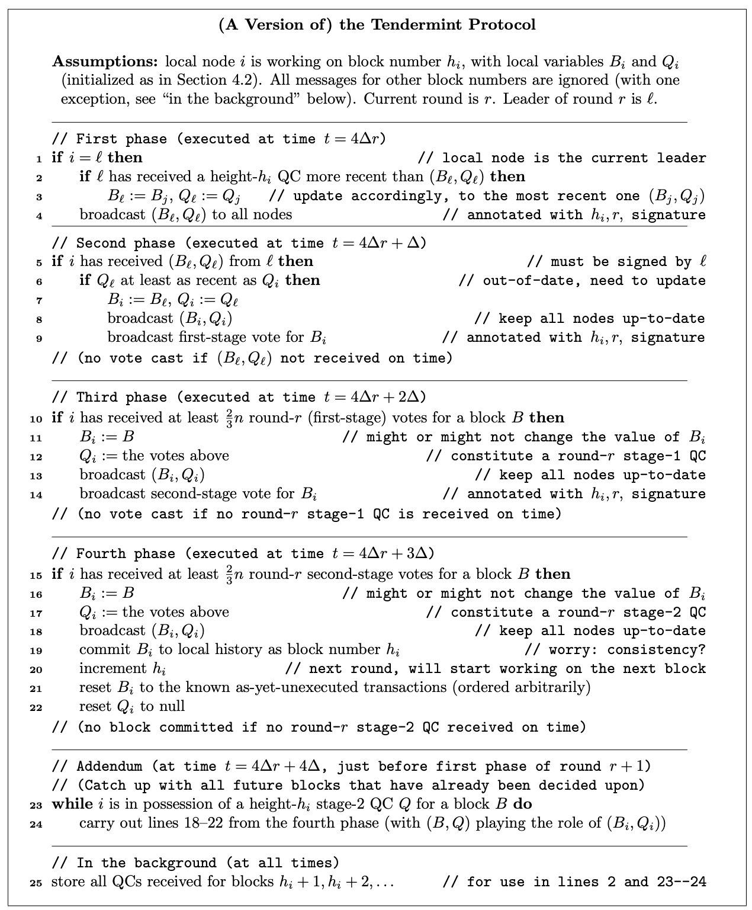

# 区块链基础 - Lecture 7
## 7 Tendermint

Lecture 7 原版讲义链接：https://timroughgarden.github.io/fob21/l/l7.pdf

Lecture 7 原版PPT链接：https://timroughgarden.github.io/fob21/slides/F21L7.pdf

### 7.0 温故知新

**本章的主要结论**：本章对半同步模型下的SMR问题给出一种可能性结果，该结果相对于我们在上一章中所证明过的不可能性结果。我们将使用一个著名的区块链协议，Tendermint协议，来证明这个可能性结果。Terra和Cosmos这两个区块链网络都是基于Tendermint共识机制设计的，Tendermint是一种现成的共识方案，适合那些不想自行设计共识协议的新项目。而比特币和工作量证明版本的以太坊使用的是最长链共识机制，我们将在第8章中详细讨论。

**半同步模型：**在第二和第三章所建立的同步模型下，很容易证明存在强正向性的结果，例如使用Dolev-Strong协议可以解决拜占庭广播问题。但问题是同步模型下对于消息投递是有保障的假设是不切实际的。在第四、第五章中所建立的一部模型中，我们使用了最小假设，但问题在于FLP定理提出的不可能性结果，我们对这样的模型无能为力——在异步模型下，创造出一个确定性协议能同时满足我们想要的所有性质是绝对不可能的。这迫使我们必须做出一定的妥协和让步，于是便有了半同步模型，该模型假设攻击和服务中断是暂时的，将系统的运行时间分为正常阶段（同步阶段）和受攻击阶段（异步阶段）。和异步模型一样，半同步模型中存在全局共享时钟的假设，允许该时钟存在一定的漂移，但漂移速率不能超过一个先验已知的上限。该模型的基础版本包含两个约束消息投递的参数。第一个参数是$\Delta$，即同步阶段中，消息延迟的时间步上限。这个参数是先验已知的，因此协议定义可以依赖该参数。第二个参数是$GST$，即全局稳定时间，Global Stabilization Time。该参数指的是通信网络从异步阶段转换为同步阶段的那个时刻。更精确的描述是，一条消息若在时间步$t$发送，则必然在$max\{t,GST\}+\Delta$内到达。$GST$并不是先验的参数，它的值可以是任意大（但有限，不是无穷大），协议在设计时必须不依赖$GST$，无论该值为多少，都必须提供应有的性质保障。

回顾第六章中，半同步模型下的共识协议之传统目标：

1. 安全性：协议在任何时候都要保障安全性，包括异步阶段（即GST之前）；
2. 最终活性：协议在GST之后须<u>尽快</u>同时保障安全性和活性。

最终活性中的”尽快“具体是多久？你可以认为系统在GST之后，恢复活性所需的时间步是有一个上界的。这个上界是$\Delta$和$n$的某个多项式函数。对此有很多研究，读者可以自行搜索。

我们再回顾一下在第二章定义SMR问题时讲过的安全性和活性的一些条件。首先，网络中有节点是负责运行共识协议的，共识协议指的是解决SMR问题的由事件驱动的代码，客户端通过网络找到这些节点，然后给这些节点提交tx，节点会将tx添加到本地维护的tx只增序列（append-only）的末尾，这个tx序列我们称为history。在这些条件下，安全性和活性指的是：

**目标1：一致性（Consistency）**

任意两个节点对不同的两个tx之相对顺序必然保持一致。理想情况下所有节点始终是保持同步的，但我们允许存在一些节点出现滞后的情况，这些滞后需要在有限时间内消除。滞后节点的消息序列是其他节点的消息序列的子集。

**目标2：活性（Liveness）**

任意一个被提交到至少一个节点上的tx最终必然被添加到每个节点本地history的末尾。

上一章中我们做出过如下断言：

**定理7.0-1：**在半同步模型下，当且仅当$f < \frac{n}{3}$时，存在一个确定性的SMR协议能够同时满足一致性（consistency）和最终活性（eventual liveness，即GST后）。

其实在上一章中，我们做出的断言是解决BA问题的，BA问题是一个一次性共识问题。该断言在SMR问题下依然成立，SMR问题是一个多次共识问题。上一章中，我们对BA问题所证明过的不可能性结果在SMR问题下也成立，读者可尝试自行证明。

定理7.0-1无论是否在PKI假设下都是成立的。本章中我们会证明在PKI假设下该定理的可能性结果，这个可能性结果在没有PKI假设的情况下也成立，读者可自行证明。

### 7.1 Tendermint协议总体设计思想 - Tendermint: High-Level Ideas

> 注：Tendermint协议已经迭代了几个版本，讲义和本笔记中描述的版本是旧版本，但不影响我们分析Tendermint协议的基本设计思想

虽然Tendermint是一个为21世纪的区块链场景设计的协议，但它的运作方式类似于上世纪80、90年代的经典BA协议的迭代版本。本节主要介绍Tendermint协议的三个核心思想，后续会展开说明协议细节。

本节所描述的三个思想看起来都很自然，将这些转变为一个具体的协议有很多种方法。而细节最为关键：大多数做法最终会得到一个存在漏洞的协议，无法满足一致性（consistency）、最终活性（eventual liveness），甚至两者都无法满足。

在计算机科学的某些领域，直觉常常是一个好帮手，但对于分布式协议的设计而言绝非如此。对于任何没有清晰描述或对一致性和最终活性没有严格证明的协议，我们都要持高度怀疑的态度。

#### 7.1.1 思想1：一次性共识的多次迭代 - Idea #1: Iterated Single-Shot Consensus

第一个思想是将多轮共识的SMR问题归约为一次性共识。Tendermint协议基本上是重复迭代执行一种拜占庭协议，每次执行都达成一个区块的共识（区块即多个tx的有序列表，也包含其他的一些信息例如区块的hash等，区块具体字段和内容参考[Tendermint Specs](https://github.com/tendermint/tendermint/blob/master/spec/core/data_structures.md)）。换言之，节点首先通过运行一次性共识产出区块#1，然后再运行一轮一次性共识产出区块#2，依此类推。

在区块链中，我们常用高度（height）来表示一个区块的次序编号，每个节点都维护属于自己的height => $h_i$表示当前正在处理的区块次序编号。例如$h=10$表示当前正在处理本地history的第10个区块。

每个节点在任意一个时刻都只运行一个区块的共识。一个节点发送的每条消息都会被标记上对应的正在处理的区块编号，而对于被标记过去或者未来区块标号的消息，节点会选择忽略。（后文会说明一种例外情况）

我们在后面会遇到一个挑战，在异步阶段，不同的节点可能会参与到不同轮次的一次性共识中。比如，有些节点可能已经在处理第9个区块了，而其他的一些节点由于关键的消息被严重延迟，还停留在第7个区块，第7个区块其实早就被其他节点出块了。

#### 7.1.2 思想2：主动重启机制 - Idea #2: Aggressive Restarts

假设我们现在正在运行区块9的共识。和BB问题一样，Tendermint每一轮会有一个leader节点负责向其他节点提出一个提案。有两个明显的问题会阻碍诚实节点对区块9达成共识。

第一个问题，leader节点可能是拜占庭的，它会向其他诚实节点投递不一致的消息；

第二个问题，在系统还没达到GST之前，诚实节点之间的消息可能会被严重延迟。

Tendermint对这两个问题的解决方案是，如果节点看不到区块9的共识有明显进展，它们会在短时间内主动重启共识流程，并轮替leader节点。如果leader是诚实的，系统进入GST后，诚实节点最终会对区块9达成共识，并推进到区块10的共识流程。

但这里有另一个挑战，由于拜占庭节点的不一致行为，以及/或者消息延迟太大，有一些诚实节点可能会认为区块共识的进展是足够的而选择不重启，另一些节点选择重启。这种分歧可能导致共识一致性被破坏。这个问题将通过思想3来解决。

#### 7.1.3 思想3：两阶段投票 - Idea #3: Two Stages of Voting

Tendermint的第三个设计思想很巧妙，是诚实节点尝试对下一个区块达成共识时，使用两阶段投票。为什么是两轮投票而不是一轮？原因如上文所述，是因为不同的诚实节点可能会看到不同的投票结果（在异步节点或有拜占庭节点干扰时，信息不总是对称的，也不一定是及时传播的，不同节点看到的投票结果可能不一致）。比如，在一个简单的多数投票中，节点可能面临两个投票选择：提交区块B / 换一个leader重启。那可能会出现这样的情况：有些诚实节点看到超过50%的投票选择了提交区块B，另一些诚实节点看到超过50%的投票选择了换leader重启。

不难想到，一些节点会认为投票是成功的，它们会把提议的区块作为第9个区块写入本地history，另一些节点认为投票是失败的，它们会选择重启对第9个区块的共识并轮替leader，这明显会破坏一致性，系统分叉了。

单阶段投票的问题是它只有两种可能的结果，要么投票通过，要么投票不通过。因此持不通观察结果的诚实节点会感知到截然相反的结果。

两阶段投票机制有三种可能的结果：

1. 第一轮投票失败
2. 第一轮投票成功，第二轮失败
3. 两轮都成功

通过引入一种中间状态的结果，可以让诚实节点在提交某个区块和重启共识这两种阶段结果之间有一个缓冲地带。如果一个诚实节点观察到第一轮投票成功，第二轮失败（中间情况），它会锁定某个它认为很可能会成为第9个区块的提案，但不会不可逆地直接提交。该节点对最终选择是持开放态度的，等待更多的证据进行最后的抉择。

### 7.2 Tendermint协议

#### 7.2.1 前置知识

**教学用的版本。**Tendermint协议有很多不同的变体版本。本讲中所描述的变体版本是最为贴近上文中所述的Tendermint三大基本设计思想的实现版本，并且是可形式化证明为正确的版本。我们选择的这种版本在教育目的上比较方便，它并不是工业版本，因此会牺牲一定的效率。例如，我们不会去考虑谁给谁发送了什么消息这类细节（本版本中的每条消息都由发送者签名并广播给所有人），也不会去优化协议中影响区块产出速率的常数因子（这些细节对于工业版本提升出块效率是必要的）。另外就是，本版本的一致性和活性的证明不如其他变体那么简单。

**PKI假设**。Tendermint协议依赖于PKI假设，从一个公共已知的节点与其公钥的列表开始启动，并且假设每个节点拥有属于自己的私钥。在半同步模型中，实现最优的容错性其实不一定需要PKI假设，Dwork，Lynch和Stockmeyer给出过证明。不过有PKI假设对于一个区块链设置来说会比较方便，并且合理。对于PoS类的区块链或许PKI假设是更为合理的，因为PoS通常要求用户注册一个公钥，作为参与出块的前提条件。像Tendermint这样的BFT类型的共识协议通常应用在这类PoS区块链中。

**轮次**。在半同步模型中，所有节点在无需通信的条件下始终知道当前的时间步，在异步阶段亦是如此。在GST后，消息最多会延迟$\Delta$个时间步，$\Delta$是先验已知的上界。在Tendermint中，每一个轮次（round）对应连续的$4\Delta$时间步，表示一次对于某个区块达成共识的尝试（在共识重启前）。第一个轮次从时间步$0$开始，到$4\Delta$结束；第二个轮次从$4\Delta$开始，到$8\Delta$结束，依此类推。由于所有节点总是知道当前的时间步（以及每一轮的时间步长度），因此即便在异步阶段，节点也总是知道当前是第几轮，即轮次不依赖通信。协议设计依赖于先验已知的参数$\Delta$的值，但不能依赖未知的$GST$（之前讲过很多次了）。

> 那为什么不能设置一个自定义的统一的interval，非要用$\Delta$?
>
> 因为$\Delta$能保证系统最紧凑的推进，并且便于形式化证明。假设我们将间隔设置为$interval < \Delta$，那么每一个阶段的消息都还没有传完，协议就推进到下一个阶段了；如果将间隔设置为$interval > \Delta$，虽然能保证安全性，但协议的节奏被拖慢了，效率太低。因此$\Delta$是最为合适的时间间隔。

**领导者轮换**。每一个轮次都有一个唯一的leader节点，负责提交区块提案，节点轮流担任leader。这个设计和我们在第二章的同步模型下的SMR协议很类似，比如Dolev-Strong协议中的sender。本讲中的Tendermint协议由于不是同步假设，因此无法在一个轮次中等待节点们对某一个区块形成共识，只能在超时后重启协议，轮换leader。Tendermint的节点处于共享全局时钟的许可模型中，且存在PKI假设，因此节点知道彼此的节点名称、IP地址和节点的公钥等相关信息，以及当前的轮次，所有阶段都知道当前的leader是谁。

#### 7.2.2 共识证书 - Quorum Certificates

本节介绍一个BFT类共识协议中非常重要的概念，共识证书。

**投票**：上文中有提到，节点会对区块进行投票。一次投票包含下述五个属性：

1. $i$即identity，投票者的身份信息（身份信息通常使用可验证的密码学签名，该签名只能由投票者节点自己生成）；
2. $B$即Block，被投票区块（即尚未执行的tx有序列表）；
3. $h$即height，区块编号（例如，区块#9）；
4. $r$即round，轮次号（例如，轮次#117）；
5. $s$即stage，投票所属阶段（第一阶段/第二阶段，对应前文提到的两阶段投票）

综上，一个投票可以看作为一个五元组$(i,B,h,r,s)$，其中，$h$为height（区块高度，与区块编号紧密关联）。前两个属性是为了说明投票是谁投的、投给哪个区块，以给出正确的投票信息并防止灌票的发生。协议必须能够将每一个投票都与某个特定节点关联起来，这里正是在应用PKI假设。

后面三个属性：

区块高度是为了说明当前的节点正在处理哪个区块，因为前文中说过，每个节点正在处理的进度可能是不同的，有的节点快，有的节点滞后，它们各自独立处理当前的区块高度。**Tendermint协议并不保证每个节点在某一个时刻所处理的区块高度是一致的。**

轮次是为了将投票和轮次关联，因为对于某个区块达成共识可能会经历多次重启。

每个区块的出块都要经历两阶段投票，因此需要关联投票和所属的阶段。

**定义7.2-1：**我们将一个三元组$(h,r,s)$称为一次公投（referendum），它表示在第$r$轮、对高度为$h$的区块、处于$s$投票阶段的投票过程。

**定义7.2-2：**一个QC证书（quorum certificate, QC）是由至少$\frac{2}{3}n$不同的投票人对同一次公投（referendum）、同一个区块（block）的投票集合。其中$n$表示节点数量。

也就是说，一个QC中的所有投票的$(B,h,r,s)$（投票五元组的后四个属性）是一致的，$(i)$至少有$\frac{2}{3}n$个不同的值。

一个QC表示对某个区块在某次公投中获得了多数支持，我们将其称为“这个QC支持某个区块”。QC可以理解为在某次公投中对于被支持区块的一次成功的投票。

**QC的性质：**下述引理是QC的一个简单但重要的引理。

**引理7.2-3（QC重叠性质）：**任意两个QC之间至少有$\frac{n}{3}$个节点是重叠的。

证明：设$Q_1,Q_2$表示任意两个QC。根据定义7.2-2，至多有$\frac{n}{3}$个节点在$Q_1$中未出现；同理，至多有$\frac{n}{3}$个节点在$Q_2$中未出现。因此，至少有$n-\frac{n}{3}-\frac{n}{3}=\frac{n}{3}$个节点必然同时出现在$Q_1$和$Q_2$中。$\square$

无论拜占庭节点的数量是多少，上述引理总是成立的。假使拜占庭节点的数量少于1/3，我们可以得到如下推论。

**推论7.2-4（两个QC至少在一个诚实节点上重叠）**：若$f<\frac{n}{3}$，则任意两个QC至少在同一个诚实节点中重叠。

该推论展现出一种拜占庭策略和拜占庭攻击的门槛。Tendermint的诚实节点在每次公投中最多投票一次，而拜占庭节点可能进行两次投票，一次投给区块$B$然后发送给一批诚实节点，另一次投给区块$B'$然后发送给其他的诚实节点。不过只要$f<\frac{n}{3}$，它们就无法为同一次公投中的两个不同的区块都构造出QC。<u>也就是说，如果拜占庭节点数量没有达到$n/3$，系统就不会出现两个互相冲突的多数投票，这为协议的一致性（consistency）保障打下了基础。</u>

**推论7.2-5（每轮公投至多产生一个QC）：**假设每个诚实节点在每轮公投中最多投票一次，且$f<\frac{n}{3}$，设$Q_1,Q_2$是同一轮公投中的两个QC，则$Q_1,Q_2$必然支持同一个区块。

证明：根据推论7.2-4，存在某个节点$i$同时出现在两个QC中。根据诚实节点在每轮公投中最多投票一次的假设，该节点在在同一轮公投中不会重复投票。因此，这两个QC必然支持同一个区块，即节点$i$在该轮公投中所投区块。$\square$

在Tendermint协议中，任意一个诚实节点$i$都会在本地维护两个本地变量$(B_i,Q_i)$：区块$B_i$和支持$B_i$的QC证书$Q_i$。有一个例外，当节点首次开始处理一个新的区块高度时，它会将$Q_i$设为空（null），$B_i$设为该节点已知但未执行的交易，顺序是随意的。也就是初始状态下，还没有投票结果。直观地说，$B_i$表示$i$节点当前认为下一个区块是什么区块。

**QC的更新：**对于同一个区块高度，一个节点可能会丢弃旧的QC，使用新的代替。

例如，设$Q_1$是对公投$(h,r_1,s_1)$的一个非空QC，$Q_2$是对公投$(h,r_2,s_2)$的一个非空QC。若满足下述任意条件，则认为$Q_1$比$Q_2$更新：

- $Q_1$来自更新的共识轮次，即$r_1 > r_2$
- $Q_1,Q_2$来自相同的共识轮次，但$Q_1$属于更新的投票阶段，即$r_1=r_2,s_1>s_2$

任何非空QC都被认为比一个空值QC更新。

> 注：有一个边界情况是两个QC都是null，这种情况下节点可以将这两个QC任意替换，这样可以简化代码逻辑。另外，对于两个不同高度的QC，由于它们之间不会产生相互影响，因此不必关心这两个QC的比较；对于$Q_1$和$Q_2$之$r_1=r_2,s_1=s_2$的情况，根据推论7.2-5，它们都支持同一个区块，可以视作相同的QC，因此对这两个QC的比较没有意义，也可以忽略。

#### 7.2.3 协议伪代码 - Protocol Pseudocode

如前所述，Tendermint协议的每一轮投票都会消耗$4\Delta$个时间步，$\Delta$表示GST后的消息投递最大延迟。

$t=0$到$t=\Delta$时，leader节点提出区块提案（block proposal）；

$t=\Delta$到$t=2\Delta$时，节点广播prevote；

$t=2\Delta$到$t=3\Delta$时，节点广播precommit；

$t=3\Delta$到$t=4\Delta$时，等待是否达到precommit的多数投票，然后重启下一轮（投票失败）或者决定block（投票成功）

每个诚实节点只会在$\Delta$的整数倍时间步执行动作，在这些整数倍时间步之间会持续收到消息。因此，我们将每一轮投票划分为4个阶段，下面我们先用伪代码描述，再用自然语言进行说明。

> 为什么Tendermint的时间间隔都是$\Delta$的整数倍？
>
> 有可能你忘了，在7.2.1中有讲过，请参考7.2.1中对于问题“为什么不能设置一个自定义的统一的interval，非要用$\Delta$?”的解释。

下述伪代码描述的是$i$节点处理一个特定的区块高度$h_i$的算法，节点会忽略所有与该节点当前处理高度不一致的消息。另外，所有消息都必须由消息发送者签名，任何看上去不是由诚实节点发出的消息都会被诚实节点忽略。例如：

- 没有签名的消息；
- 不是第$r$轮的leader却发送了该轮区块提案的节点所发出的消息；
- 不符合预期数量或类型的消息，比如，如果一个leader节点在同一轮替票发送了多个区块的提案，那么诚实节点只会接受第一个，忽略其余的消息。

下面是Tendermint（education version）的伪代码

**轮次和leader节点是所有节点在无通信情况下就已知的。**我们过一遍上面的伪代码来观察诚实节点的行为。考虑一个诚实节点$i$正在处理高度为$h_i$（前驱区块$1,2,...,h_i-1$已经确认并提交），轮次为$r$的区块。该区块开始处理的时间步为$4 \Delta r$，假设$r$的初始值为0。由于Tendermint协议工作在半同步通信模型和许可设置环境下，且存在全局共享时钟假设（permissioned and partially synchronous setting with a shared global clock）和leader轮换规则是公开已知的假设（例如用round-robin算法轮换，并以节点ID排序轮换），节点$i$通过本地算法和时钟便可知当前的轮次$r$以及当前的leader节点$\mathscr{l}$与其对应的身份信息（节点ID/公钥）。

**阶段一：**当节点$i$是本轮次的leader节点时，该节点负责向其他节点发送区块提案（block proposal），这与拜占庭广播问题中的sender节点类似。节点$i$首先检查其是否收到了其他节点发送的任何比现有QC更新的、高度为$h_i$的QC。如果有收到，则将本地存储的QC，即$Q_i$更新为收到的更新的QC，并将本地维护的区块变量$B_i$更新为对应的区块，即新的$Q_i$所支持的区块。接着，节点$i$将提案$(B_i,Q_i)$广播给所有节点（为了便于解释，可以想象广播对象包括自己）。节点$i$会在每条消息上都附加自己的签名，以及区块高度$h_i$和轮次$r$。

**阶段二：**第二阶段是为了让非leader节点处理在第一阶段已经发送出来的区块提案。每个节点$i$在时间步$4 \Delta r, 4 \Delta r + 1, ..., 4 \Delta r + \Delta$期间监听当前轮次的leader节点$\mathscr{l}$所发送的$(Block,QC)$对。如果节点收到的不止一个这样的区块-QC对，那么只接受第一个，其余的都忽略，并且非$\mathscr{l}$节点的提案也会被忽略（只有leader节点才能提案）。如果在时间步$4 \Delta r + \Delta$之前没有收到区块-QC对的消息（可能有两种情况，$\mathscr{l}$是一个拜占庭节点或者消息延迟），节点$i$在第二阶段不会做任何操作。如果节点$i$收到了$(B_{\mathscr{l}},Q_{\mathscr{l}})$，其中$Q_{\mathscr{l}}$和节点$i$本地已存储的QC（即$Q_i$）是一样新的，或者比$Q_i$更新，那么节点会用收到的$(B_{\mathscr{l}},Q_{\mathscr{l}})$替换原有的$(B_i,Q_i)$。并且，无论$B_{\mathscr{l}}$是否和$B_i$相同（这里的相同指的是区块提案的内容一样，或许有些header字段不同导致两个区块并非bit-by-bit完全一样，比如timestamp不同，因此讲义原文写的是matches），只要$Q_{\mathscr{l}}$满足上一句所述的条件，节点$i$都会执行更新操作。在这种情况下，节点还会广播更新后的$(B_i,Q_i)$（即$(B_{\mathscr{l}},Q_{\mathscr{l}})$）给所有其他的节点，使所有节点能够保持更新，并附加自己对$B_i$的第一阶段投票（即prevote）。如果本地的$Q_i$比收到的$Q_{\mathscr{l}}$更新，节点$i$会认为leader可能落后了或者是拜占庭节点。这种情况下，节点$i$会忽略$(B_{\mathscr{l}},Q_{\mathscr{l}})$，并跳过本阶段的公投。

> 注：上述更新广播的这种all-to-all沟通机制非常消耗资源，并且效率低下。可以这样实现：首先由leader节点收集所有的投票（all-to-one），再由leader将投票汇总后广播给所有节点（one-to-all）。这样能将消息数量从$O(n^2)$降到$O(n)$，适合大规模网络。

**阶段三：**本阶段是二阶段投票的第二阶段，节点尝试确认本轮次第二阶段的公投结果。如果某个节点在$4 \Delta r + 2\Delta$之前收到了某个区块$B$的第一阶段第$r$轮的多数投票，且票数至少达到$\frac{2}{3}n$（可能包括该节点自身的投票），则节点认定区块$B$是本轮公投的胜出区块。根据推论7.2-5，只要$f < \frac{n}{3}$，这样的胜出区块就只有一个，不会出现两个QC支持不同区块的情况。节点$i$会将区块$B$赋值给本地变量$B_i$，并将这些投票汇聚为一个支持$B$的QC。该QC是节点能够得到的最新的QC，因此节点$i$将其赋值给本地变量$Q_i$。最后，节点$i$会将$(B_i,Q_i)$广播给所有节点，并附加对$B_i$的第二阶段投票，该投票包括区块高度$h_i$、轮次$r$、阶段编号$s=2$以及节点$i$的签名。若在时间步$4 \Delta r + 2\Delta$超时前没有收到第一阶段第$r$轮对区块$B$的多数投票，则该节点不会进行第二阶段的投票。

**阶段四：**在本阶段，节点会搜寻第三阶段中对某个区块公投成功的证据。如果一个节点在时间步$4 \Delta r + 3\Delta$之前收到了对区块$B$在第$r$轮第2阶段的多数投票，则节点认为区块$B$是这轮公投的胜出区块（同样的，假设$f < \frac{n}{3}$成立，则只可能存在一个胜出区块。如果超时前节点未收到多数投票，那么节点$i$在本阶段什么都不会做）。在这种情况下，与第三阶段类似，节点$i$会将区块$B$赋值给本地变量$B_i$，并将对$B$的投票汇聚为QC赋值给$Q_i$，进行一次更新，然后将更新后的$(B_i,Q_i)$广播给其余节点。区块$B$此时已经历经两轮投票并且全都胜出，因此节点$i$现在将正式将其提交为高度为$h_i$的区块，并追加到本地的history中，这是不可逆的。接着节点$i$开始在第$r+1$轮处理高度为$h_i + 1$的区块，并将$B_i$重置为本地tx池中已知但未执行的tx，将$Q_i$重置为null。

**最后的细节：**正在处理高度为$h_i$区块的诚实节点$i$会忽略高度不一致的相关消息，但有一个例外：当节点收到$h > h_i$的QC时（这些QC可能是伪代码中的第4、8、13、18、24行被广播的），节点会将这个QC存起来备用（伪代码25行）。首先，这些被存储的QC在该节点下次成为leader时很有用，比如在伪代码第2、3行中会处理；其次，在每一轮的末尾，节点$i$会处理之前缓存的未来高度的第二阶段QC，但前提是它必须先按顺序提交完前面所有的高度，才能高度为$h$的区块。也就是说，即便未来高度$h$的QC已经形成，节点也不会跳跃式提交，必须按照$h_i,h_{i+1},...,h-1,h$的顺序提交。另外，节点$i$无需事后参与已经完成的对应的单轮共识过程，因此会跳过这些轮次，并直接采用已被达成共识的未来区块。举例来说，比如节点$i$因为网络延迟或宕机，在$h=10$的时候失联了，此时其余节点已经完成了这个高度的共识，并且提交了$B_{10}$，节点$i$在第12轮才恢复上线，并从网络中收到了$h=12$的stage-2 QC for $B_{12}$。这个时候节点$i$无需再参与第10、11轮的投票，因为共识已经形成了，并且已经出块了。为了追赶进度，节点会在有对应QC的情况下，直接进行区块提交操作（伪代码23、24行）。

### 7.3 Tendermint的一致性证明 - Proof of Consistency

本节的目标是证明在半同步模型中，Tendermint协议在两个通信阶段都满足一致性（consistency）。

**定理7.3-1(Tendermint协议的一致性)：**在Tendermint协议中，设$f < \frac{n}{3}$，若任意两个诚实节点对同一个区块高度$h$分别在本地历史中完成区块$B$和$B'$的提交，则$B=B'$。

> Theorem 7.3-1 (Consistency of the Tendermint Protocol) In the Tendermint protocol, if $f < \frac{n}{3}$ and two honest nodes commit blocks B and B' to their local histories as the same block number $h$, then $B=B'$.

一致性保证不会出现<u>两个诚实节点对同一个区块高度提交不同的两个区块</u>这种致命错误。

也就是说，一旦有一个诚实节点在本地history中提交了区块$B$，那么该区块就必然是最终确定的（finalized），不会再有别的诚实节点在同样的高度上提交别的区块。

定理7.3-1允许存在一些诚实节点的出块进度有所落后，但这些节点一旦追赶上来，他们的本地history和其他领先的节点应该是一致的。

**证明：**

我们按照区块高度逐个来证明一致性。假设我们目前关注特定的区块高度$h$，接下来的证明聚焦在$h$上。

设$Q_1,Q_2$是高度为$h$的两个stage-2 QC，它们分别支持区块$B_1$和$B_2$（$Q_1$和$Q_2$可能来自不同的共识轮次），需要证明$B_1=B_2$。它的等价命题是，在协议运行的任意时刻，在某个特定区块高度上，不可能出现两个stage-2的QC分别支持不同的区块。由于一个诚实节点在高度$h$提交区块$B$的前提条件是该节点拥有一个支持区块B且高度为$h$的stage-2 QC，因此上述命题可以推出，不会由两个诚实节点在高度$h$上提交不同的区块。（*另一个问题是，诚实节点是否有可能在高度$h$上不提交任何区块？这个问题是最终活性问题，后续章节会对此进行证明）*

设$r$为这样一个投票轮次：在该轮次中，首次出现超过$\frac{n}{3}$的诚实节点为同一个高度为$h$的区块投出了stage-2的投票。令$S$表示上述诚实节点的集合，$B^*$表示$S$所支持的区块。

由于一个QC需要来自至少$\frac{2}{3}n$个不同的节点的投票（$f<\frac{n}{3}$），故上述事件是高度为$h$的stage-2 QC产生的前置条件。也就是说，在第$r$轮之前，这样的QC不可能产生。

其基本思想是，$S$中的节点在看到至少一次对$B^*$的成功投票后，就会”锁定“$B^*$，即这些节点会拒绝对其他区块投票，除非有令人信服的证据表明它们判断错误。又由于$S$的规模足够大，且QC的生成要求足够多的节点参与，因此这样的证据永远不可能被构造出来。

$S$可以粗略地理解为那些观察到第一阶段投票中某个胜出结果的诚实节点（由于拜占庭节点和消息延迟的存在，不同诚实节点观察到的结果可能不同）。第二阶段的投票结果让$S$中的节点确信有许多其他节点与自己的意见一致。这样节点就可以继续推进，提交区块$B^*$。如果第二阶段的结果的说服力不够，例如$S$太小，或者消息延迟，那么节点会保持观望，进入下一轮投票，但仍然会倾向于$B^*$，只是没有提交。

> 注：上述“……至少一次对$B^*$的成功投票后……”，这里的成功投票指的是高度$h$的投票中，至少有一个stage-2 vote投给了$B^*$，且该投票被$S$中的节点看到（投票消息在限定的时间步内被成功送达到诚实节点）。

我们可以通过证明下述命题来完成证明：

永远不存在高度为$h$的非$B^*$区块的stage-2 QC。

下面我们通过归纳法来证明。

Base case：

命题：在公投$(h,r,2)$中，不存在支持$B \ne B^*$的QC。

证明：由于$|S| > \frac{n}{3}$，且一个QC至少需要$\frac{2}{3}n$个节点的投票支持，因此这样的QC必然需要$S$中的诚实节点参与。如果存在$B \ne B^*$，则必然存在$S$中的一个节点在公投$(h,r,2)$中分别为$B$和$B^*$投票。伪代码中明确表述了，每个诚实节点在每轮投票中至多只能投票一次，因此这是不可能发生的，即命题成立。

为了继续论证，我们来总结一下第$r$轮结束和第$r+1$轮开始时的状态，即时间步为$4 \Delta (r+1)$时：

1. 由于在第$r$轮的第二阶段投票中支持了区块$B^*$（伪代码第14行），因此在时间步$4 \Delta r + 2r$开始时，$S$中的任意一个节点都有源于$(h,r,1)$轮投票且支持区块$B^*$的QC。（根据推论7.2-5，该投票轮次中的任意一个QC都必然支持区块$B^*$）
2. 同时，$S$中的任意一个节点都必将其本地变量$B_i$设为$B^*$，$Q_i$设为源于$(h,r,1)$且支持$B^*$的QC（伪代码第11、12行）。
3. 根据base case的证明，任意一个从$(h,r,2)$轮中汇集投票而构建的QC都必然支持区块$B^*$。因此，该投票轮次中的所有QC都不可能使得任意一个节点$i \in S$在伪代码第16行中将其$B_i$的值设为$B^*$以外的其他区块。观察伪代码第15-17行，由于可能存在网络延迟等原因，这些节点在限定的时间步内，可能收到，也可能没有收到超过$\frac{2}{3} n$个stage-2的投票，因此它们可能会，也可能不会将$Q_i$从源于$(h,r,1)$的QC更新为源于$(h,r,2)$的QC，如果更新了，那么该节点在第$r$轮会将区块$B^*$提交到其本地历史中。

总结一下上述所论证的**三个性质**。

在时间步$4 \Delta (r+1)$时：

1. 对于任意一个尚未提交区块$B^*$的节点$i \in S$，其本地变量$B_i = B^*$；
2. 对于任意一个尚未提交区块$B^*$的节点$i \in S$，其本地变量$Q_i$是一个源于$(h,r,1)$或更晚阶段的，支持区块$B^*$的QC；
3. 任意一个属于高度$h$且源于$(h,r,1)$或更晚阶段的QC都必然支持区块$B^*$。

当系统进入第$r+1$轮时，上述论证过的性质可以推出任意一个$S$中的节点都必然继续支持$B^*$。已经将区块$B^*$提交到本地history的节点显然不会改变主意，提交是不可逆的，并且它们不会再参与任何同一高度的投票。

例如，在第一阶段，任何不支持$B^*$的QC都无法满足伪代码第2行的测试条件，因此节点$\mathscr{l} \in S$的本地变量$B_i$在之后的阶段中将保持$B_i = B^*$。同理，在第二阶段，任何不支持$B^*$的QC无法满足伪代码第6行的测试条件，因此节点$i \in S$的本地变量$B_i$在之后的阶段中也依然保持$B_i = B^*$。故，在第二阶段中，任意一个上述节点都不可能支持非$B^*$区块。又由于$|S| > \frac{n}{3}$，因此在公投$(h,r+1,1)$中，无法产生支持非$B^*$区块的QC。进而可以推断，在第三阶段中，任何不支持$B^*$的QC无法满足伪代码第10行的测试条件，故任意一个$S$中的节点都不可能投票给非$B^*$区块，于是$(h,r+1,2)$轮次的投票不可能产生支持非$B^*$的区块。同理，在第四阶段中，由于第15行的测试条件无法满足，故任意一个尚未提交$B^*$的节点$i \in S$在此阶段结束后都仍有$B_i=B^*$。因此，四个阶段都会保持上述性质1-3不变。由于在$r+2$轮开始时，性质1-3依然成立，故上述论证将继续成立，直到该轮结束也依然成立。

对轮次数进行归纳可知，性质1-3恒成立。

根据性质3，且由于第$r$轮是可能产生高度为$h$的stage-2 QC最早的轮次，可以得到结论：不可能再产生高度为$h$的支持非$B^*$区块的QC。

综上所述，任意一个诚实节点在高度$h$上不可能提交非$B^*$区块。$\square$

### 7.4 Tendermint的活性证明 - Proof of Liveness

接下来我们来证明Tendermint满足最终活性（eventual liveness）。

最终活性的意思是，当网络恢复正常，即GST之后，活性性质成立。

Tendermint的一致性证明是非平凡的，但是相对稳健的。即使协议定义有一些变动，证明依然有效。这主要得益于协议中的两阶段QC机制。相比之下，Tendermint的活性证明要脆弱一些，它依赖于协议中某些设计细节，稍有变动就可能导致活性不成立。出于同样的原因，一些有bug的BFT类协议的实现也存在类似的缺陷，往往会导致活性失效，甚至可能导致一致性也失效。

#### 7.4.1 活性的定义 - Defining Liveness

在第二章中，SMR问题的活性定义如下：

若某个tx被至少一个诚实节点知晓，则该tx最终会被追加到所有诚实节点的本地历史（local history）中。

然而这个性质在本课程中所描述的Tendermint协议版本并不成立。如果某个tx只被一个诚实节点$i$知晓，那么有可能$i$提出的区块永远无法被最终确认，即该tx永远不会被追加到任何一个节点的本地历史中（读者可自行证明以检测自己是否真正理解了Tendermint）。因此我们定义一个相对较弱的活性，Tendermint可以满足这个版本的活性性质。

较弱版本的活性定义（Liveness Weak Version）：

若某个tx被所有诚实节点知晓，则该tx最终会被追加到每个诚实节点的本地历史中。

我们显然更希望协议能够满足更强版本的活性性质。可以通过应用gossip协议，使得诚实节点之间互相传播它们所知道的tx，这样就能将强版本的活性归约为弱版本，或者直接对Tendermint协议进行一些修改（比如强制mempool同步等），从而使它能满足强版本的最终活性。

#### 7.4.2 通过快进思想实验越过对Tendermint协议推进的阻滞障碍 - Fast Forwarding Past Obvious Obstruction to Progress

**快进越过GST**：在什么时间点，我们才能期望协议的推进进展？所谓协议的推进进展，意为诚实节点能够持续不断地向其local history中添加新的区块，那么这个时间点是什么时候呢？在半同步模型中，一个显而易见的阻滞协议推进的障碍是消息延迟。在GST之前，有可能没有任何消息能够送达，因此想要确保活性，我们需要快进并越过GST。

**快进越过拜占庭leader：**另一个明显的协议进展的阻滞障碍，是leader节点恰好是拜占庭节点。当一个拜占庭节点通过轮换算法成为leader节点后，它有可能对所有节点沉默来浪费这个轮次的时间，不给出任何的区块提案。所以我们需要快进到由一个诚实节点轮转为leader的轮次（当然也是在GST之后）。实际上，只是这样依然不够，我们需要快进到连续两轮的leader节点都是诚实的，才有可能确保协议的推进。那为什么这样的连续两轮都是由诚实节点担任leader的轮次存在呢？假设leader是以某种round-robin轮转顺序来轮转的，即每个节点每n轮担任一次leader。如果不存在连续两轮的leader是诚实的，那么需要至少每隔一轮的leader是拜占庭的。在round-robin轮换中，当且仅当$f \ge \frac{n}{2}$时，上述情况才有可能发生。我们一直以来的假设是$f < \frac{n}{3}$，因此我们无需担心这种情况会发生。

**引理 7.4-1（连续的诚实领导者轮次存在的必然性）：** 若系统采用round-robin进行领导节点轮转，且$f < \frac{n}{3}$，则存在无穷多对连续两轮领导者节点是诚实节点的轮次。

#### 7.4.3 证明 - The Proof

**定理7.4-2（Tendermint协议的活性）：** 在$f<\frac{n}{3}$，采用round-robin进行领导者轮换的Tendermint协议中，若某个$tx$在某个时间步$t$对所有节点是已知的，则该$tx$最终必然被所有诚实节点添加到其本地历史中。

我们不妨通过7.4.2所说的快进思想实验来构造证明。由引理7.4-1，我们可以快进到第一个连续两轮leader节点为诚实节点的轮次，$r_1$和$r_2$。其中，$r_1$轮在时间步不早于$max\{t,GST+\Delta\}$时开始。令$\mathscr{l}_1, \mathscr{l}_2$分别为第$r_1,r_2$轮的诚实领导者节点。基本思想是，第一个诚实的leader节点$\mathscr{l}_1$会使所有诚实节点达成同步，清理前面拜占庭leader可能对系统制造的混乱状态。随后，第二个诚实的leader节点$\mathscr{l}_2$让诚实节点都提交包含$tx$的区块。

> 为什么是$max\{t,GST+\Delta\}$?
>
> $t$指的是$tx$对所有诚实节点来说已知的最早时间，$GST$是网络稳定时间，$\Delta$是GST之后的网络最大延迟。
>
> 在$t$之前，$tx$并非对所有诚实节点已知，即便是在$GST+\Delta$之后也无法达成包含$tx$的共识。
>
> 在$GST+\Delta$之前，网络不稳定，此时区块提案消息、投票消息等都可能被无限延迟，也无法达成共识。
>
> 因此需要$r_1$的开始时间步$t_{r_1}$既要比$t$晚，也要比$GST+\Delta$晚，也就是取二者的最大值。

**引理7.4-3（节点本地区块高度的近似收敛）：** 每个诚实节点在第$r_1$轮开始时，都会处理高度为$h$或$h+1$的区块。其中$h$表示在时间步$t^* := 4 \Delta r_1 - \Delta$时，任意诚实节点正在处理的最高区块高度。

> 为什么需要这个引理？
>
> 该引理实际上是一个中间结论：在$r_1$轮开始时，诚实节点的高度最多只相差1（即近似收敛，near-convergence），这样就很有希望在该轮或下一轮对某个共同的区块达成共识，从而为liveness的证明提供状态一致性的保证，或者说是在清理之前拜占庭leader制造的混乱状态。如果诚实节点没有在差不多同一个高度上工作，那么他们在轮转成为leader后所提议的区块很难达成共识（各自在不同的区块高度上工作），也就无法确保所有人都对包含某个$tx$的区块投票。
>
> 这样的近似收敛是必然发生的（下面会证明），因此可以作为下一步演绎推理的前提。
>
> 为什么这里的$h$的时间步$t^*$是$4 \Delta r_1 - \Delta$？
>
> 回顾一下，每一轮$r$都要经历四个阶段，这四个阶段的起始时间步分别为：
>
> Stage 1 - Propose: $4 \Delta r$
>
> Stage 2 - Prevote: $4 \Delta r + \Delta$
>
> Stage 3 - Precommit: $4 \Delta r + 2\Delta$
>
> Stage 4 - Finalize/Commit: $4 \Delta r + 3 \Delta$
>
> 引理7.4-3想要分析的是在$r_1$之前的一个阶段所发出的区块同步消息，也就是$r_0$最后一个阶段产生的区块高度的消息，而$r_0$最后一个阶段的时间步用$r_1$来表达就是:
>
> $4 \Delta r_0 + 3 \Delta = 4\Delta(r_1 -1) + 3\Delta = 4\Delta r_1 - \Delta$
>
> 为什么该引理要关注$r_0$？
>
> 因为我们想要关注在$r_1$还没开始前，所有诚实节点最有可能可以看到的最多的区块高度是多少？也就是$r_0$最后一个阶段，大部分节点能看到什么？这个时间步就是$r \Delta r_0 + 3 \Delta$。那又为什么要用$r_1$来表达这个时间步，用$r_0$不就好了？因为我们想要分析的是“紧跟$r_1$开始前的那一个时间步”，我们并不想分析$r_0$，把注意力聚焦到$r_1$轮上，这会让推理结构更加清晰。一会儿出现$r_0$，一会儿出现$r_1$会扰乱我们的注意力。我们需要统一参考框架（reference frame）到$r_1$和$r_2$上，把注意力聚焦到“连续两轮诚实领导者共识”上。

**证明：** 不妨考虑开始于时间步为$4 \Delta r_0 + 3\Delta = t^*$的紧接$r_1$的轮次$r_0$的第四阶段。根据假设，$t^* \ge GST$。在$t^*$时，由于没有诚实节点投票支持任何高度高于$h$的区块，因此没有任何节点拥有高度高于$h$区块的QC。假设诚实节点$i$在$t^*$时正在处理高度为$h$的区块，此时，该节点必然拥有高度为$1,2,...,h-1$的区块的第二阶段QC。这些QC在$t^*$或之前已经通过广播传播给了所有节点，这些传播可能发生在伪代码中的某一轮的第24行，或者当前轮或更早轮次的第4、8、18行。由于$t^* \ge GST$，这些被广播的QC会在$r_0$轮结束前被所有诚实节点接收到。根据伪代码第24行，在$r_0$轮中处理完这些QC后，所有诚实节点在开始下一轮即$r_1$轮时，都会从高度$\ge h$开始处理区块。又由于当前不存在任何高度大于$h$的QC，因此所有进入$r_1$轮的诚实节点所处理的区块高度必然是$h$或$h+1$。$\square$

不幸的是，在$r_1$轮中，一个拜占庭节点有可能会强迫一些诚实节点工作在高度$h$上，并强迫另一些诚实节点工作在高度$h+1$上，使共识失败。其攻击策略是将一个高度为$h$的第二阶段QC隐瞒到时间步$t^*$，然后选择性地只向部分诚实节点披露，从而造成状态分裂。

我们尝试对上述问题进行分类讨论：

Case 1：所有节点都工作在高度$h+1$上
