# 区块链基础 - Lecture 8

## 8 Longest-Chain Consensus

Lecture 8 原版讲义链接：https://timroughgarden.github.io/fob21/l/l8.pdf

Lecture 8 原版PPT链接：https://timroughgarden.github.io/fob21/slides/F21L8.pdf

### 8.1 两类协议设计的故事 - A Tale of Two Protocol Designs

第七讲讨论了Tendermint协议（for SMR），以及它在半同步模型中的最有容错能力，即始终保持一致性和最终活性。到此为止，经典共识协议的训练就此结束，这些内容大部分都是上世纪80年代由杰出的计算机科学家们提出的。Tendermint是一个21世纪的协议，不过深受1980s和1990s经典协议的影响。

区块链协议中，最著名的共识协议，例如比特币底层的共识协议，和我们到现在为止所讨论的协议完全不同。

<u>在区块链领域里，目前存在两种主流的共识协议范式：</u>

<u>**BFT类协议** 和 **最长链协议**</u>

#### 8.1.1 第一类协议：BFT类协议（例如Tendermint协议）- BFT-type Protocols

像Tendermint这样的协议，通常称为BFT（类）协议（BFT or BFT-type protocols），BFT是Byzantine fault tolerant的缩写，意为“拜占庭容错”。这些协议的第一个共同特征是，从宏观角度看，它们的结构相似，通常包括多个投票阶段以及某种类似QC的机制。这确保了一个节点只有在可以确认不会有其他诚实节点提交任何其他区块时，才会提交新的区块（假设拜占庭节点不超过一定的比例）。

在适当的假设下（比如$f < \frac{n}{3}$），BFT协议在设计上不会产生分叉，即不会出现有两个诚实节点在同一高度上提交了不同的区块。如果BFT类型协议中确实出现了分叉（要么是代码实现有bug，要么是拜占庭节点数量超出假设阈值），那么**协议本身并不知道要如何解决分叉**（[Tendermint官方文档](https://docs.tendermint.com/master/spec/consensus/consensus.html#overcoming-forks-and-censorship-attacks)这样写道：“目前，重组提案协调的问题让人类通过互联网渠道自行协商解决”，也就是在discord上开一个频道，让节点运营商一起商量下一步该怎么做，然后恢复系统）。由于BFT类协议在网络遭受攻击或网络状况恶劣时，倾向于保持一致性而不是活性，因此这类协议的故障通常是系统停滞，即较长时间内协议不再提交新的区块。比如，你通常不会听说有BFT协议因为回滚已被提交的区块而引起的双花攻击。

#### 8.1.2 第二类协议：最长链协议（例如比特币）- Longest-Chain Protocols

如果你曾经看过一些对于比特币的介绍，你应该知道区块链的共识协议还存在第二种类型，就是所谓的“最长链协议”。

最长链协议是中本聪（Nakamoto）发明的，并首次发表于[比特币白皮书](https://bitcoin.org/bitcoin.pdf)中。从概念上讲，最长链协议与BFT类协议有着根本性的不同：

1. 没有显式的投票过程，每一个区块（以及一个明确指向前驱区块的指针）都是由某个节点单方面提案的（一个区块提案可以被解释为对其前驱和祖先区块的隐式投票，即节点提出某个区块提案时，也承认了该区块的前驱和祖先是合法的）；
1. 由于协议无需等待QC，在正常运行中很容易出现分叉，即两个区块（可能是冲突的区块）都声称自己是同一前驱区块的后继（可能是拜占庭节点作妖或网络延迟所致）。由于协议中可能频繁出现分叉，为了使系统能正常运行，这类协议只能依靠协议内建机制自动解决由分叉带来的不确定性，解决方法就是协议始终倾向于选择最长的区块链；
1. 最长链协议在节点之间的通信中断时更倾向于保证活性而不是一致性。因此在实际应用中，最长链协议的故障通常是因为违背了一致性（不同节点对哪些区块已被最终提交产生分歧，导致被认为已提交的区块回滚），而不是因为系统停滞（比如旧版本的以太坊协议中曾经多次出现大规模的区块链重组事件）。**这种一致性被破坏的情况使得双花攻击成为可能**。例如，假设一个区块链tx用于支付一件昂贵的实体商品，比如特斯拉汽车。一旦特斯拉经销商认为该交易已经确认，就会允许买家开走他买下的新车。但如果这笔tx在之后被回滚，那么买家实际上就得到了全额退款，然而车子还是在买家的手里。

### 8.2 许可设置下的最长链共识 - Longest-Chain Consensus (Permissioned)

#### 8.2.1 前言

本章中所描述的最长链共识版本是许可设置下（permissioned setting）、有PKI假设（PKI assumption）的版本。PKI假设的意义与前面几章一样，即对于一组运行协议的节点来说，这些信息是先验已知的：

1. 每个节点都有自己的私钥
2. 每个节点都有一个与上述私钥对应的公钥是全部节点已知的

我们做出上述两个设置有两个原因，一是为了与之前的课程保持连贯性，二是最长链共识的许多开创性的思想和特性在许可设置下就能够体现出来。不过，最长链共识最引人瞩目的特点，还是它可以拓展到免许可设置下，即协议根本不知道有哪些节点在运行协议代码。下一章（Lecuture 9）我们会专门讨论免许可设置下的最长链共识，特别是比特币所使用的工作量证明（Proof-of-Work）版本。

**从比特币协议往前展望：**本系列课程主要专注于区块链的设计与分析和底层的基本原理，而不是讲解某个具体的区块链协议。如果你只是为了了解比特币而研究比特币，往往会将多项本质上相互独立的创新混为一谈。在本系列课程中，我们会努力将这些创新拆解开，一方面是为了获得更加清晰的认知，另一方面是因为这些分开的部分可以和其他的思想重组并设计出其他有趣的区块链协议。

> 比特币的重要性不仅仅在于它创造了最长链共识，更是因为它把多个已有的技术有机结合在一起，灵活运用并组合这些技术，从而构造出可实践的新产品。

共识协议的核心功能是制定规则，使得协议能够决定哪些被提案的区块是有效区块（还有这些区块的排序）。另一个在概念上独立的问题是，哪些节点可以参与协议，比如提出新区块、对已提案的区块进行投票。在许可设置与PKI假设下，这个问题很好回答，例如允许所有节点投票，并让节点以Round-Robin方式轮转担任出块节点。而在免许可设置下，这个问题不容易回答，因为协议根本不知道有哪些节点在运行它。比特币的第二个重大创新是，在免许可设置下，为最长链共识提供了一种有效的出块节点选择机制，即工作量证明（Proof-of-Work）。在本系列课程中，我们会尽可能把这两个问题分开讨论，(1)哪些区块是有效的？(2)谁可以参与出块？

**许可设置+PKI假设 vs. 工作量证明（Proof-of-Work） vs. 权益证明（Proof-of-Stake）：** 有些同学可能沿着前面的课程一路学下来，已经习惯了许可设置下的共识；有些同学可能是直接跳入本章中学习的，对免许可设置下的共识更感兴趣，本系列课程尽可能同时照顾这两类同学的需求。本章的内容主要是许可设置下的最长链共识，但我们会时不时插入注解和前瞻性提示，帮助同学们理解这些内容在免许可区块链协议中对应的意义。我们会同时讲解第9讲中对于PoW的实现以及第12讲中对于PoS的实现。如果你还没有听说过像PoW或者PoS这类女巫攻击防护机制（sybil-resistance），那也不用担心，本章的主线只假设你已了解许可设置下的SMR协议，不会要求你已经掌握了其他的知识。

> 人们常常提到的中本聪共识（Nakamoto Consensus）是最长链共识 + PoW的组合。前者负责决定哪个区块最终可以被提交，后者决定哪个节点可以提出区块提案

**还记得Dolev-Strong协议吗？**持续关注并展望免许可实现的另一个原因是，在本章所处的设置下（许可设置和PKI假设），最长链共识协议是严格劣于第二讲中分析过的Dolev-Strong协议的。Dolev-Strong协议的特性是令人印象深刻的，即便存在99%的拜占庭节点，一致性和活性依然成立。但前提是你需要做出一些假设，许可设置、PKI假设和同步模型。

正如我们将在第12节看到的，在半同步模型下，最长链共识无法保证一致性。因此，我们主要在同步模型下研究该协议。在同步模型下，协议可以至多容忍49%的拜占庭节点并保证一致性和活性。设计一个满足这两个性质的协议是困难的，证明最长链共识具备这两个性质也困难。但你不得不承认，在许可设置+PKI假设+同步模型的设置下，真的没必要用最长链共识，只需要每个区块跑一次Dolev-Strong协议就很香（搭配领导者节点轮换机制一起食用）。因此，只有拓展到免许可设置下，最长链共识才能大展身手，达成其他机制无法实现的目标。

综上，本章最好被看作是通往第9章（PoW）和第12章（PoS）中所讲的最长链共识的一个前置知识，而不是独立的课程。

#### 8.2.2 协议描述

我们对最长链共识的描述同时考虑了下述三种场景：

- 许可设置和PKI假设
- 免许可设置并使用PoW抵抗女巫攻击
- 免许可设置并使用PoS抵抗女巫攻击

如果你对免许可设置的协议不熟悉，可以暂时跳过，我们会在后续课程中详细讨论。

**一个未定的版本：**让我们从一个抽象的最长链共识开始，然后再将其分别放到上述三种场景中具体化。

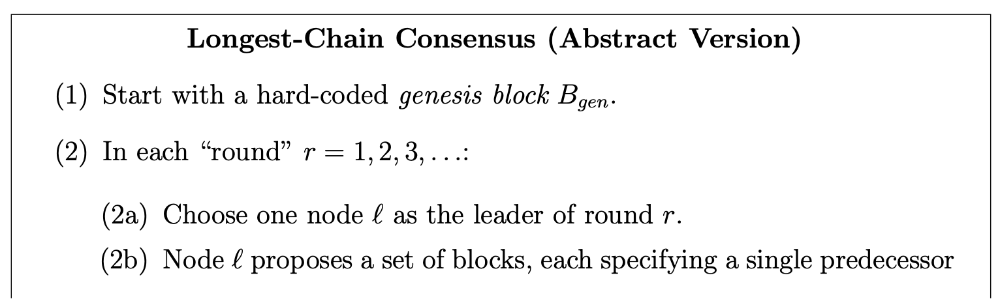

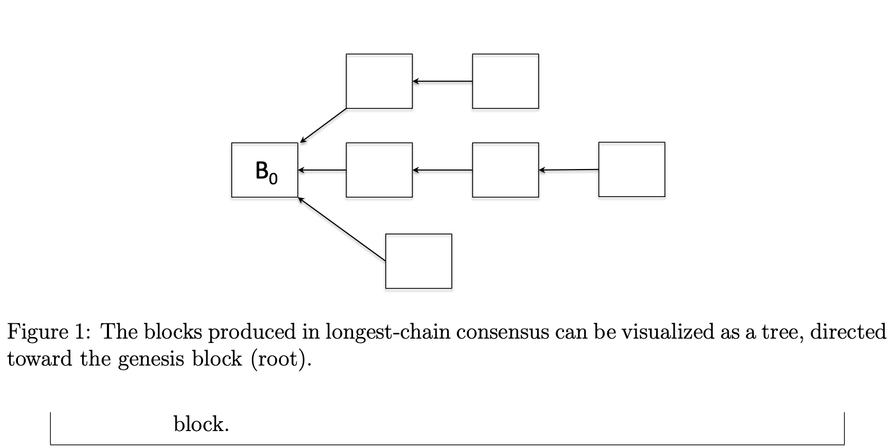

我们将在下文中提供更多细节。不过在抽象版本这一层，我们也能看到协议运行过程中产生的数据结构是一颗***入树（in-tree）***，一种有向无环连通图，其中所有的边都指向树的根节点。在这里，创世区块就是这棵树的根节点，而每条有向边则对应一个区块的前驱区块的名称。当协议刚开始运行时，这棵入树中只有创世区块，随着一轮轮的推进，运行协议的节点会不断扩展这棵入树（每一轮的领导者会添加一批新的顶点，每个顶点的出度为1）。要注意的是，正如前文所述，在最长链共识协议中，分叉（即一个区块被多个新区块作为前驱引用，或者可以认为是入度大于1的顶点）是协议正常操作的一部分。

**创世区块（The genesis block）：**每个最长链协议都内置了一个创世区块，用来启动系统。创世区块中不包含任何tx，但该区块是后面所有的新区块都可以合法引用的前驱。就像每个节点对协议代码是先验已知的那样，我们可以认为创世区块的内容对于每个节点来说，也是先验已知的。

**什么是轮次（Round）？**最长链共识的每一次迭代，且每次迭代都由一个获得向当前区块链添加区块权力的单个领导者节点主导，这样的一个迭代被称为一个轮次。轮次的含义取决于我们讨论的是哪种情形。在PKI设置和PoS下，我们会假设存在一个全局共享时钟（如同步模型中所设），此时每个轮次对应一个固定长度的时间区间。例如，第1轮是0-10秒，第二轮是下一个10秒，依此类推。我们在之前的课程中见过这种设计，比如第2章中的Dolev-Strong协议和第7章中的Tendermint协议。在PoW场景中，轮次并不对应一个固定的时间区间，这种机制对共享时间的依赖非常小，是以纯粹的事件驱动的方式定义的。熟悉PoW运行机制的同学应该知道，出块节点会互相竞争，抢先解出一个困难的密码学难题，这就是刚才所说的“事件驱动”。当某个出块节点运气不错，成功解出难题时，就标志着系统进入了下一轮。

**领导者节点是怎么选出来的？**协议中的每一轮都仅有一个节点担任领导者的角色。上述抽象版本的协议描述(2a)没有写具体的选举方法，因为具体的方法取决于协议所处的具体场景。

最简单的场景是PKI设置。我们可以沿用第2讲和第7讲中使用round-robin轮换领导者的方法。例如，如果系统中有100个节点，当前轮次是117，那么节点17就是本轮的领导者。另一种方式对于最长链共识来说更好，即通过随机/伪随机的方式选出领导者。比如用当前时间步的哈希值而不是直接使用时间步决定本轮领导者。无论是哪种方式，只要假设每轮有一个固定长度，且所有节点都共享全局时钟，那么节点们就都能自知当前的轮次，并且在许可设置中，他们也都知道每个时间步的领导者是谁。

从更高的视角看，PoS场景与PKI设置场景的第二种方法更类似，即通过随机方式选出领导者。不过PoS有一点不一样，其领导者不是均匀随机的，而是按照某个节点在特定的智能合约中锁定的代币数量，按比例随机抽取的（按权益权重）。例如，如果某个节点$i$持有合约中总质押金额的10%，那么在任意一轮中，该节点被选为该轮领导者的概率就是$\frac{1}{10}$。

PoW与PoS类似，不同的地方在于，某个节点是否有效地成为领导者，取决于该节点是否为第一个解出一个密码学难题的节点。该节点被选中的概率与它在系统中贡献的计算能力成正比。

**领导者节点能做什么？** 一旦某个节点在(2a)步被选为某轮领导者，在(2b)步该节点就可以创建若干个区块。这里所说的区块和之前说的一样，依然是一个有序的tx列表。这些交易通常是由参与SMR协议的客户端在先前提交给节点的。不管领导者节点创建了多少个区块，它都必须为每一个区块指定一个唯一的前驱区块。领导者节点一定可以做到这点，即便没有任何前驱区块可选，它也可以使用创世区块作为前驱。任何一个没有指定前驱区块或指定了两个以上前驱区块的区块，都会被诚实节点视为无效区块。诚实领导者只会创建一个区块，拜占庭节点可能会创建多个区块。

> tx在有一些区块链中不表示交易，只记录需要append-only的数据，因此这里保留tx这个术语，不做翻译

领导者节点具体能做什么取决于具体场景（在PoW下，领导者受到的约束最大）。Tendermint这类BFT协议不需要显式指定前驱区块。在这类协议中，在满足$f < \frac{n}{3}$的条件下，由于区块最终确认需要QC，而QC又具备定足数交集特性（quorum intersection property），因此每个高度上就只会出现一个区块。而在最长链共识中，任何领导者节点都可以随意制造分叉，因此同一个高度上可能出现多个区块，它们会竞争最终确认权。因此显式指定前驱区块在最长链共识中是必要的。

#### 8.2.3 五个假设

本章的目标是展示当拜占庭节点不超过49%时，在同步模型下，最长链共识满足一致性和活性。我们将在下述五个假设的前提下进行分析。

1. **创世区块假设：**

第一个假设是可信设置假设，意为我们对该假设无条件信任，至于该假设如何被执行，则搁置不论。具体来说，我们假设没有节点事先知道协议创世区块的描述，节点只有在协议开始运行的那一刻才知道创世区块的名称。因此，创世区块不可能是由某个拜占庭节点事先选择的。

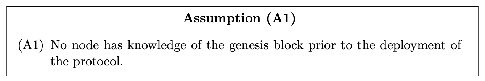

**假设(A1)：任何节点在协议部署之前都不知道创世区块的任何信息。**

作为一个可信设置假设，我们不会在协议内部尝试强制实现它。在部署最长链协议时，一种好的做法是包含一个引用了在协议部署之前不可能被预测到的可验证信息的创世区块。

> 中本聪在部署比特币协议时，包含了一个创世区块，该区块引用了最新的泰晤士报的一个头版标题：“The Times 03/Jan/2009 Chancellor on brink of second bailout for banks.”

2. **领导者选择假设1：**

我们还需要对最长链共识的(2a)步中关于领导者选择如何工作的机制做出两个假设。这两个假设不是可信设置假设，因此我们必须确保最长链共识的实际实现中强制实现它们。

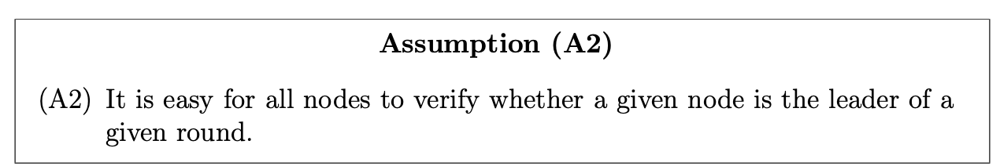

**假设(A2)：给定一个节点并验证该节点是否为本轮次的领导者，对于所有节点都是容易的。**

第二个假设断言了每一轮领导者选择是可验证的。这意味着两件事：

- 该轮被选中的领导者可以很容易地证明自己的确是这轮的领导者；
- 其他任何节点无法欺骗、误导诚实节点，让它们以为自己是领导者。

幸运的是，在我们所关注的所有场景中，假设(A2)是自成立的。我们逐个分析这三种场景：

- PKI场景：假设领导者按顺序轮换，例如$n=100$，在117轮中，节点17会自动成为领导者。接着，假设每个诚实节点发送的所有消息都必须附带签名，并注明所属轮次。由于我们有PKI假设，在117轮中，只有节点17有能力附带有效签名并发送消息，冒充者无法伪造签名。如果某个节点声称自己是117号节点，由于它无法生成正确的签名，所有诚实节点都会忽略。对于伪随机选出的领导者，类似的逻辑同样成立。
- PoS场景：领导者选择通常是由一个确定性函数输出的（输出内容是领导者的公钥），并且这个输出是很容易进行验证的。
- PoW场景：在下一章我们会看到，PoW的领导者身份是通过竞争获取的，领导者需要证明自己解出了一个密码学难题，通常附在步骤(2b)中所选择的区块与其前驱区块。实际上，在PoW下的最长链共识中，每条消息都天然附带一份自证明，用于证明该节点有权发送此消息。

3. 领导者选择假设2：

除此之外，我们还需要第二个领导者选择的假设。

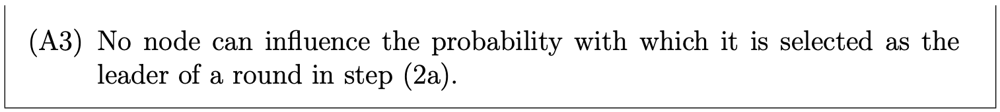

**假设(A3)：任意节点在任何轮次对于步骤(2a)选择哪个节点以及该节点被选中为领导者的概率都无法干预。**

从直觉上看，如果某个拜占庭节点能构建出一种策略，使其每一轮都能被选为领导者，那显然会带来严重问题。理想情况下，领导者选举应当完全不受运行协议的节点操纵，每一轮领导者就像从天而降一样。

在PKI场景中，实现这个假设很简单（轮换或随机）。每个节点自知当前轮次，因此也就知道当前轮次的领导者是谁，而且没有人能改变这个结果。

在非许可设置的场景中，满足(A3)就没那么简单了。不过，在PoW场景下却很简单。我们将在下一章中看到，在所谓“随机预言机假设”（random oracle assumption）下，确实存在一些密码学难题，这些难题在现实中只能通过不断猜测才能解决，并且每次猜测都是独立的，成功概率相同。在这个假设下，我们可以把所有节点想象成在不断地向靶子扔飞镖，尝试扔中靶心。显然的，一个节点越频繁地扔飞镖（算力越强），就越有可能第一个命中靶心，任何耍小聪明的尝试在这里是徒劳的。

在PoS场景下，要实现(A3)就更复杂了。我们会在第12章中详细探讨。直观地看，PoW和PoS的区别在于，前者存在一种天然的外部随机源，后者需要协议自身在密封环境内生成伪随机数，这种环境只能依赖协议代码和区块链已执行的tx序列，并无法访问外部世界的随机性（一种替代的方案是信任一个或多个第三方，由它们负责从外部世界导入随机性）。这样会显得相当危险，比如，某个节点是否可以通过操纵链上的状态，影响自己未来被选为领导者的概率？例如，假设用当前时间步$t$的哈希值$h(t)$从权益质押合约中选一个注册过的公钥。那么节点就会被激励去注册一个能够在之后以高于平均频率被选为领导者的公钥。由于公钥几乎是无成本生成的，因此一个节点可以预先计算出很多。这个问题在PKI场景中没有出现，因为根据假设，节点名称从一开始就是固定的。

> 这段的意思是，由于PoS没有引入外部随机源，其随机方式几乎是通过内部状态决定的，例如通过$H(t)\ mod\ N$来选举leader节点。这种方式有一个致命缺陷：攻击者可以预先生成一大堆密钥对，又由于选举算法依赖的参数是可预知的state，因此攻击者完全可以提前离线运算选举算法，选出中签概率高于平均频率的公钥去参与选举，通过操纵选举池的方式将选举结果改变为对自身有利的结果。这种攻击称为public key grinding attack / stake grinding。PoS协议的设计主要就是围绕如何抵御grinding攻击这个主题展开的。

在过去几年里，PoS区块链的设计者们持续提出各种新的方法，以更好地满足(A3)。

(A2)和(A3)在我们之后的安全性论证中都是至关重要的。因为我们要将拜占庭节点不超过49%这个假设（或PoW中的计算能力、PoS中的质押份额）转换为step (2a)中拜占庭领导者的比例限制，而这必须建立在(A2)和(A3)成立的基础上。

4. **区块生成假设：**

接下来这个假设在最长链共识的分析中起到了基础性的作用，我们必须在任何具体实现中小心地确保这个假设成立。

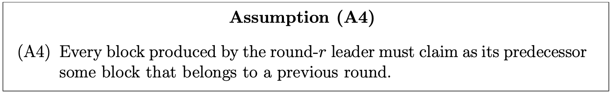

**假设(A4)：第$r$轮领导者所生成的每个区块，都必须将一个上一轮的区块作为其前驱。**

换句话说，如果你从某个区块往回追溯其前驱指针，你会看到一连串区块，它们的**轮次号严格递减**，并最终以创世区块结束，也就是第0轮区块。特别地，由于该假设排除了生成的区块之间产生环的可能，我们可以将最长链共识可视化为一颗不断增长的入树（in-tree）结构。该假设也自动排除了同一轮中的两个区块出现在同一条链上的可能（见Figure 2）。

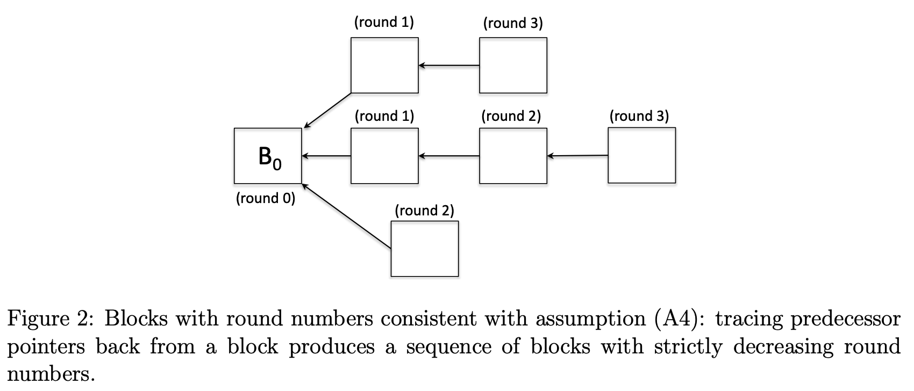

假设(A4)阻止了节点引用不存在的内容。

考虑下述两种情况。

一、在步骤(2b)中，一个拜占庭节点可能会创建多个第$r$轮的区块。假设(A4)做出了一个并非显而易见的断言：这些第$r$轮的区块不能互相引用作为各自的前驱。

二、一个被选为第$r$轮领导者的拜占庭节点可能会采取的一种策略是在步骤(2b)中故意延迟提案。我们需要处理这种情况，因为该情况和一个消息被延迟的诚实节点的表现无法区分。举例说明，设想节点17是一个拜占庭节点，被选为117轮的领导者，而它直到第125轮才宣布它提案的区块，其中一些被引用为前驱的区块是在118-124轮创建的，(A4)断言了上述攻击是无法得逞的。在我们考虑的三个场景中，它都很容易实现。例如，在PKI中，可以要求每个区块提案都附带轮次号以及该轮领导者的签名，并要求诚实节点忽略所有前驱区块轮次号大于等于新建区块轮次号的提案。在PoS中，也可以采用一样的策略。

**PoW设置下更强的性质：**实际上，在PoW场景中，区块并不会明确标注它们属于哪一个轮次。正如我们将在第9章中看到的，基于PoW的典型最长链共识实现中，节点需要在知道自己是当前轮的leader之前就完成(2b)步骤中的区块决策。从技术上看，只有当(2b)步骤中的决策被打包并编码进一个包含了密码学难题之解的区块提案中时，诚实节点才会认可这个提案是有效的。并且，只有当提案被完整构造出来后，才能对其进行有效性检查。因为节点在第$r$轮还没开始时就提交了区块提案（只有在节点验证了自己的中奖彩票之后才开始该轮次，而这张彩票中已经包含了编码过的区块提案，所谓中签彩票即节点解出了密码学难题），这些区块只能引用在当时已经存在的前驱区块（根据定义，这些区块必然是在第$r$轮之前的轮次中创建的）。因此，即使没有显式的轮次编号，PoW也天然保证了新区块只能引用前一轮的区块。

在PoW场景中，中奖的彩票按定义必须编码节点在(2b)步骤中的决策，那何不进一步限制彩票的格式，让节点只指定恰好一个第$r$轮区块及其前驱区块？后面我们会看到，最长链共识中，诚实节点本来就应该在一轮共识中只提案一个区块。

通过引入这一想法，PoW场景下的典型的最长链共识实现，最终会强制执行一个假设(A4)更强的版本：

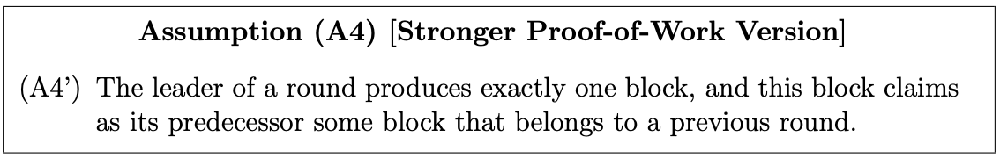

**假设(A4) 更强的PoW版本：(A4') 一轮共识中的领导者节点只产生一个区块，且该区块声明上一轮的某个区块为其前驱。**

最长链共识的基本一致性与活性保证只依赖于假设(A4)，而不依赖于经典PoW的更强版本的假设(A4')。不过，如果能使用假设(A4')，一致性证明则会简单一点。

这也正是你如果只是单纯的研究Bitcoin本身，而不去单独分析它的每个组成部分时很容易忽略的洞见。这一点也展示了清晰表述一个论证所需的最小假设的价值：事实证明，许多最初专门为分析PoW场景而提出的思想，其实可以直接复用在另两个场景中。

5. **通信假设：**

你可能对最后一个假设感到困惑，因为它显然是错误的。

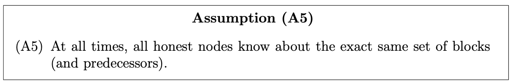

**假设(A5)：在任意一个时刻，所有诚实节点所知晓的区块与其前驱之集合都是一致的。**

换句话说，你可以把假设(A5)理解为，我们在一个同步模型中工作，消息的最大延迟$\Delta=0$。即无论何时，只要有一个诚实节点掌握了一个新的情报，该节点就能够0延迟将新情报传递给所有其他的诚实节点（这显然是不可能的）。我们有时将其称为超级同步模型（super-synchronous）或即刻通信模型（instant communication），这两个称谓都不是标准术语。

即便我们在$\Delta=1$的同步模型下工作，总是存在一段时间，不同的诚实节点所掌握的信息是不同的。例如，当一个诚实领导者提出一个新区块时，它会比其他诚实节点早一个时间步知道该区块的存在。

与(A1)假设不同，我们无法相信假设(A5)，因为它显然不成立。(A5)也不像(A2)-(A4)那样可以通过设计共识协议使其被强制满足，因为消息延迟不在协议的控制范围之内。那为什么我们要做出这个显然不成立的假设，要多此一举？

有以下几个原因：

1. (A5)假设只是暂时采用，然后我们会放宽该假设。目的是为了便于教学。我们想先做出一个理想条件的假设，厘清协议的基本原理后，再进行放宽，避免一开始就引入过多的复杂性，不利于拆解分析和学习；
2. 在分析最长链共识的过程中，即便是在假设(A5)之下，对大部分有趣又非平凡的思想进行深入思考和分析是必要的；
3. 在假设(A5)提供的安全边界内，这些思想更同意理解，不会被其余的细节干扰；
4. 假设(A5)下的最长链共识中的所有保证在传统的同步模型中依然成立，只要消息最大延迟$\Delta$相对于一个轮次平均时长来说足够小；
5. 一旦你正确掌握了本讲中(A5)下的核心思想，那么将这些分析推广到同步模型上时，在概念上可以直接衔接。

简单来说，这个十分理想的假设，它的主要作用是简化推理环境，避免我们学习和分析最长链共识的初始阶段就接触到不必要的细枝末节，帮助我们先学会最长链共识的核心机制，再引入网络延迟等细节问题。

**一致性 vs. 终结性（Consistency vs. finality）**

如果你提出这样的质疑，那你是对的：

SMR的核心目的不就是让节点保持同步吗？假设所有节点自动得知同样的信息不是把问题过度简化了吗？

这确实是一个合理的批评。

假设(A5)没有让活性（liveness）问题过度简化（trivialize），但确实看上去把一致性（consistency）问题平凡化/简化了。我们不妨把一致性进一步拆解为两个在概念上不同的属性：

(i) 不同节点在某一时刻之间的一致性；

(ii) 自我一致性（self-consistency），意为一个诚实节点和它自身的未来版本之间保持一致性。

属性(i)在假设(A5)下显然是被简化掉了，因为按照该假设，不同的节点在某一个时刻始终知道同样的信息，所以我们来看属性(ii)。所谓“与自身的未来版本保持一致性”的意思是，如果一个诚实节点$i$在时刻$t$认为某个区块$B$已经被最终确认（finalized），那么之后该区块就不应再被回滚，节点$i$在所有后续时刻都应认为区块$B$是最终确认的，并且已最终确定区块的顺序也必须保持不变。我们有时把这种性质称为**终结性/最终性（finality）**。

在之前的课程中，属性(ii)已经内置在SMR问题的定义里头了，每个节点都维护一个只追加（append-only）的tx数据结构。“只追加”等价于“不会回滚任何数据”。对于类似Tendermint的BFT类共识协议，我们证明不同节点一致性的方法是，通过QC来论证在同一个区块高度上永远不会出现两个不同的最终区块。这直接意味着在$f<n/3$下，没有任何诚实节点会回滚已经提交的区块。然而，在最长链共识中，终结性可能会以回滚的形式被打破。即便在假设(A5)下，想要证明该协议在合理假设下能够满足这种自我一致性也是困难的。

好在用来证明(A5)下的终结性（属性(ii)）的主要思想基本上可以直接复用到(A5)被放宽后对于属性(i)的证明（即传统的同步模型下，消息延迟$\Delta$相对平均轮次长度较小的情况下）。

**总结**

方便起见，我们把五个假设归集到这里：

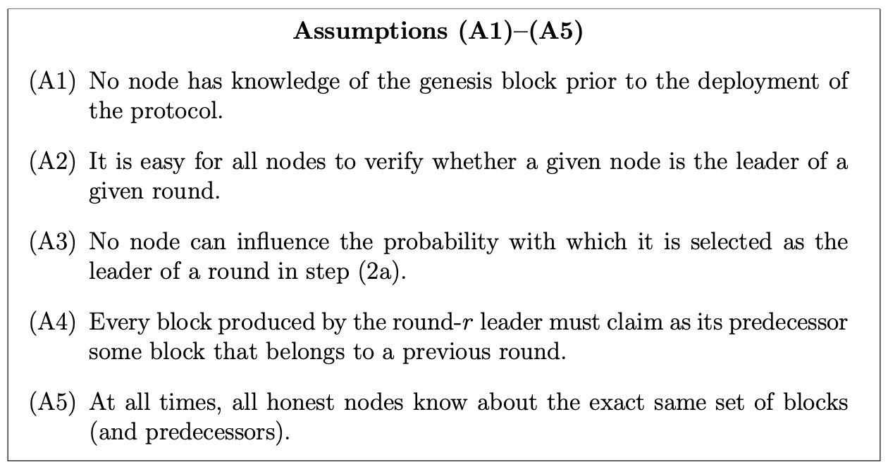

你可能会好奇，这些假设在本讲分析中分别起到的作用是什么。本课程对最长链协议的分析是模块化的，有两个主要步骤：

第一步，找出最长链共识在步骤(2a)对领导者选择之序列的充分条件，这个条件是一种“平衡性性质（balancedness property）”，在该性质成立的条件下，协议就能满足一致性（consistency）和活性（liveness）；

第二步，找出哪些条件能保证领导者序列的产生能满足上述平衡性性质，例如拜占庭参与者的数量上限、领导者节点的选择方法（如随机选择）。

假设(A2)和(A3)关乎领导者节点选择的程序正义，它们在后续章节会涉及，用于证明拜占庭领导者的出现不会过度频繁。其余三个假设用于排除不常出现的拜占庭领导者对协议造成巨大破坏的可能性。

下表总结了这五个假设的作用：

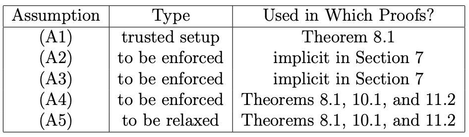

#### 8.2.4 诚实行为与不诚实行为 - Honest vs. Dishonest Behavior

##### 8.2.4.1 诚实节点的预设行为

我们已经在宏观视角上理解了最长链共识是什么样子的，接下来讨论诚实节点在被选为领导者后应该做什么（步骤(2b)），以及拜占庭节点可能会如何偏离这种预设的行为。

**诚实节点必然包含所有tx**

首先，当节点被选择为领导者节点时，若该节点是诚实的，则节点会像之前的SMR协议那样从零开始组装区块。节点把自己已知的所有未执行tx（可能直接来自客户端或者其他节点）以某一种顺序放入区块中。

> 诚实领导者只会提案**一个区块**

**拓展最长链**

那么前驱区块要怎么选？一个诚实的领导者节点会按照程序查看自己所知的所有的区块所构成的入树（in-tree），并将自己<u>新区块的前驱设置为距离创世区块最远端的现有区块</u>（即跳数最大的区块）。也就是说，一个诚实节点会把自己的新区块添加到最长链的末端，从而让最长链继续增长（见Figure 3）。

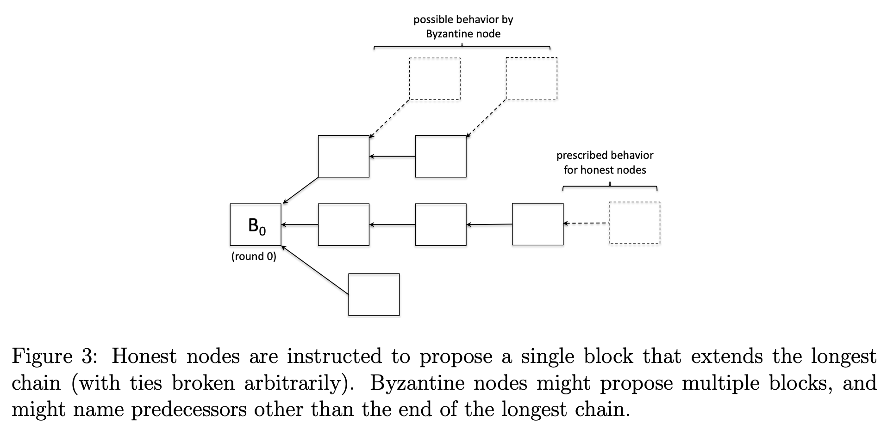

> 从Figure 3可以得知，诚实节点必然会在入树的最长链后添加新区块，这是一个预定规则。而拜占庭节点可能做出违反该规则的行为，在非最长链后添加一个新区块

那如果出现两条以上一样长的链呢？为了分析一致性和活性，我们采用悲观假设，即假设诚实节点可能会做出任意选择，该选择也有可能是由敌手恶意指定的。当然，你也可以设想强制规定一种该情况的处理规则，但一致性和活性这样重要的性质不能依赖于这种脆弱的细节规则。

**即刻广播**

最后，虽然看上去显而易见，但这恰恰是拜占庭节点可能偏离的行为：诚实节点一旦得知自己是本轮领导者节点，会立即广播自己选定的区块与其前驱。

##### 8.2.4.2 拜占庭节点的偏离行为

拜占庭节点可能以任何方式偏离上述的三种预设行为。例如，提案多个区块，或者提出一个并未包含所有已知tx的区块，甚至是空区块，选择非最长链的链作为新区块的前驱，或者延迟新区块提案的广播到某个更晚的时间点。

**空区块**

第一类偏离看上去没有那么严重。从第二章基于Dolev-Strong协议迭代的SMR协议开始，我们就一直在处理拜占庭领导者节点提出不诚实区块的威胁。不同的是，这里无法保证任何一个诚实提出的区块最终会被确认（finalized）。在后续的活性分析中，我们会解决这个问题，论证诚实节点能够定期成功组装并最终确认一些区块。如果所有被确认区块都来自拜占庭节点，那么这些区块可能都是空的，从而导致所有tx都无法被执行，导致“tx饥荒”，系统空转。

> 最长链协议和之前的SMR协议不同的是，区块并不是最终被确认的。所谓最终确认（finalized），指的是区块和其包含的tx是100%不可能被回滚的，即Bob给Alice的一笔转账的tx一旦被确认后就无法再被回滚撤销，是不可逆的。但最长链协议中的区块不是最终确认的，即区块有一定概率（可能微乎其微）会被回滚撤销，例如出现分叉现象，那么一条原先的最长链可能被新的最长链替代，原先最长链中的某些区块可能被回滚。

**延迟区块广播**

出于本章对一致性和活性分析的目的而言，第三类行为偏离，即延迟区块广播其实并不重要。但展望后续课程，在第十章中，当我们研究区块生产者为区块激励竞争时，这类偏离行为就很重要（这类偏离与第十一章的链质量讨论也相关）。在第十章中，我们会发现一个反直觉现象，节点通过一种包含战略性延迟区块广播的偏离行为来获得比诚实执行协议更多区块奖励的偏离。

> 实际上这就是一种自私挖矿（selfish mining）的思想，通过延迟广播来操纵链的增长方向。

**蓄意分叉**

第二类偏离，即通过在非最长链末端上添加区块来蓄意制造或维持分叉，是需要引起高度警惕的，这也是本章分析的重点。为何这类偏离需要引起警惕？因为诚实节点的目标是尽量协调到一条单一的最长链上进行拓展，如果没有拜占庭节点的干扰，这条最长链会不断增长，难以出现实质性分叉。而一个没有在最长链上被添加的区块，不仅不能让最长链获得拓展，还可能导致最长链的切换，从而导致对之前最长链上若干个区块的回滚（即恶意分叉攻击，导致已经被认为稳定的区块被推翻）。

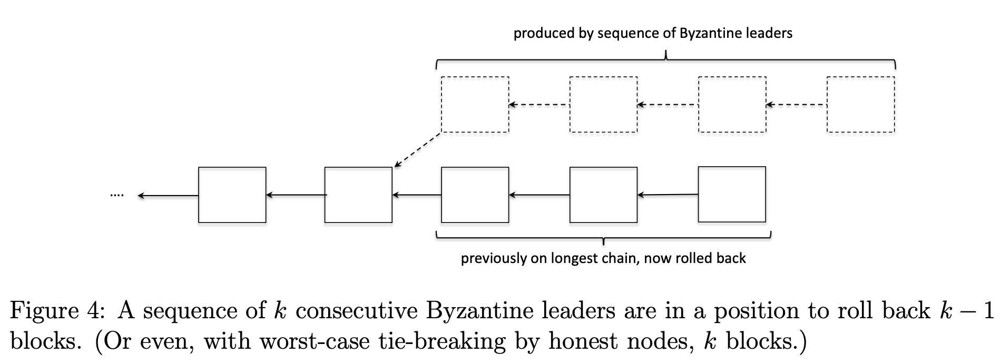

例如，假设连续10轮都是拜占庭领导者，这些拜占庭节点可以协作，从最长链上的最后一个区块往前数第9个区块的位置开始构建一个长度为10的分叉，从而回滚最长链上的最后9个区块（见Figure 4）。更一般地说，若有$k$个连续的拜占庭领导者，他们就有能力回滚最长链最末端往前回溯的$k-1$个区块。进一步，如果在某个领导者序列中，拜占庭领导者比诚实领导者多出$k$个，那么拜占庭节点就可以回滚最长链上的$k-1$个区块。比如，如果在一个1000轮的窗口中，有510个拜占庭领导者和490个诚实领导者，那么拜占庭领导者就有能力回滚最长链上的19个区块。事实上，在我们上述提到的诚实节点遇到多条同长度最长链的情况下，由于诚实节点可能采取任意策略，那么拜占庭节点甚至可以回滚$k$个区块。

**要点总结**

我们可以从这些蓄意分叉的例子里头学到些什么？大致有三点：

1. 在最长链共识中，你应当始终把最长链上最末端的几个区块视为暂时的（tentative）而非确定的区块，这些区块还处于博弈状态中。换句话说，只有当一个区块被嵌入到最长链中足够深的位置，即该区块的后继数量足够多时，它才可以被认为是最终确定的（finalized）。那么，要嵌入多深，后继需要多少，才能认为是finalized的？这个问题我们会在下一节里头解决。
2. 上述例子指出了在证明最长链共识的终结性时存在的一个根本性障碍：如果你无法排除拜占庭领导者数量比诚实领导者数量多出$k$个的连续区块序列，那么你就不能指望最长链上最后$k-1$（甚至$k$）个区块能维持任何形式的终结性。最好的情况是，这是唯一的障碍，这意味着反之亦然：如果你可以排除这种连续序列，那么除了最后$k$个区块之外，最长链上的所有区块都将具有终结性。这个逆命题构成了后续我们对最长链共识协议的一致性分析的核心。
3. 这种蓄意分叉的模式表明，除非拜占庭节点严格少于总结点数的一般，否则最长链共识协议的任何我们想要的性质都不可能被证明。为了理解这一点，假设有51%的节点是拜占庭节点，且领导者选举是公平的，每个节点都能获得他们应有的出块机会，那么在51%的轮次中将由拜占庭节点担任领导者。在1000个连续的领导者序列中，你很可能会看到大约510个拜占庭节点和490个诚实节点。这些拜占庭节点随后有能力回滚最长链上最新的20个区块。在1万个节点的序列中，如果有5100个拜占庭领导者和4900个诚实领导者，拜占庭节点有能力回滚最长链上最新的200个区块，依此类推。由于随着序列长度的增加，拜占庭领导者的数量可以任意程度地超过诚实领导者，那么任何区块都无法免于被回滚。结果就是，拜占庭节点实际上对哪些区块最终留在最长链上拥有独裁控制权。

因此，最长链共识想要具备任何可证明的安全性保障，一个必要条件是，超过一半的节点必须是诚实节点。最理想的情况是该条件同时也是一个充分条件，这样可以确保一致性和活性。这正是我们即将要证明的。

### 8.3 均衡领导者序列 - Balanced Leader Sequences

#### 8.3.1 哪些区块会被最终确认？ - Which Blocks Are Finalized?

考虑前一节中提出的拜占庭节点可能采取的偏离行为（特别是蓄意分叉），我们注意到最长链共识中可能成立的一个很cool的结论：

只要系统中的诚实节点超过50%，那么在最长链上除了最后$k$个区块之外的所有区块都可以被认为是最终确认的（同时还满足其他我们想要的性质，例如活性），这些都是本章分析的核心。

##### 8.3.1.1 参数$k$

参数$k$是最长链以最末端为起点往前回溯的区块数量，这些区块会被认为是还未最终确认且处于博弈状态的区块。一方面，我们希望$k$值越小越好，这样才能让新创建的区块中的tx能够尽快被最终确认；另一方面，从直觉上看，$k$值越大就越容易保证一致性的证明成立。

为了便于后续的一些推理，我们在这里引入一些数学记号。用$G$表示以区块构成的一颗入树（in-tree），树的根节点是创世区块；$k$表示一个非负整数。有如下定义：
$$
\mathcal{B}_k(G):=\text{the longest chain of }G\text{, with the lask }k\text{ blocks removed.}
$$
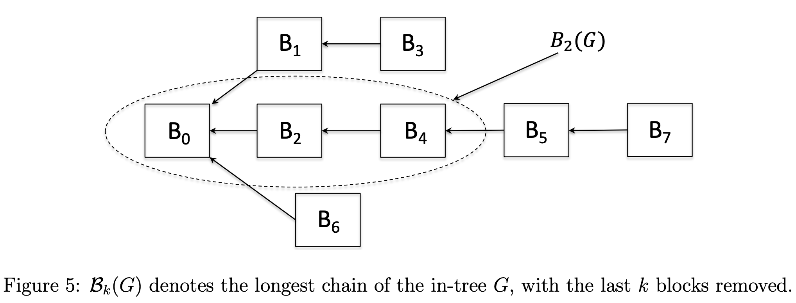

例如，对于Figure 5中的入树$G$，$\mathcal{B}_2(G)$表示链$B_0 \leftarrow B_2 \leftarrow B_4$，而$\mathcal{B}_3(G)$表示链$B_0 \leftarrow B_2$。

对于上述定义可能有两个容易混淆的地方。

**在客户端处定义，而非在协议内定义**

如果你回头看8.2.2中的协议描述，会发现那里没有参数$k$。也就是说，协议的演化和参数$k$无关。实际上，参数$k$只决定了我们如何解释协议的演化，即最长链末尾有多少个区块应该被看作是暂时性的（tentative）。

参数$k$是一个**<u>观察者视角参数</u>**，因此它可以在客户端自由设定，并且不同的客户端可以设定不同的$k$值。（这里的“客户端”指的是计算机领域通常意义上的客户端，即用户与区块链交互的应用程序，不是SMR定义中的client）

例如，可以设想一个类似于比特币、基于最长链共识且内置本币的区块链协议。假设你是一个接受这个加密货币支付的卖家。如果你售卖的商品是低价高频的，例如咖啡，那么当你的客户发起的支付tx被打包到一个区块，且该区块被追加到最长链中，而后这个区块之后又追加了一个区块之后（即$k=1$），你或许才愿意把咖啡交付给客户。这样做的风险很明显，交易可能会被回滚，相当于你的客户白嫖了一杯咖啡。但从你的视角出发，你可能认为减少客户的等待时间比承担这个风险更重要。如果你卖的是特斯拉汽车，大概率你会让你的客户等久一点（比如$k=100$），这样能大概率确保客户的支付tx被最终确认，不会被回滚。因为特斯拉的价格相比咖啡昂贵的多，相比承担这笔支付tx被回滚的风险来说，多等一些时间更加可接受一点。

**$\mathcal{B}_k(G)$是否是良定义的？**

这是第二个可能引起混淆的问题：你完全由理由怀疑，符号$\mathcal{B}_k(G)$在数学意义上是否是良定义的。

> 注：良定义（well-defined / well-definition）指的是用于确认用一组基本公理以数学或逻辑的方式定义的某个概念或对象是完全无歧义的，满足它必须满足的那些性质。
>
> 下面的例子展示了由于最长链可能不唯一，导致$\mathcal{B}_k(G)$的运算结果也可能不唯一（具有歧义），那就不能说$\mathcal{B}_k(G)$在任何情况下都是良定义的。

在上述表达式(1)中，“最长链”可能存在歧义。因为可能存在由多条同样长的链的情况。

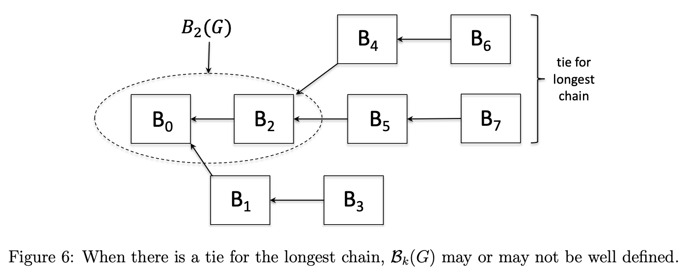

Figure-6 描述了入树$G$上有两条一样长的最长链。在这里，$\mathcal{B}_2(G)$是良定义的，因为无论你选择哪条最长链，丢掉最后2个区块后，该表达式的运算结果是唯一的，都是$B_0 \leftarrow B_2$。但是表达式$\mathcal{B}_2(G)$是具有歧义的，你会得到两条链：$B_0 \leftarrow B_2 \leftarrow B_4$或$B_0 \leftarrow B_2 \leftarrow B_5$。一般的，当我们说$\mathcal{B}_k(G)$是良定义的，指的是无论你选择哪条最长链，丢掉最后$k$个区块后，其运算结果应当一致。其等价命题是，所有最长链在去除末尾$k$个区块后所剩余的部分是完全一致的。换句话说，所有最长链共享一个公共前缀（common prefix）：如果它们的长度都是$\mathscr{l}$，那么它们的前$\mathscr{l}-k$个区块的前缀是相同的。

##### 8.3.1.2 均衡领导者序列 - Balanced Leader Sequences

在我们的分析中，首先要做的是证明所谓的“公共前缀性质（common prefix property）”，假设超过50%的节点是诚实节点，且参数$k$足够大，并满足前述假设A(1) - A(5)，则$\mathcal{B}_k(G)$必然是良定义的。接下来，我们的目标是证明终结性（finality），即$\mathcal{B}_k(G)$区块是最终确认的，以及活性（liveness），即$\mathcal{B}_k(G)$区块会随着时间的增长而持续增长，并且诚实节点产生的节点会被定期追加到该链上。

**分析计划**

我们的分析是模块化的。考虑最长链共识中的一系列轮次与其对应的领导者，由于诚实领导者都遵循协议且行为完全一致，拜占庭领导者可能彼此串通，因此无论选择哪个节点都没差别。我们可以做一些抽象便于分析，将每一轮的领导者序列看作是由一串“H”（Honest，表示诚实领导者）和一串“A”（Adversarial，表示拜占庭领导者）组成的字符串。

举例来说，我们在之前论证过，如果在某个轮次序列中，A比H多出$k$个，那么拜占庭节点就有能力回滚当前最长链的最后$k$个区块。

据此，可以对模块化分析做出下述计划：

1. 提出一个定义，明确描述某个领导者序列是否满足某种条件；
2. 证明只要最长链共识中产生的领导者序列满足上述定义中的条件，且参数$k$选择得当，假设(A1)-(A5)成立，则协议就能满足我们所期望的所有性质，包括一致性（consistency）和活性（liveness）等；
3. 进一步证明，只要运行协议的节点中超过一半是诚实节点，那么上述定义中的条件即可满足（可能是概率性满足）。

把第二步和第三步结合起来，就能得出我们想要的结论：只要节点超过一半是诚实的，且参数$k$选择得当，最长链共识就能满足一致性和活性。

**均衡领导者序列（Balanced leader sequences）**

这里我们开始<u>**第一步**</u>：提出一个关键的定义（其中，$w$是一个正整数，表示窗口（window））：

**定义8.3-1：（$w$-均衡领导者序列）**

当对于任何长度至少为$w$的窗口$\mathscr{l}_i, \mathscr{l}_{i+1}, ..., \mathscr{l}_{j-1}, \mathscr{l}_j$中，若满足诚实节点$H$的数量都严格大于拜占庭节点$A$，则我们称序列$\mathscr{l}_1, \mathscr{l}_2, \mathscr{l}_3, ... \in \{H,A\}$是$w$-均衡的。

> 注：窗口指的是从领导者序列中选取的一个连续子区间，和tcp协议的滑动窗口中的窗口类似
>
> $\mathscr{l}_i$（leader）表示一个领导者节点，$\mathscr{l}_1, \mathscr{l}_2, ...$表示一个领导者节点序列
>
> 例如有如下序列：
>
> ℓ₁  ℓ₂  ℓ₃  ℓ₄  ℓ₅  ℓ₆  …
> H   A   H   H   A   H
>
> 假设$w=3$，则我们可以得到下述窗口（连续子区间）：
>
> (ℓ₁, ℓ₂, ℓ₃) = (H, A, H)
>
> (ℓ₂, ℓ₃, ℓ₄) = (A, H, H)
>
> (ℓ₃, ℓ₄, ℓ₅) = (H, H, A)

窗口$w$的值越大，则上述定义越容易满足（显然的）。因此，我们通常关心的是某个领导者序列能够满足$w$-均衡的$w$最小值。

例如，任何一个包含至少1个拜占庭节点的领导者序列都不可能是1-均衡或2-均衡的。因为在包含拜占庭节点的长度为1或2的窗口中，诚实节点的数量都不会大于拜占庭节点。如果在一个序列中，任意2个拜占庭节点之间至少隔着2个诚实节点，那么该序列就是3-均衡的。因为在任意一个$w=3$的窗口中，诚实节点至少有2个，总是大于拜占庭节点的数量。

如果系统中有$n$个节点，其领导者节点采用round-robin的方式选择，且拜占庭节点数$f<n/3$，则该领导者序列就是$n$-均衡的（证明留作读者的作业）。我们尝试放宽假设，如果$f<n/2$会是什么情况？为什么？同样的，这个问题留作读者的作业。

如果一个领导者序列中，无论其选择方式是round-robin还是随机选择，只要拜占庭节点的平均出现频率大于诚实节点，比如$f>n/2$，那么它对任意$w$都不是$w$-均衡的。证明留给读者作为作业。

> 证明：当$f>n/2$时，$\forall w \in \mathbb{N}$，不存在任何$w$-均衡的领导者序列。

那么当$f=n/2$，情况又如何呢？还是留给读者作为家庭作业。

